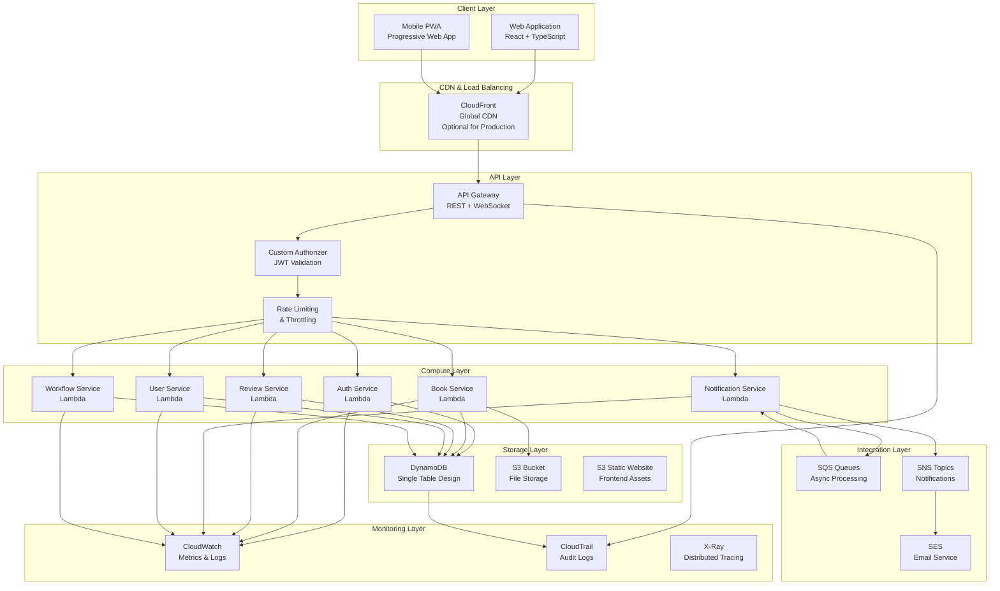
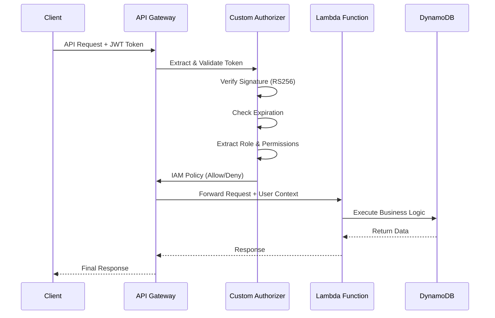
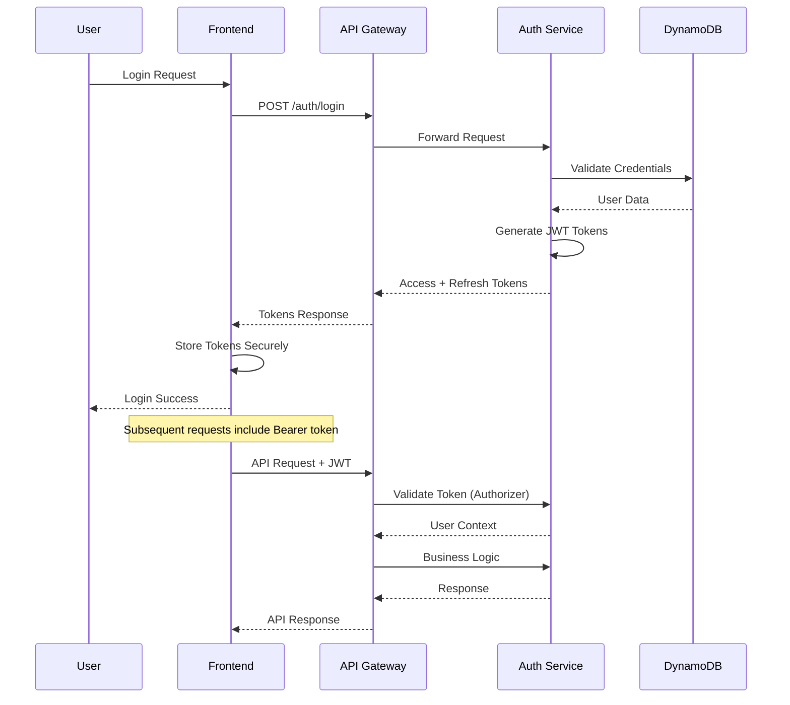
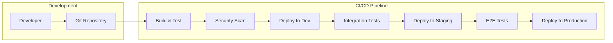
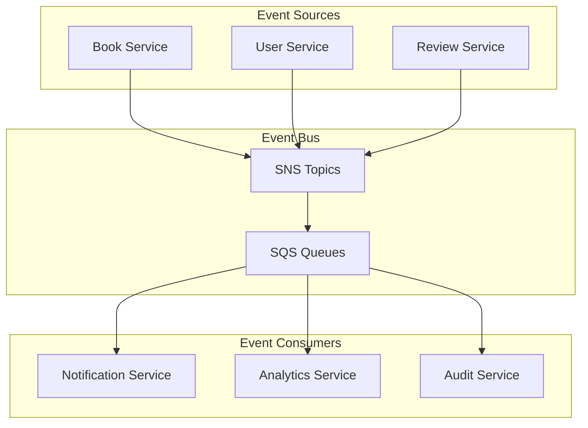

# 🏗️ System Architecture - Ebook Publishing Platform

## Table of Contents

1. [Architecture Overview](#architecture-overview)
2. [Component Architecture](#component-architecture)
3. [Data Architecture](#data-architecture)
4. [Security Architecture](#security-architecture)
5. [Deployment Architecture](#deployment-architecture)
6. [Free Tier Optimization](#free-tier-optimization)
7. [Scalability Considerations](#scalability-considerations)
8. [Integration Patterns](#integration-patterns)

---

## Architecture Overview

### **High-Level System Architecture**



### **Architectural Principles**

#### **1. Serverless-First**
- **No Server Management**: All compute via AWS Lambda
- **Auto-Scaling**: Automatic scaling based on demand
- **Pay-per-Use**: Cost only for actual usage
- **High Availability**: Built-in fault tolerance

#### **2. Single Responsibility**
- **Microservices**: Each Lambda handles one domain
- **Clear Boundaries**: Well-defined service interfaces
- **Independent Deployment**: Services can be updated independently
- **Fault Isolation**: Failures contained within service boundaries

#### **3. Event-Driven Architecture**
- **Asynchronous Processing**: Non-blocking operations via events
- **Loose Coupling**: Services communicate via events
- **Scalable**: Event-driven systems scale naturally
- **Resilient**: Built-in retry and error handling

#### **4. Security by Design**
- **Zero Trust**: Every request authenticated and authorized
- **Defense in Depth**: Multiple layers of security
- **Least Privilege**: Minimal required permissions only
- **Encryption Everywhere**: Data protected at rest and in transit

---

## Component Architecture

### **Frontend Components**

#### **React Application Structure**
```typescript
src/
├── components/           # Reusable UI components
│   ├── auth/
│   │   ├── LoginForm.tsx
│   │   ├── RegisterForm.tsx
│   │   └── ProtectedRoute.tsx
│   ├── books/
│   │   ├── BookEditor.tsx
│   │   ├── BookList.tsx
│   │   ├── BookViewer.tsx
│   │   └── BookWorkflow.tsx
│   ├── reviews/
│   │   ├── ReviewForm.tsx
│   │   ├── ReviewList.tsx
│   │   └── RatingDisplay.tsx
│   └── common/
│       ├── Layout.tsx
│       ├── Navigation.tsx
│       └── LoadingSpinner.tsx
├── hooks/               # Custom React hooks
│   ├── useAuth.ts
│   ├── useBooks.ts
│   ├── useReviews.ts
│   └── useWebSocket.ts
├── services/            # API integration
│   ├── api.ts
│   ├── auth.ts
│   ├── websocket.ts
│   └── storage.ts
├── store/              # State management
│   ├── authStore.ts
│   ├── bookStore.ts
│   └── uiStore.ts
├── types/              # TypeScript definitions
│   ├── user.ts
│   ├── book.ts
│   ├── review.ts
│   └── api.ts
└── utils/              # Utility functions
    ├── constants.ts
    ├── helpers.ts
    ├── validators.ts
    └── formatters.ts
```

#### **State Management Strategy**
```typescript
// Zustand for lightweight state management
interface AuthStore {
  user: User | null;
  token: string | null;
  isAuthenticated: boolean;
  login: (credentials: LoginCredentials) => Promise<void>;
  logout: () => void;
  refreshToken: () => Promise<void>;
}

interface BookStore {
  books: Book[];
  currentBook: Book | null;
  loading: boolean;
  error: string | null;
  fetchBooks: () => Promise<void>;
  createBook: (book: CreateBookRequest) => Promise<void>;
  updateBook: (id: string, updates: UpdateBookRequest) => Promise<void>;
  deleteBook: (id: string) => Promise<void>;
}
```

### **Backend Services Architecture**

#### **Lambda Function Organization**
```typescript
// Service-oriented Lambda functions
services/
├── auth-service/
│   ├── src/
│   │   ├── handlers/
│   │   │   ├── login.ts
│   │   │   ├── register.ts
│   │   │   ├── refresh.ts
│   │   │   └── logout.ts
│   │   ├── middleware/
│   │   │   ├── validation.ts
│   │   │   ├── rateLimiting.ts
│   │   │   └── errorHandling.ts
│   │   ├── utils/
│   │   │   ├── jwt.ts
│   │   │   ├── password.ts
│   │   │   └── security.ts
│   │   └── index.ts
│   └── package.json
├── book-service/
│   ├── src/
│   │   ├── handlers/
│   │   │   ├── create.ts
│   │   │   ├── read.ts
│   │   │   ├── update.ts
│   │   │   ├── delete.ts
│   │   │   └── transition.ts
│   │   ├── models/
│   │   │   ├── book.ts
│   │   │   └── workflow.ts
│   │   ├── services/
│   │   │   ├── bookService.ts
│   │   │   ├── workflowService.ts
│   │   │   └── validationService.ts
│   │   └── index.ts
│   └── package.json
└── [other-services]/
```

#### **API Gateway Configuration**
```yaml
# API Gateway REST API Structure
/api/v1/
├── /auth
│   ├── POST /login           # User authentication
│   ├── POST /register        # User registration
│   ├── POST /refresh         # Token refresh
│   └── POST /logout          # User logout
├── /books
│   ├── GET /books            # List books (filtered by role)
│   ├── POST /books           # Create new book
│   ├── GET /books/{id}       # Get book details
│   ├── PUT /books/{id}       # Update book
│   ├── DELETE /books/{id}    # Delete book
│   └── POST /books/{id}/transition  # State transition
├── /reviews
│   ├── GET /books/{bookId}/reviews   # Get book reviews
│   ├── POST /books/{bookId}/reviews  # Create review
│   ├── PUT /reviews/{id}             # Update review
│   └── DELETE /reviews/{id}          # Delete review
├── /users
│   ├── GET /users/profile    # Get user profile
│   ├── PUT /users/profile    # Update profile
│   └── GET /users/{id}/books # Get user's books
└── /admin
    ├── GET /admin/users      # Admin: List users
    ├── PUT /admin/users/{id} # Admin: Update user
    └── GET /admin/analytics  # Admin: System metrics
```

### **Custom Authorizer Architecture**

#### **JWT Authorization Flow**


#### **Authorization Implementation**
```typescript
// Custom Authorizer Lambda
export const authorizerHandler = async (event: APIGatewayTokenAuthorizerEvent) => {
  try {
    const token = extractToken(event.authorizationToken);
    const decoded = verifyJWT(token);
    
    const policy = generatePolicy(decoded.sub, 'Allow', event.methodArn);
    
    return {
      principalId: decoded.sub,
      policyDocument: policy,
      context: {
        userId: decoded.sub,
        role: decoded.role,
        permissions: JSON.stringify(decoded.permissions),
        email: decoded.email
      }
    };
  } catch (error) {
    throw new Error('Unauthorized');
  }
};

// IAM Policy Generation
const generatePolicy = (principalId: string, effect: string, resource: string) => {
  return {
    Version: '2012-10-17',
    Statement: [{
      Action: 'execute-api:Invoke',
      Effect: effect,
      Resource: resource
    }]
  };
};
```

---

## Data Architecture

### **DynamoDB Single Table Design**

#### **Table Structure**
```typescript
interface EbookPlatformTable {
  PK: string;           // Partition Key
  SK: string;           // Sort Key
  GSI1PK?: string;      // Global Secondary Index 1 PK
  GSI1SK?: string;      // Global Secondary Index 1 SK
  GSI2PK?: string;      // Global Secondary Index 2 PK
  GSI2SK?: string;      // Global Secondary Index 2 SK
  entityType: string;   // Entity type identifier
  data: any;           // Entity-specific data
  createdAt: string;   // ISO 8601 timestamp
  updatedAt: string;   // ISO 8601 timestamp
  version: number;     // Optimistic concurrency control
  ttl?: number;        // TTL for temporary data
}
```

#### **Access Patterns**
| **Pattern** | **PK** | **SK** | **GSI** | **Description** |
|-------------|---------|---------|---------|-----------------|
| Get User | `USER#{userId}` | `PROFILE` | - | User profile data |
| Get User's Books | `USER#{userId}` | `BOOK#{bookId}` | - | Books owned by user |
| Get Book Details | `BOOK#{bookId}` | `METADATA` | - | Book information |
| Get Book Reviews | `BOOK#{bookId}` | `REVIEW#{reviewId}` | - | Reviews for book |
| Get Books by Status | - | - | GSI1: `STATUS#{status}` | Books in specific state |
| Get Books by Genre | - | - | GSI2: `GENRE#{genre}` | Books by genre |
| Workflow History | `WORKFLOW#{bookId}` | `{timestamp}` | - | State change history |
| User Sessions | `SESSION#{sessionId}` | `METADATA` | - | Active user sessions |

#### **Entity Patterns**

```typescript
// User Entity
{
  PK: "USER#123",
  SK: "PROFILE", 
  entityType: "USER",
  data: {
    email: "author@example.com",
    firstName: "John",
    lastName: "Doe", 
    role: "AUTHOR",
    createdAt: "2024-01-01T00:00:00Z",
    lastLoginAt: "2024-01-15T10:30:00Z",
    preferences: {
      notifications: true,
      theme: "dark"
    }
  }
}

// Book Entity
{
  PK: "BOOK#456",
  SK: "METADATA",
  GSI1PK: "STATUS#DRAFT",
  GSI1SK: "BOOK#456",
  GSI2PK: "GENRE#FICTION", 
  GSI2SK: "BOOK#456",
  entityType: "BOOK",
  data: {
    title: "My Great Novel",
    description: "An amazing story...",
    content: "Chapter 1...",
    authorId: "USER#123",
    status: "DRAFT",
    genre: "FICTION",
    wordCount: 75000,
    coverImageUrl: "https://s3.../cover.jpg",
    tags: ["adventure", "young-adult"]
  }
}

// Review Entity
{
  PK: "BOOK#456",
  SK: "REVIEW#789",
  entityType: "REVIEW",
  data: {
    reviewId: "789",
    userId: "USER#321",
    rating: 5,
    comment: "Excellent book!",
    helpful: 15,
    reportCount: 0
  }
}
```

### **S3 Storage Architecture**

#### **Bucket Organization**
```
ebook-platform-assets/
├── book-covers/
│   ├── {bookId}/
│   │   ├── original.jpg
│   │   ├── thumbnail.jpg
│   │   └── medium.jpg
├── user-avatars/
│   ├── {userId}/
│   │   ├── profile.jpg
│   │   └── thumbnail.jpg
├── static-assets/
│   ├── images/
│   ├── icons/
│   └── fonts/
└── exports/
    ├── user-data/
    │   └── {userId}-{timestamp}.json
    └── system-backups/
        └── {date}/
```

#### **File Upload Strategy**
```typescript
// Presigned URL for secure uploads
export const generatePresignedUrl = async (
  fileName: string,
  contentType: string,
  userId: string
) => {
  const key = `book-covers/${userId}/${Date.now()}-${fileName}`;
  
  const presignedUrl = await s3.getSignedUrlPromise('putObject', {
    Bucket: process.env.ASSETS_BUCKET,
    Key: key,
    ContentType: contentType,
    Expires: 300, // 5 minutes
    Conditions: [
      ['content-length-range', 0, 10485760] // Max 10MB
    ]
  });
  
  return { presignedUrl, key };
};
```

---

## Security Architecture

### **Authentication Flow**



### **JWT Token Structure**

#### **Access Token Payload**
```typescript
interface AccessTokenPayload {
  sub: string;          // User ID
  email: string;        // User email
  role: UserRole;       // AUTHOR | EDITOR | PUBLISHER | READER
  permissions: Permission[]; // Role-specific permissions
  iat: number;         // Issued at
  exp: number;         // Expires at (15 minutes)
  aud: string;         // Audience: ebook-platform-api
  iss: string;         // Issuer: ebook-auth-service
}

interface RefreshTokenPayload {
  sub: string;         // User ID
  tokenId: string;     // Unique token identifier
  iat: number;         // Issued at
  exp: number;         // Expires at (7 days)
  aud: string;         // Audience: ebook-platform-refresh
  iss: string;         // Issuer: ebook-auth-service
}
```

### **RBAC Permission Matrix**

| **Resource** | **AUTHOR** | **EDITOR** | **PUBLISHER** | **READER** |
|--------------|------------|------------|---------------|------------|
| **Own Draft Books** | CRUD | - | - | - |
| **Submitted Books** | R | CRUD | R | - |
| **Ready Books** | R | R | CRUD | - |
| **Published Books** | R | R | R | R |
| **Reviews** | R | R | R | CRUD (own) |
| **User Profile** | CRUD (own) | CRUD (own) | CRUD (own) | CRUD (own) |
| **Analytics** | R (own books) | R (assigned) | R (all) | R (own activity) |

### **Data Encryption Strategy**

#### **Encryption at Rest**
```typescript
// DynamoDB encryption with AWS managed keys
const tableConfig = {
  TableName: 'ebook-platform',
  SSESpecification: {
    Enabled: true,
    SSEType: 'KMS',
    KMSMasterKeyId: 'alias/aws/dynamodb'
  }
};

// Application-level encryption for PII
class DataEncryption {
  private algorithm = 'aes-256-gcm';
  private key = process.env.ENCRYPTION_KEY;
  
  encrypt(plaintext: string): EncryptedData {
    const iv = crypto.randomBytes(16);
    const cipher = crypto.createCipher(this.algorithm, this.key);
    
    let encrypted = cipher.update(plaintext, 'utf8', 'hex');
    encrypted += cipher.final('hex');
    
    return {
      encrypted,
      iv: iv.toString('hex'),
      tag: cipher.getAuthTag().toString('hex')
    };
  }
}
```

---

## Deployment Architecture

### **Infrastructure as Code**

#### **Terraform Module Structure**
```
infrastructure/
├── modules/
│   ├── api-gateway/
│   │   ├── main.tf
│   │   ├── variables.tf
│   │   └── outputs.tf
│   ├── lambda/
│   │   ├── main.tf
│   │   ├── variables.tf
│   │   └── outputs.tf
│   ├── dynamodb/
│   │   ├── main.tf
│   │   ├── variables.tf
│   │   └── outputs.tf
│   ├── s3/
│   │   ├── main.tf
│   │   ├── variables.tf
│   │   └── outputs.tf
│   └── monitoring/
│       ├── main.tf
│       ├── variables.tf
│       └── outputs.tf
├── environments/
│   ├── dev/
│   │   ├── main.tf
│   │   ├── variables.tf
│   │   └── terraform.tfvars
│   ├── staging/
│   │   ├── main.tf
│   │   ├── variables.tf
│   │   └── terraform.tfvars
│   └── prod/
│       ├── main.tf
│       ├── variables.tf
│       └── terraform.tfvars
└── scripts/
    ├── deploy.sh
    ├── destroy.sh
    └── plan.sh
```

### **CI/CD Pipeline**



#### **GitHub Actions Workflow**
```yaml
name: Deploy Ebook Platform
on:
  push:
    branches: [main, develop]
  pull_request:
    branches: [main]

jobs:
  build-and-test:
    runs-on: ubuntu-latest
    steps:
      - uses: actions/checkout@v3
      - uses: actions/setup-node@v3
        with:
          node-version: '18'
          
      - name: Install dependencies
        run: |
          npm ci
          cd frontend && npm ci
          
      - name: Run tests
        run: |
          npm run test:coverage
          cd frontend && npm run test:coverage
          
      - name: Security scan
        run: |
          npm audit
          npx snyk test
          
      - name: Build application
        run: |
          npm run build
          cd frontend && npm run build
          
  deploy-dev:
    needs: build-and-test
    runs-on: ubuntu-latest
    if: github.ref == 'refs/heads/develop'
    steps:
      - name: Deploy to Dev
        run: ./scripts/deploy.sh dev
        
  deploy-prod:
    needs: build-and-test
    runs-on: ubuntu-latest
    if: github.ref == 'refs/heads/main'
    steps:
      - name: Deploy to Production
        run: ./scripts/deploy.sh prod
```

---

## Free Tier Optimization

### **Service Limits & Usage Optimization**

#### **AWS Free Tier Capacity**
```yaml
Lambda:
  monthly_requests: 1,000,000
  compute_seconds: 400,000 GB-seconds
  concurrent_executions: 1,000
  
API Gateway:
  monthly_calls: 1,000,000
  websocket_messages: 1,000,000
  
DynamoDB:
  storage: 25 GB
  read_capacity_units: 25 per second
  write_capacity_units: 25 per second
  
S3:
  storage: 5 GB
  get_requests: 20,000 per month
  put_requests: 2,000 per month
  
CloudWatch:
  custom_metrics: 10
  alarms: 10
  log_ingestion: 5 GB per month
  
SQS:
  requests: 1,000,000 per month
```

#### **Optimization Strategies**

```typescript
// Lambda Memory Optimization
const lambdaConfigs = {
  'auth-service': { memory: 128, timeout: 10 },      // Lightweight operations
  'book-service': { memory: 256, timeout: 30 },      // Medium complexity
  'notification-service': { memory: 128, timeout: 15 }, // Simple processing
  'workflow-service': { memory: 192, timeout: 20 }   // State management
};

// DynamoDB Optimization
const dynamoOptimization = {
  // Use single table design to minimize RCU/WCU usage
  singleTable: true,
  
  // Batch operations to reduce request count
  batchSize: 25,
  
  // Use TTL for temporary data
  ttlEnabled: true,
  
  // Efficient query patterns
  queryPatterns: [
    'Get items by PK',
    'Query range with SK prefix',
    'GSI queries for secondary access patterns'
  ]
};
```

### **Cost Monitoring & Alerting**

```typescript
// CloudWatch Cost Monitoring
const costAlerts = [
  {
    service: 'Lambda',
    metric: 'Invocations',
    threshold: 800000, // 80% of free tier
    period: 'Monthly'
  },
  {
    service: 'DynamoDB',
    metric: 'ConsumedReadCapacityUnits',
    threshold: 20, // 80% of 25 RCU/second
    period: 'Per Second'
  },
  {
    service: 'S3',
    metric: 'BucketSizeBytes',
    threshold: 4294967296, // 4GB (80% of 5GB)
    period: 'Daily'
  }
];
```

---

## Scalability Considerations

### **Horizontal Scaling Strategy**

#### **Lambda Concurrency Management**
```typescript
// Reserved Concurrency Configuration
const concurrencyLimits = {
  'auth-service': 200,        // High throughput for authentication
  'book-service': 300,        // Main business logic
  'review-service': 100,      // Medium load
  'notification-service': 50,  // Background processing
  'user-service': 100,        // User management
  'workflow-service': 50      // State transitions
};

// Auto-scaling based on metrics
const scalingPolicy = {
  targetValue: 70, // 70% utilization target
  scaleUpCooldown: 300, // 5 minutes
  scaleDownCooldown: 300, // 5 minutes
  minCapacity: 2,
  maxCapacity: 1000
};
```

#### **Database Scaling Strategy**
```typescript
// DynamoDB Auto Scaling
const dynamoScaling = {
  readCapacity: {
    min: 5,
    max: 4000,
    targetUtilization: 70
  },
  writeCapacity: {
    min: 5,
    max: 4000,
    targetUtilization: 70
  },
  
  // Global Secondary Indexes
  gsiScaling: {
    'StatusIndex': { min: 5, max: 1000 },
    'GenreIndex': { min: 5, max: 500 }
  }
};
```

### **Performance Optimization**

#### **Caching Strategy**
```typescript
// Multi-layer Caching
interface CacheStrategy {
  // Lambda memory caching
  memory: {
    userProfiles: '5 minutes',
    bookMetadata: '10 minutes',
    jwtPublicKeys: '1 hour'
  };
  
  // API Gateway caching
  apiGateway: {
    '/books': '5 minutes',
    '/reviews': '10 minutes',
    '/users/profile': '15 minutes'
  };
  
  // CloudFront caching (Production)
  cloudFront: {
    staticAssets: '24 hours',
    api: '0 seconds', // No caching for API
    images: '7 days'
  };
}
```

---

## Integration Patterns

### **Event-Driven Integration**



#### **Event Schema**
```typescript
interface DomainEvent {
  eventId: string;
  eventType: string;
  source: string;
  timestamp: string;
  version: string;
  data: any;
  metadata: {
    correlationId: string;
    causationId?: string;
    userId: string;
    traceId: string;
  };
}

// Book Events
interface BookCreatedEvent extends DomainEvent {
  eventType: 'book.created';
  data: {
    bookId: string;
    authorId: string;
    title: string;
    status: 'DRAFT';
  };
}

interface BookStateChangedEvent extends DomainEvent {
  eventType: 'book.stateChanged';
  data: {
    bookId: string;
    fromState: BookState;
    toState: BookState;
    changedBy: string;
    reason?: string;
  };
}
```

### **API Versioning Strategy**

```typescript
// URL Path Versioning
const apiVersions = {
  v1: {
    path: '/api/v1',
    supportedUntil: '2025-12-31',
    features: ['basic-crud', 'authentication', 'rbac']
  },
  v2: {
    path: '/api/v2',
    supportedUntil: '2026-12-31',
    features: ['real-time', 'advanced-search', 'analytics']
  }
};

// Backward Compatibility
const versionMiddleware = (version: string) => {
  return (req: Request, res: Response, next: NextFunction) => {
    req.apiVersion = version;
    
    // Handle deprecated features
    if (version === 'v1' && req.path.includes('/analytics')) {
      return res.status(410).json({
        error: 'This endpoint has been moved to v2',
        newEndpoint: req.path.replace('/v1/', '/v2/')
      });
    }
    
    next();
  };
};
```

---

## Summary

This architecture provides:

✅ **Serverless-first design** for automatic scaling and cost efficiency  
✅ **Enterprise security** with comprehensive RBAC and encryption  
✅ **Free Tier optimization** achieving $0/month for first 12 months  
✅ **Production scalability** supporting 1000+ concurrent users  
✅ **Event-driven patterns** for loose coupling and resilience  
✅ **Comprehensive monitoring** with CloudWatch and X-Ray  
✅ **Infrastructure as Code** with Terraform for repeatability  
✅ **Modern development practices** with TypeScript and CI/CD  

The architecture is designed to start small with the Free Tier and scale seamlessly as usage grows, maintaining enterprise-grade security and compliance throughout the journey.

---

## Related Documentation

- **[Requirements](./01-REQUIREMENTS.md)**: Comprehensive project requirements
- **[Implementation](./03-IMPLEMENTATION.md)**: Development roadmap and tasks
- **[Security](./04-SECURITY.md)**: Security and compliance framework
- **[API Specification](./05-API.md)**: Complete REST API documentation
- **[Data Model](./06-DATA.md)**: Database design and access patterns
- **[Development](./07-DEVELOPMENT.md)**: Local development workflow
- **[Deployment](./08-DEPLOYMENT.md)**: Infrastructure deployment guide
