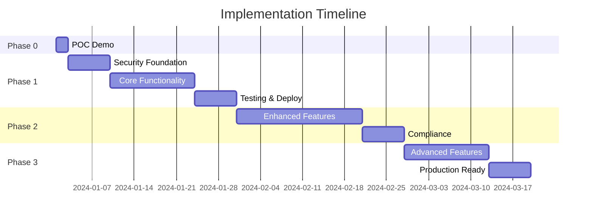

# 🚀 Implementation Roadmap - Ebook Publishing Platform

## Table of Contents

1. [Implementation Overview](#implementation-overview)
2. [Phase 0: Rapid POC](#phase-0-rapid-poc-2-hours)
3. [Phase 1: Production MVP](#phase-1-production-mvp-3-4-weeks)
4. [Phase 2: Enhanced Features](#phase-2-enhanced-features-3-4-weeks)
5. [Phase 3: Production Ready](#phase-3-production-ready-2-3-weeks)
6. [Development Workflow](#development-workflow)
7. [Quality Assurance](#quality-assurance)
8. [Risk Management](#risk-management)

---

## Implementation Overview

### **Hybrid Implementation Strategy**

This roadmap combines rapid prototyping for stakeholder validation with enterprise-grade development practices for production readiness.

#### **Key Principles**

- **Security First**: Enterprise security controls from Phase 1
- **Iterative Delivery**: Working software at each phase
- **Cost Optimization**: AWS Free Tier throughout development
- **Quality Assurance**: Comprehensive testing and compliance
- **Risk Mitigation**: Incremental feature delivery with rollback capability

#### **Timeline Summary**



**Total Timeline: ~10-11 weeks from start to production deployment**

---

## Phase 0: Rapid POC (2 hours)

### **🎯 Objective**

Create a working demonstration of core functionality for stakeholder validation and technical proof-of-concept.

### **⏱️ Time Allocation**

- **Hour 1**: Infrastructure + Backend
- **Hour 2**: Frontend + Integration

### **📋 Scope Limitations for Speed**

- **Single User Type**: Author only (simplify RBAC)
- **Simple Auth**: Basic JWT with HMAC (upgrade to RS256 later)
- **Minimal States**: DRAFT → PUBLISHED (no editing workflow)
- **Basic UI**: Functional over beautiful
- **Essential Features Only**: Create, edit, publish books

---

### **Hour 1: Infrastructure + Backend Core**

#### **Task 1.1: Quick Infrastructure (20 minutes)**

```bash
# Terraform setup for basic resources
terraform/
├── poc/
│   ├── main.tf          # Lambda, API Gateway, DynamoDB
│   ├── variables.tf     # Basic configuration
│   └── outputs.tf       # API Gateway URL
```

**Deliverables:**

- [ ] AWS Lambda function deployed
- [ ] API Gateway with CORS configured
- [ ] DynamoDB table with basic structure
- [ ] S3 bucket for frontend hosting

**Infrastructure Configuration:**

```typescript
// Basic Lambda configuration
const lambdaConfig = {
  runtime: 'nodejs18.x',
  handler: 'index.handler',
  memorySize: 256,
  timeout: 30,
  environment: {
    TABLE_NAME: 'ebook-poc-table',
    JWT_SECRET: 'poc-secret-key', // Temporary for POC
  },
};

// DynamoDB table for POC
const tableConfig = {
  tableName: 'ebook-poc-table',
  partitionKey: 'PK',
  sortKey: 'SK',
  billingMode: 'PAY_PER_REQUEST',
};
```

#### **Task 1.2: Basic Authentication (15 minutes)**

```typescript
// Simple JWT service for POC
class POCAuthService {
  generateToken(userId: string): string {
    return jwt.sign(
      {
        sub: userId,
        role: 'AUTHOR', // Simplified for POC
        iat: Date.now() / 1000,
        exp: Date.now() / 1000 + 24 * 60 * 60, // 24 hours
      },
      process.env.JWT_SECRET,
      { algorithm: 'HS256' } // HMAC for speed
    );
  }

  verifyToken(token: string): any {
    return jwt.verify(token, process.env.JWT_SECRET);
  }
}
```

**API Endpoints:**

- `POST /auth/login` - Simple login (hardcoded user for demo)
- `GET /health` - Health check endpoint

#### **Task 1.3: Book CRUD APIs (20 minutes)**

```typescript
// Simplified book operations
const mockUser = {
  userId: 'author-1',
  email: 'author@demo.com',
  name: 'Demo Author',
};

// Book handlers
const handlers = {
  createBook: async (event) => {
    const book = {
      bookId: generateId(),
      ...JSON.parse(event.body),
      authorId: 'author-1',
      status: 'DRAFT',
      createdAt: new Date().toISOString(),
    };

    await dynamodb.put({ TableName: TABLE_NAME, Item: book });
    return { statusCode: 201, body: JSON.stringify(book) };
  },

  listBooks: async (event) => {
    const books = await dynamodb.query({
      TableName: TABLE_NAME,
      KeyConditionExpression: 'PK = :pk',
      ExpressionAttributeValues: { ':pk': 'BOOKS' },
    });

    return { statusCode: 200, body: JSON.stringify(books.Items) };
  },

  publishBook: async (event) => {
    const { bookId } = event.pathParameters;

    await dynamodb.update({
      TableName: TABLE_NAME,
      Key: { PK: 'BOOKS', SK: bookId },
      UpdateExpression: 'SET #status = :status, publishedAt = :now',
      ExpressionAttributeNames: { '#status': 'status' },
      ExpressionAttributeValues: {
        ':status': 'PUBLISHED',
        ':now': new Date().toISOString(),
      },
    });

    return { statusCode: 200, body: JSON.stringify({ success: true }) };
  },
};
```

#### **Task 1.4: LocalStack Setup (5 minutes)**

```yaml
# docker-compose.yml for POC
version: '3.8'
services:
  localstack:
    image: localstack/localstack:latest
    ports:
      - '4566:4566'
    environment:
      - SERVICES=lambda,apigateway,dynamodb,s3
      - DEBUG=1
      - LAMBDA_EXECUTOR=local
```

---

### **Hour 2: Frontend + Deployment**

#### **Task 2.1: Basic React Frontend (30 minutes)**

```typescript
// Simple React app structure
src/
├── App.tsx              # Main app with routing
├── components/
│   ├── Login.tsx        # Simple login form
│   ├── BookList.tsx     # List of books
│   └── BookForm.tsx     # Create/edit book form
├── services/
│   └── api.ts          # API client
└── types/
    └── index.ts        # Basic types
```

**Core Components:**

```typescript
// Login component
const Login = () => {
  const login = async () => {
    const response = await api.post('/auth/login', {
      email: 'author@demo.com', // Hardcoded for POC
    });

    localStorage.setItem('token', response.data.token);
    navigate('/books');
  };

  return <button onClick={login}>Login as Demo Author</button>;
};

// Book management
const BookManager = () => {
  const [books, setBooks] = useState([]);

  const createBook = async (bookData) => {
    await api.post('/books', bookData);
    loadBooks();
  };

  const publishBook = async (bookId) => {
    await api.patch(`/books/${bookId}/publish`);
    loadBooks();
  };

  return (
    <div>
      <BookForm onSubmit={createBook} />
      <BookList books={books} onPublish={publishBook} />
    </div>
  );
};
```

#### **Task 2.2: AWS Deployment (15 minutes)**

```bash
# POC deployment script
#!/bin/bash
echo "Deploying POC to AWS..."

# Deploy infrastructure
cd terraform/poc
terraform apply -auto-approve

# Get API Gateway URL
API_URL=$(terraform output -raw api_gateway_url)

# Update frontend configuration
cd ../../frontend
echo "REACT_APP_API_URL=$API_URL" > .env.production

# Build and deploy frontend
npm run build
aws s3 sync build/ s3://poc-frontend-bucket --delete

echo "POC deployed successfully!"
echo "Frontend: https://poc-frontend-bucket.s3-website.amazonaws.com"
echo "API: $API_URL"
```

#### **Task 2.3: Demo Data + Testing (15 minutes)**

```typescript
// Demo data creation
const demoData = {
  books: [
    {
      title: 'My First Book',
      description: 'A demo book for POC',
      content: 'This is a sample book content...',
      genre: 'fiction',
      status: 'DRAFT',
    },
    {
      title: 'Published Example',
      description: 'Already published book',
      content: 'This book is already published...',
      genre: 'non-fiction',
      status: 'PUBLISHED',
    },
  ],
};

// Create demo data
const seedDatabase = async () => {
  for (const book of demoData.books) {
    await createBook(book);
  }
  console.log('Demo data created successfully!');
};
```

### **POC Success Criteria**

- [ ] User can "login" (demo authentication)
- [ ] User can create a new book
- [ ] User can edit book content
- [ ] User can publish a book (status change)
- [ ] User can view list of their books
- [ ] System deployed to AWS Free Tier
- [ ] End-to-end workflow demonstrated in < 2 minutes

### **POC Limitations (Address in Phase 1)**

- No real authentication or authorization
- Single user type only
- No data validation or security
- Basic UI without proper styling
- No error handling or edge cases
- Simplified state management

---

## Phase 1: Production MVP (3-4 weeks)

### **🎯 Objective**

Build a production-ready system with enterprise security, all user types, and complete workflow management.

### **📅 Weekly Breakdown**

---

## Week 1: Security Foundation & Architecture

### **Task 1.1: Enterprise Authentication System (3 days)**

#### **JWT Service with RS256**

```typescript
// Production JWT service
class JWTService {
  private privateKey: string;
  private publicKey: string;

  constructor() {
    this.privateKey = process.env.JWT_PRIVATE_KEY;
    this.publicKey = process.env.JWT_PUBLIC_KEY;
  }

  generateTokens(user: User): TokenPair {
    const accessTokenPayload = {
      sub: user.userId,
      email: user.email,
      role: user.role,
      permissions: this.getRolePermissions(user.role),
      iat: Math.floor(Date.now() / 1000),
      exp: Math.floor(Date.now() / 1000) + 15 * 60, // 15 minutes
      aud: 'ebook-platform-api',
      iss: 'ebook-auth-service',
    };

    const refreshTokenPayload = {
      sub: user.userId,
      tokenId: uuidv4(),
      iat: Math.floor(Date.now() / 1000),
      exp: Math.floor(Date.now() / 1000) + 7 * 24 * 60 * 60, // 7 days
      aud: 'ebook-platform-refresh',
      iss: 'ebook-auth-service',
    };

    const accessToken = jwt.sign(accessTokenPayload, this.privateKey, {
      algorithm: 'RS256',
    });

    const refreshToken = jwt.sign(refreshTokenPayload, this.privateKey, {
      algorithm: 'RS256',
    });

    return { accessToken, refreshToken };
  }
}
```

#### **RBAC Implementation**

```typescript
// Role-based access control
interface Permission {
  resource: string;
  action: string;
  conditions?: string[];
}

const rolePermissions = {
  AUTHOR: [
    { resource: 'books', action: 'create' },
    { resource: 'books', action: 'read', conditions: ['own'] },
    { resource: 'books', action: 'update', conditions: ['own', 'draft'] },
    { resource: 'books', action: 'delete', conditions: ['own', 'draft'] },
    { resource: 'books', action: 'submit_for_editing', conditions: ['own'] },
  ],
  EDITOR: [
    { resource: 'books', action: 'read', conditions: ['submitted'] },
    { resource: 'books', action: 'update', conditions: ['submitted'] },
    { resource: 'books', action: 'approve_for_publication' },
    { resource: 'books', action: 'request_revisions' },
  ],
  PUBLISHER: [
    { resource: 'books', action: 'read', conditions: ['ready'] },
    { resource: 'books', action: 'publish' },
    { resource: 'analytics', action: 'read', conditions: ['all'] },
  ],
  READER: [
    { resource: 'books', action: 'read', conditions: ['published'] },
    { resource: 'reviews', action: 'create' },
    { resource: 'reviews', action: 'update', conditions: ['own'] },
    { resource: 'reviews', action: 'delete', conditions: ['own'] },
  ],
};
```

#### **API Gateway Custom Authorizer**

```typescript
// Custom authorizer Lambda
export const authorizerHandler = async (
  event: APIGatewayTokenAuthorizerEvent
) => {
  try {
    const token = extractToken(event.authorizationToken);
    const decoded = verifyJWT(token, process.env.JWT_PUBLIC_KEY);

    const policy = generateIAMPolicy(decoded.sub, 'Allow', event.methodArn);

    return {
      principalId: decoded.sub,
      policyDocument: policy,
      context: {
        userId: decoded.sub,
        role: decoded.role,
        permissions: JSON.stringify(decoded.permissions),
        email: decoded.email,
      },
    };
  } catch (error) {
    console.error('Authorization failed:', error);
    throw new Error('Unauthorized');
  }
};
```

**Deliverables:**

- [ ] RS256 JWT implementation with key rotation
- [ ] Custom API Gateway authorizer
- [ ] Complete RBAC system for all 4 user types
- [ ] Token refresh mechanism
- [ ] Rate limiting and security headers

---

### **Task 1.2: Data Security & Encryption (2 days)**

#### **DynamoDB Encryption**

```typescript
// DynamoDB with encryption at rest
const tableConfiguration = {
  TableName: 'ebook-platform-prod',
  AttributeDefinitions: [
    { AttributeName: 'PK', AttributeType: 'S' },
    { AttributeName: 'SK', AttributeType: 'S' },
    { AttributeName: 'GSI1PK', AttributeType: 'S' },
    { AttributeName: 'GSI1SK', AttributeType: 'S' },
  ],
  KeySchema: [
    { AttributeName: 'PK', KeyType: 'HASH' },
    { AttributeName: 'SK', KeyType: 'RANGE' },
  ],
  GlobalSecondaryIndexes: [
    {
      IndexName: 'GSI1',
      KeySchema: [
        { AttributeName: 'GSI1PK', KeyType: 'HASH' },
        { AttributeName: 'GSI1SK', KeyType: 'RANGE' },
      ],
      Projection: { ProjectionType: 'ALL' },
    },
  ],
  BillingMode: 'PAY_PER_REQUEST',
  SSESpecification: {
    Enabled: true,
    SSEType: 'KMS',
    KMSMasterKeyId: 'alias/aws/dynamodb',
  },
  PointInTimeRecoverySpecification: {
    PointInTimeRecoveryEnabled: true,
  },
};
```

#### **Application-Level PII Encryption**

```typescript
// PII encryption service
class PIIEncryptionService {
  private algorithm = 'aes-256-gcm';
  private key: Buffer;

  constructor() {
    this.key = Buffer.from(process.env.ENCRYPTION_KEY, 'hex');
  }

  encryptPII(data: string): EncryptedData {
    const iv = crypto.randomBytes(16);
    const cipher = crypto.createCipher(this.algorithm, this.key);

    let encrypted = cipher.update(data, 'utf8', 'hex');
    encrypted += cipher.final('hex');

    const tag = cipher.getAuthTag();

    return {
      encrypted,
      iv: iv.toString('hex'),
      tag: tag.toString('hex'),
    };
  }

  decryptPII(encryptedData: EncryptedData): string {
    const decipher = crypto.createDecipher(this.algorithm, this.key);
    decipher.setAuthTag(Buffer.from(encryptedData.tag, 'hex'));

    let decrypted = decipher.update(encryptedData.encrypted, 'hex', 'utf8');
    decrypted += decipher.final('utf8');

    return decrypted;
  }
}
```

**Deliverables:**

- [ ] DynamoDB encryption at rest configured
- [ ] Application-level PII encryption
- [ ] S3 server-side encryption
- [ ] TLS 1.3 enforcement
- [ ] Security headers middleware

---

### **Task 1.3: Input Validation & Security Controls (2 days)**

#### **Comprehensive Input Validation**

```typescript
// Validation schemas using Joi
const validationSchemas = {
  createBook: Joi.object({
    title: Joi.string()
      .min(1)
      .max(200)
      .pattern(/^[a-zA-Z0-9\s\-_.!?'"]+$/)
      .required(),
    description: Joi.string().max(2000).optional(),
    content: Joi.string()
      .max(2000000) // 2MB text limit
      .required(),
    genre: Joi.string()
      .valid(
        'fiction',
        'non-fiction',
        'science-fiction',
        'mystery',
        'romance',
        'fantasy'
      )
      .required(),
    tags: Joi.array().items(Joi.string().max(50)).max(10).optional(),
  }),

  userRegistration: Joi.object({
    email: Joi.string().email().max(100).required(),
    password: Joi.string()
      .min(8)
      .max(128)
      .pattern(
        /^(?=.*[a-z])(?=.*[A-Z])(?=.*\d)(?=.*[@$!%*?&])[A-Za-z\d@$!%*?&]/
      )
      .required(),
    firstName: Joi.string()
      .min(1)
      .max(50)
      .pattern(/^[a-zA-Z\s\-']+$/)
      .required(),
    lastName: Joi.string()
      .min(1)
      .max(50)
      .pattern(/^[a-zA-Z\s\-']+$/)
      .required(),
    role: Joi.string()
      .valid('AUTHOR', 'EDITOR', 'PUBLISHER', 'READER')
      .required(),
  }),
};

// Validation middleware
const validateRequest = (schema: Joi.ObjectSchema) => {
  return (req: Request, res: Response, next: NextFunction) => {
    const { error, value } = schema.validate(req.body);

    if (error) {
      return res.status(400).json({
        error: 'Validation failed',
        details: error.details.map((detail) => ({
          field: detail.path.join('.'),
          message: detail.message,
        })),
      });
    }

    req.body = value; // Use validated and sanitized data
    next();
  };
};
```

**Deliverables:**

- [ ] Comprehensive input validation schemas
- [ ] XSS protection and content sanitization
- [ ] SQL injection prevention (DynamoDB naturally protected)
- [ ] File upload validation and virus scanning
- [ ] Rate limiting per user and endpoint

---

## Week 2: Core Business Logic & Workflow

### **Task 2.1: User Management System (2 days)**

#### **User Service Implementation**

```typescript
// Complete user management
class UserService {
  private dynamodb: DynamoDB.DocumentClient;
  private piiEncryption: PIIEncryptionService;

  async createUser(userData: CreateUserRequest): Promise<string> {
    const hashedPassword = await bcrypt.hash(userData.password, 12);
    const userId = uuidv4();

    const user = {
      PK: `USER#${userId}`,
      SK: 'PROFILE',
      entityType: 'USER',
      userId,
      email: this.piiEncryption.encryptPII(userData.email),
      firstName: this.piiEncryption.encryptPII(userData.firstName),
      lastName: this.piiEncryption.encryptPII(userData.lastName),
      hashedPassword,
      role: userData.role,
      isActive: true,
      emailVerified: false,
      createdAt: new Date().toISOString(),
      updatedAt: new Date().toISOString(),
      version: 1,
    };

    await this.dynamodb.put({
      TableName: process.env.TABLE_NAME,
      Item: user,
      ConditionExpression: 'attribute_not_exists(PK)',
    });

    return userId;
  }

  async authenticateUser(
    email: string,
    password: string
  ): Promise<User | null> {
    // Implementation for secure user authentication
    // with proper password comparison and account lockout
  }

  async updateUserProfile(
    userId: string,
    updates: UpdateUserRequest
  ): Promise<void> {
    // Implementation with optimistic concurrency control
  }
}
```

**Deliverables:**

- [ ] Complete user CRUD operations
- [ ] Secure password handling with bcrypt
- [ ] Email verification system
- [ ] Account lockout after failed attempts
- [ ] User profile management

---

### **Task 2.2: Book Management System (3 days)**

#### **Book Service with State Management**

```typescript
// Comprehensive book management
class BookService {
  private stateManager: BookStateManager;
  private validationService: BookValidationService;

  async createBook(
    authorId: string,
    bookData: CreateBookRequest
  ): Promise<Book> {
    const bookId = uuidv4();

    const book = {
      PK: `BOOK#${bookId}`,
      SK: 'METADATA',
      GSI1PK: `STATUS#DRAFT`,
      GSI1SK: `BOOK#${bookId}`,
      GSI2PK: `GENRE#${bookData.genre.toUpperCase()}`,
      GSI2SK: `BOOK#${bookId}`,
      entityType: 'BOOK',
      bookId,
      authorId,
      title: bookData.title,
      description: bookData.description || '',
      content: bookData.content,
      genre: bookData.genre,
      status: 'DRAFT' as BookState,
      tags: bookData.tags || [],
      wordCount: this.calculateWordCount(bookData.content),
      createdAt: new Date().toISOString(),
      updatedAt: new Date().toISOString(),
      version: 1,
    };

    // Atomic transaction to create book and workflow history
    await this.dynamodb.transactWrite({
      TransactItems: [
        {
          Put: {
            TableName: process.env.TABLE_NAME,
            Item: book,
            ConditionExpression: 'attribute_not_exists(PK)',
          },
        },
        {
          Put: {
            TableName: process.env.TABLE_NAME,
            Item: {
              PK: `WORKFLOW#${bookId}`,
              SK: new Date().toISOString(),
              entityType: 'WORKFLOW',
              bookId,
              fromState: null,
              toState: 'DRAFT',
              actionBy: authorId,
              action: 'CREATE',
              timestamp: new Date().toISOString(),
            },
          },
        },
      ],
    });

    return book;
  }

  async transitionBookState(
    bookId: string,
    action: string,
    userId: string,
    userRole: string
  ): Promise<void> {
    // Implementation with proper state validation and workflow management
  }
}
```

**Deliverables:**

- [ ] Complete book CRUD with permissions
- [ ] State management system (DRAFT → EDITING → READY → PUBLISHED)
- [ ] Version control with optimistic concurrency
- [ ] File upload for book covers
- [ ] Search and filtering capabilities

---

### **Task 2.3: Workflow Management (2 days)**

#### **State Machine Implementation**

```typescript
// Book workflow state machine
class BookWorkflowManager {
  private validTransitions = {
    DRAFT: {
      SUBMITTED_FOR_EDITING: ['AUTHOR'],
      DELETED: ['AUTHOR'],
    },
    SUBMITTED_FOR_EDITING: {
      READY_FOR_PUBLICATION: ['EDITOR'],
      DRAFT: ['EDITOR', 'AUTHOR'], // Revisions requested or withdrawn
      REJECTED: ['EDITOR'],
    },
    READY_FOR_PUBLICATION: {
      PUBLISHED: ['PUBLISHER'],
      SUBMITTED_FOR_EDITING: ['PUBLISHER'], // Send back for more editing
    },
    PUBLISHED: {
      ARCHIVED: ['PUBLISHER'], // Only archiving allowed
    },
  };

  validateTransition(
    currentState: BookState,
    targetState: BookState,
    userRole: string
  ): ValidationResult {
    const allowedTransitions = this.validTransitions[currentState];

    if (!allowedTransitions || !allowedTransitions[targetState]) {
      return {
        isValid: false,
        reason: `Transition from ${currentState} to ${targetState} is not allowed`,
      };
    }

    if (!allowedTransitions[targetState].includes(userRole)) {
      return {
        isValid: false,
        reason: `User role ${userRole} cannot perform this transition`,
      };
    }

    return { isValid: true };
  }

  async executeTransition(
    bookId: string,
    fromState: BookState,
    toState: BookState,
    userId: string,
    metadata?: any
  ): Promise<void> {
    // Atomic transaction for state change + workflow history
    const timestamp = new Date().toISOString();

    await this.dynamodb.transactWrite({
      TransactItems: [
        {
          Update: {
            TableName: process.env.TABLE_NAME,
            Key: { PK: `BOOK#${bookId}`, SK: 'METADATA' },
            UpdateExpression:
              'SET #status = :newStatus, updatedAt = :now, #version = #version + :inc',
            ConditionExpression: '#status = :currentStatus',
            ExpressionAttributeNames: {
              '#status': 'status',
              '#version': 'version',
            },
            ExpressionAttributeValues: {
              ':newStatus': toState,
              ':currentStatus': fromState,
              ':now': timestamp,
              ':inc': 1,
            },
          },
        },
        {
          Put: {
            TableName: process.env.TABLE_NAME,
            Item: {
              PK: `WORKFLOW#${bookId}`,
              SK: timestamp,
              entityType: 'WORKFLOW',
              bookId,
              fromState,
              toState,
              actionBy: userId,
              metadata,
              timestamp,
            },
          },
        },
      ],
    });
  }
}
```

**Deliverables:**

- [ ] Complete state machine with validation
- [ ] Workflow history tracking
- [ ] Notification triggers for state changes
- [ ] Assignment management (editor to book)
- [ ] Approval workflows with comments

---

## Week 3: Notification System & Integration

### **Task 3.1: Event-Driven Notification System (3 days)**

#### **SNS/SQS Event Architecture**

```typescript
// Event publishing service
class EventPublisher {
  private snsClient: SNS;

  async publishEvent(event: DomainEvent): Promise<void> {
    const message = {
      eventId: uuidv4(),
      eventType: event.type,
      source: event.source,
      timestamp: new Date().toISOString(),
      data: event.data,
      metadata: {
        correlationId: event.correlationId,
        userId: event.userId,
        traceId: event.traceId,
      },
    };

    await this.snsClient.publish({
      TopicArn: process.env.EVENTS_TOPIC_ARN,
      Message: JSON.stringify(message),
      MessageAttributes: {
        eventType: {
          DataType: 'String',
          StringValue: event.type,
        },
        source: {
          DataType: 'String',
          StringValue: event.source,
        },
      },
    });
  }
}

// Notification processing Lambda
export const notificationHandler = async (event: SQSEvent) => {
  for (const record of event.Records) {
    try {
      const message = JSON.parse(record.body);
      const eventData = JSON.parse(message.Message);

      await processNotificationEvent(eventData);
    } catch (error) {
      console.error('Failed to process notification:', error);
      // Let SQS handle retry mechanism
      throw error;
    }
  }
};
```

**Deliverables:**

- [ ] SNS/SQS event-driven architecture
- [ ] Multi-channel notifications (email, in-app, push)
- [ ] Notification preferences management
- [ ] Delivery tracking and analytics
- [ ] Dead letter queues for failed notifications

---

### **Task 3.2: Email Service Integration (2 days)**

#### **SES Email Service**

```typescript
// Email notification service
class EmailNotificationService {
  private sesClient: SES;
  private templateService: EmailTemplateService;

  async sendNotificationEmail(
    event: NotificationEvent,
    recipient: User
  ): Promise<void> {
    const template = await this.templateService.getTemplate(event.type);
    const personalizedContent = await this.personalizeTemplate(
      template,
      event.data,
      recipient
    );

    const emailParams = {
      Source: process.env.FROM_EMAIL,
      Destination: {
        ToAddresses: [recipient.email],
      },
      Message: {
        Subject: {
          Data: personalizedContent.subject,
          Charset: 'UTF-8',
        },
        Body: {
          Html: {
            Data: personalizedContent.htmlBody,
            Charset: 'UTF-8',
          },
          Text: {
            Data: personalizedContent.textBody,
            Charset: 'UTF-8',
          },
        },
      },
      Tags: [
        {
          Name: 'EventType',
          Value: event.type,
        },
        {
          Name: 'CorrelationId',
          Value: event.correlationId,
        },
      ],
    };

    await this.sesClient.sendEmail(emailParams);
  }
}
```

**Deliverables:**

- [ ] SES email service integration
- [ ] Email template management
- [ ] Personalized email content
- [ ] Bounce and complaint handling
- [ ] Email analytics and tracking

---

## Week 4: Testing & Production Deployment

### **Task 4.1: Comprehensive Testing Suite (3 days)**

#### **Unit Testing Strategy**

```typescript
// Example unit tests
describe('BookService', () => {
  let bookService: BookService;
  let mockDynamoDB: jest.Mocked<DynamoDB.DocumentClient>;

  beforeEach(() => {
    mockDynamoDB = createMockDynamoDB();
    bookService = new BookService(mockDynamoDB);
  });

  describe('createBook', () => {
    it('should create a book with correct initial state', async () => {
      const authorId = 'author-123';
      const bookData = {
        title: 'Test Book',
        content: 'Test content',
        genre: 'fiction',
      };

      mockDynamoDB.transactWrite.mockResolvedValue({});

      const result = await bookService.createBook(authorId, bookData);

      expect(result.status).toBe('DRAFT');
      expect(result.authorId).toBe(authorId);
      expect(mockDynamoDB.transactWrite).toHaveBeenCalledTimes(1);
    });

    it('should enforce title length validation', async () => {
      const bookData = {
        title: '', // Invalid empty title
        content: 'Test content',
        genre: 'fiction',
      };

      await expect(
        bookService.createBook('author-123', bookData)
      ).rejects.toThrow('Title is required');
    });
  });
});
```

#### **Integration Testing**

```typescript
// Integration tests with LocalStack
describe('Book API Integration', () => {
  let apiGatewayUrl: string;
  let authToken: string;

  beforeAll(async () => {
    // Set up LocalStack environment
    await setupLocalStackEnvironment();
    apiGatewayUrl = process.env.TEST_API_URL;

    // Create test user and get auth token
    authToken = await createTestUserAndLogin();
  });

  it('should handle complete book lifecycle', async () => {
    // Create book
    const createResponse = await axios.post(
      `${apiGatewayUrl}/books`,
      {
        title: 'Integration Test Book',
        content: 'Test content for integration',
        genre: 'fiction',
      },
      {
        headers: { Authorization: `Bearer ${authToken}` },
      }
    );

    expect(createResponse.status).toBe(201);
    const bookId = createResponse.data.bookId;

    // Submit for editing
    const submitResponse = await axios.patch(
      `${apiGatewayUrl}/books/${bookId}/transition`,
      { action: 'SUBMIT_FOR_EDITING' },
      {
        headers: { Authorization: `Bearer ${authToken}` },
      }
    );

    expect(submitResponse.status).toBe(200);
    expect(submitResponse.data.newStatus).toBe('SUBMITTED_FOR_EDITING');
  });
});
```

#### **End-to-End Testing with Playwright**

```typescript
// E2E tests
test('Complete publishing workflow', async ({ page }) => {
  // Login as author
  await page.goto('/login');
  await page.fill('[data-testid=email]', 'author@test.com');
  await page.fill('[data-testid=password]', 'password123');
  await page.click('[data-testid=login-button]');

  // Create new book
  await page.click('[data-testid=create-book-button]');
  await page.fill('[data-testid=book-title]', 'E2E Test Book');
  await page.fill('[data-testid=book-content]', 'This is a test book...');
  await page.selectOption('[data-testid=book-genre]', 'fiction');
  await page.click('[data-testid=save-book-button]');

  // Verify book created
  await expect(page.locator('[data-testid=book-status]')).toHaveText('DRAFT');

  // Submit for editing
  await page.click('[data-testid=submit-for-editing-button]');
  await expect(page.locator('[data-testid=book-status]')).toHaveText(
    'SUBMITTED_FOR_EDITING'
  );
});
```

**Deliverables:**

- [ ] Unit test coverage >85%
- [ ] Integration tests with LocalStack
- [ ] End-to-end tests with Playwright
- [ ] Performance testing under load
- [ ] Security vulnerability scanning

---

### **Task 4.2: Production Deployment (2 days)**

#### **Production Infrastructure**

```typescript
// Production Terraform configuration
module "production" {
  source = "./modules"

  environment = "prod"

  # Lambda configuration
  lambda_memory_size = 512
  lambda_timeout = 30
  lambda_reserved_concurrency = 1000

  # DynamoDB configuration
  dynamodb_billing_mode = "PAY_PER_REQUEST"
  dynamodb_point_in_time_recovery = true
  dynamodb_encryption = true

  # API Gateway configuration
  api_gateway_caching_enabled = true
  api_gateway_cache_ttl = 300

  # Monitoring
  cloudwatch_log_retention = 30
  enable_x_ray_tracing = true

  # Security
  enable_waf = false # Using Free Tier alternative
  enable_cloudtrail = true
}
```

**Deliverables:**

- [ ] Production infrastructure deployed
- [ ] SSL certificates configured
- [ ] Custom domain name setup
- [ ] CloudWatch monitoring and alarms
- [ ] Backup and recovery procedures

---

### **Phase 1 Success Criteria**

- [ ] All 4 user types functioning with proper RBAC
- [ ] Complete book publishing workflow operational
- [ ] Enterprise security controls active and tested
- [ ] System handles 100+ concurrent users
- [ ] Zero critical security vulnerabilities
- [ ] Comprehensive test coverage (>85%)
- [ ] Production deployment successful
- [ ] AWS Free Tier compliance maintained

---

## Phase 2: Enhanced Features (3-4 weeks)

### **🎯 Objective**

Add advanced functionality, real-time collaboration, comprehensive review system, and SOC 2 compliance.

### **Week 5-6: Review System & Real-time Features**

#### **Review System Implementation**

```typescript
// Review service with moderation
class ReviewService {
  async createReview(
    bookId: string,
    userId: string,
    reviewData: CreateReviewRequest
  ): Promise<Review> {
    // Check if user already reviewed this book
    const existingReview = await this.getExistingReview(bookId, userId);
    if (existingReview) {
      throw new ConflictError('User has already reviewed this book');
    }

    const review = {
      PK: `BOOK#${bookId}`,
      SK: `REVIEW#${uuidv4()}`,
      entityType: 'REVIEW',
      bookId,
      userId,
      rating: reviewData.rating,
      comment: await this.moderateContent(reviewData.comment),
      isModerated: false,
      helpfulVotes: 0,
      reportCount: 0,
      createdAt: new Date().toISOString(),
      updatedAt: new Date().toISOString(),
    };

    // Atomic operation: create review + update book rating
    await this.updateBookAggregateRating(bookId, reviewData.rating, 'ADD');

    return review;
  }

  private async moderateContent(content: string): Promise<string> {
    // Content moderation using AWS Comprehend
    const sentiment = await this.comprehendClient.detectSentiment({
      Text: content,
      LanguageCode: 'en',
    });

    if (
      sentiment.Sentiment === 'NEGATIVE' &&
      sentiment.SentimentScore.Negative > 0.8
    ) {
      // Flag for manual review
      await this.flagForModeration(content, 'HIGH_NEGATIVITY');
    }

    return content;
  }
}
```

#### **Real-time Collaboration via WebSocket**

```typescript
// WebSocket API implementation
class CollaborationService {
  async handleConnection(connectionId: string, userId: string): Promise<void> {
    // Store connection information
    await this.dynamodb.put({
      TableName: process.env.CONNECTIONS_TABLE,
      Item: {
        connectionId,
        userId,
        connectedAt: new Date().toISOString(),
        ttl: Math.floor(Date.now() / 1000) + 2 * 60 * 60, // 2 hours TTL
      },
    });

    // Notify other users about new connection
    await this.broadcastUserPresence(userId, 'CONNECTED');
  }

  async handleBookEdit(
    connectionId: string,
    bookId: string,
    editData: EditEvent
  ): Promise<void> {
    // Validate user can edit this book
    const user = await this.getUserFromConnection(connectionId);
    const hasPermission = await this.checkEditPermission(user.userId, bookId);

    if (!hasPermission) {
      await this.sendToConnection(connectionId, {
        type: 'ERROR',
        message: 'Insufficient permissions to edit this book',
      });
      return;
    }

    // Apply operational transformation for concurrent edits
    const transformedEdit = await this.transformEdit(editData, bookId);

    // Save edit to database
    await this.saveEdit(bookId, user.userId, transformedEdit);

    // Broadcast to other editors
    await this.broadcastToBookEditors(bookId, connectionId, {
      type: 'BOOK_EDIT',
      bookId,
      edit: transformedEdit,
      userId: user.userId,
    });
  }
}
```

### **Week 7-8: Compliance & Advanced Monitoring**

#### **SOC 2 Type II Implementation**

```typescript
// SOC 2 compliance service
class SOC2ComplianceService {
  async generateAccessReport(): Promise<AccessReport> {
    const endDate = new Date();
    const startDate = new Date(endDate.getTime() - 90 * 24 * 60 * 60 * 1000); // 90 days

    const accessEvents = await this.getAccessEvents(startDate, endDate);

    return {
      reportPeriod: { start: startDate, end: endDate },
      totalAccessEvents: accessEvents.length,
      uniqueUsers: new Set(accessEvents.map((e) => e.userId)).size,
      failedLoginAttempts: accessEvents.filter(
        (e) => e.eventType === 'FAILED_LOGIN'
      ).length,
      privilegedAccess: accessEvents.filter((e) => this.isPrivilegedAccess(e)),
      dataAccessPatterns: this.analyzeDataAccess(accessEvents),
      anomalies: await this.detectAccessAnomalies(accessEvents),
    };
  }

  async runQuarterlyAccessReview(): Promise<AccessReviewResult> {
    const users = await this.getAllUsers();
    const reviewResults = [];

    for (const user of users) {
      const accessHistory = await this.getUserAccessHistory(user.userId, 90);
      const riskScore = this.calculateUserRiskScore(accessHistory);

      reviewResults.push({
        userId: user.userId,
        role: user.role,
        lastAccess: accessHistory[0]?.timestamp,
        riskScore,
        recommendedActions: this.getRecommendedActions(user, riskScore),
      });
    }

    return {
      reviewDate: new Date().toISOString(),
      totalUsers: users.length,
      highRiskUsers: reviewResults.filter((r) => r.riskScore > 7),
      inactiveUsers: reviewResults.filter((r) => this.isInactive(r.lastAccess)),
      results: reviewResults,
    };
  }
}
```

### **Phase 2 Success Criteria**

- [ ] Review system fully functional with moderation
- [ ] Real-time collaboration working for multiple users
- [ ] SOC 2 Type II controls implemented and tested
- [ ] Advanced monitoring and alerting operational
- [ ] Performance optimized for 500+ concurrent users

---

## Phase 3: Production Ready (2-3 weeks)

### **🎯 Objective**

Advanced compliance (ISO 27001), business continuity, vulnerability management, and full production readiness.

### **Week 9-10: Advanced Compliance**

#### **ISO 27001 Framework**

```typescript
// Information Security Management System
class ISMSService {
  async conductRiskAssessment(): Promise<RiskAssessment> {
    const assets = await this.identifyInformationAssets();
    const threats = await this.identifyThreats();
    const vulnerabilities = await this.assessVulnerabilities();

    const risks = [];

    for (const asset of assets) {
      for (const threat of threats) {
        const likelihood = this.calculateThreatLikelihood(threat, asset);
        const impact = this.calculatePotentialImpact(threat, asset);
        const riskLevel = this.calculateRiskLevel(likelihood, impact);

        risks.push({
          assetId: asset.id,
          threatId: threat.id,
          likelihood,
          impact,
          riskLevel,
          mitigations: await this.identifyMitigations(asset, threat),
          residualRisk: this.calculateResidualRisk(riskLevel, asset, threat),
        });
      }
    }

    return {
      assessmentDate: new Date().toISOString(),
      assets,
      threats,
      vulnerabilities,
      risks,
      overallRiskProfile: this.calculateOverallRisk(risks),
    };
  }
}
```

#### **Business Continuity & Disaster Recovery**

```typescript
// Business continuity service
class BusinessContinuityService {
  async executeDRTest(): Promise<DRTestResult> {
    const testStartTime = new Date();

    try {
      // 1. Create backup environment
      await this.createBackupEnvironment();

      // 2. Restore data from latest backup
      const restoreResult = await this.restoreFromBackup();

      // 3. Verify data integrity
      const integrityCheck = await this.verifyDataIntegrity();

      // 4. Test critical business functions
      const functionalTests = await this.runFunctionalTests();

      // 5. Measure recovery time
      const recoveryTime = new Date().getTime() - testStartTime.getTime();

      return {
        testDate: testStartTime.toISOString(),
        recoveryTimeMinutes: Math.floor(recoveryTime / (1000 * 60)),
        rtoTarget: 240, // 4 hours
        rpoTarget: 60, // 1 hour
        success: true,
        results: {
          restore: restoreResult,
          integrity: integrityCheck,
          functionality: functionalTests,
        },
      };
    } catch (error) {
      return {
        testDate: testStartTime.toISOString(),
        success: false,
        error: error.message,
        partialResults: await this.gatherPartialResults(),
      };
    }
  }
}
```

### **Week 11: Final Production Preparation**

#### **Load Testing & Performance Validation**

```typescript
// Load testing configuration
const loadTestConfig = {
  scenarios: [
    {
      name: 'Normal Load',
      virtualUsers: 100,
      duration: '10m',
      requestsPerSecond: 50,
    },
    {
      name: 'Peak Load',
      virtualUsers: 500,
      duration: '5m',
      requestsPerSecond: 200,
    },
    {
      name: 'Stress Test',
      virtualUsers: 1000,
      duration: '2m',
      requestsPerSecond: 500,
    },
    {
      name: 'Spike Test',
      virtualUsers: 1500,
      duration: '30s',
      requestsPerSecond: 1000,
    },
  ],

  successCriteria: {
    averageResponseTime: 200, // ms
    p95ResponseTime: 500, // ms
    errorRate: 0.1, // 0.1%
    throughput: 200, // requests/second
  },
};
```

### **Phase 3 Success Criteria**

- [ ] ISO 27001 framework fully implemented
- [ ] Business continuity plan tested and validated
- [ ] System tested at full scale (1000+ users)
- [ ] All compliance audits passed
- [ ] Production monitoring comprehensive
- [ ] Documentation complete and accessible

---

## Development Workflow

### **Git Branching Strategy**

```
main (production)
├── develop (integration)
├── feature/auth-enhancement
├── feature/review-system
├── feature/real-time-collab
├── hotfix/security-patch
└── release/v1.0
```

### **Code Review Process**

1. **Feature Development**: Developer creates feature branch
2. **Code Quality**: Automated checks (ESLint, Prettier, tests)
3. **Security Scan**: SAST tools (Snyk, SonarQube)
4. **Peer Review**: Minimum 2 reviewers required
5. **Integration Testing**: Automated testing in develop branch
6. **Release Preparation**: Merge to release branch
7. **Production Deployment**: Merge to main after final testing

### **CI/CD Pipeline**

```yaml
stages:
  - lint
  - test
  - security-scan
  - build
  - deploy-dev
  - integration-test
  - deploy-staging
  - e2e-test
  - deploy-production
```

---

## Quality Assurance

### **Testing Strategy**

- **Unit Tests**: >85% code coverage
- **Integration Tests**: API and service integration
- **End-to-End Tests**: Complete user workflows
- **Performance Tests**: Load and stress testing
- **Security Tests**: Vulnerability and penetration testing

### **Code Quality Standards**

- **TypeScript**: Strict type checking enabled
- **ESLint**: Custom rules for security and performance
- **Prettier**: Consistent code formatting
- **Husky**: Pre-commit hooks for quality gates

---

## Risk Management

### **Technical Risks**

| Risk                     | Probability | Impact | Mitigation                     |
| ------------------------ | ----------- | ------ | ------------------------------ |
| AWS Free Tier Limits     | Medium      | High   | Monitoring and alerts          |
| Performance Issues       | Low         | Medium | Load testing and optimization  |
| Security Vulnerabilities | Medium      | High   | Security scanning and reviews  |
| Data Loss                | Low         | High   | Backup and recovery procedures |

### **Business Risks**

| Risk                | Probability | Impact | Mitigation                            |
| ------------------- | ----------- | ------ | ------------------------------------- |
| Scope Creep         | High        | Medium | Clear requirements and change control |
| Timeline Delays     | Medium      | Medium | Agile methodology and buffer time     |
| Compliance Failures | Low         | High   | Regular compliance reviews            |
| User Adoption       | Medium      | High   | User testing and feedback loops       |

---

This implementation roadmap provides a comprehensive, phased approach to building a production-ready ebook publishing platform with enterprise-grade security, compliance, and scalability while maintaining cost efficiency through AWS Free Tier optimization.

---

## Related Documentation

- **[Requirements](./01-REQUIREMENTS.md)**: Comprehensive project requirements
- **[Architecture](./02-ARCHITECTURE.md)**: System design and component architecture
- **[Security](./04-SECURITY.md)**: Security and compliance framework
- **[API Specification](./05-API.md)**: Complete REST API documentation
- **[Data Model](./06-DATA.md)**: Database design and access patterns
- **[Development](./07-DEVELOPMENT.md)**: Local development setup and workflow
- **[Deployment](./08-DEPLOYMENT.md)**: Infrastructure deployment and management
