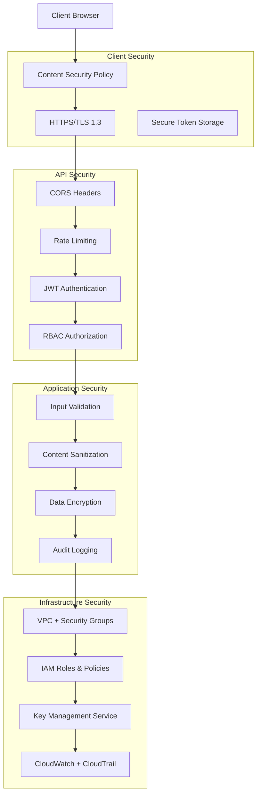

# 🔐 Security & Compliance Framework

## Table of Contents

1. [Security Overview](#security-overview)
2. [Authentication & Authorization](#authentication--authorization)
3. [Data Protection](#data-protection)
4. [Application Security](#application-security)
5. [Infrastructure Security](#infrastructure-security)
6. [Compliance Framework](#compliance-framework)
7. [Security Monitoring](#security-monitoring)
8. [Incident Response](#incident-response)
9. [Security Testing](#security-testing)

---

## Security Overview

### **Security Principles**

#### **Zero Trust Architecture**

- **Never Trust, Always Verify**: Every request authenticated and authorized
- **Least Privilege Access**: Minimal required permissions only
- **Assume Breach**: Design with assumption of compromise
- **Continuous Verification**: Real-time security validation

#### **Defense in Depth**

- **Multiple Security Layers**: Frontend, API, Backend, Database, Infrastructure
- **Fail Secure**: System fails to secure state when errors occur
- **Security by Design**: Security integrated from architecture phase
- **Continuous Monitoring**: Real-time threat detection and response

### **Security Architecture**



---

## Authentication & Authorization

### **JWT Authentication Implementation**

#### **Token Structure & Configuration**

```typescript
interface AccessTokenPayload {
  sub: string; // User ID (subject)
  email: string; // User email
  role: UserRole; // AUTHOR | EDITOR | PUBLISHER | READER
  permissions: Permission[]; // Role-specific permissions array
  iat: number; // Issued at timestamp
  exp: number; // Expires at timestamp (15 minutes)
  aud: string; // Audience: "ebook-platform-api"
  iss: string; // Issuer: "ebook-auth-service"
  jti: string; // JWT ID for tracking
}

interface RefreshTokenPayload {
  sub: string; // User ID
  tokenId: string; // Unique refresh token identifier
  iat: number; // Issued at timestamp
  exp: number; // Expires at timestamp (7 days)
  aud: string; // Audience: "ebook-platform-refresh"
  iss: string; // Issuer: "ebook-auth-service"
}

// JWT Configuration
const jwtConfig = {
  algorithm: 'RS256', // Asymmetric encryption
  accessTokenExpiry: 900, // 15 minutes
  refreshTokenExpiry: 604800, // 7 days
  keyRotationInterval: 2592000, // 30 days
  issuer: 'ebook-auth-service',
  audience: 'ebook-platform-api',
};
```

#### **Secure JWT Service**

```typescript
class JWTService {
  private privateKey: string;
  private publicKey: string;
  private keyVersion: string;

  constructor() {
    this.loadKeys();
  }

  private async loadKeys(): Promise<void> {
    // Load keys from AWS Secrets Manager or environment variables
    this.privateKey = await this.getSecret('JWT_PRIVATE_KEY');
    this.publicKey = await this.getSecret('JWT_PUBLIC_KEY');
    this.keyVersion = process.env.JWT_KEY_VERSION || 'v1';
  }

  generateTokens(user: User): TokenPair {
    const now = Math.floor(Date.now() / 1000);
    const accessTokenId = uuidv4();
    const refreshTokenId = uuidv4();

    const accessTokenPayload: AccessTokenPayload = {
      sub: user.userId,
      email: user.email,
      role: user.role,
      permissions: this.getUserPermissions(user.role),
      iat: now,
      exp: now + jwtConfig.accessTokenExpiry,
      aud: jwtConfig.audience,
      iss: jwtConfig.issuer,
      jti: accessTokenId,
    };

    const refreshTokenPayload: RefreshTokenPayload = {
      sub: user.userId,
      tokenId: refreshTokenId,
      iat: now,
      exp: now + jwtConfig.refreshTokenExpiry,
      aud: 'ebook-platform-refresh',
      iss: jwtConfig.issuer,
    };

    const accessToken = jwt.sign(accessTokenPayload, this.privateKey, {
      algorithm: 'RS256',
      keyid: this.keyVersion,
    });

    const refreshToken = jwt.sign(refreshTokenPayload, this.privateKey, {
      algorithm: 'RS256',
      keyid: this.keyVersion,
    });

    // Store refresh token hash for validation
    this.storeRefreshTokenHash(user.userId, refreshTokenId, refreshToken);

    return { accessToken, refreshToken };
  }

  verifyAccessToken(token: string): AccessTokenPayload {
    try {
      const decoded = jwt.verify(token, this.publicKey, {
        algorithms: ['RS256'],
        audience: jwtConfig.audience,
        issuer: jwtConfig.issuer,
      }) as AccessTokenPayload;

      // Check token blacklist
      if (this.isTokenBlacklisted(decoded.jti)) {
        throw new Error('Token has been revoked');
      }

      return decoded;
    } catch (error) {
      throw new AuthenticationError('Invalid or expired token');
    }
  }

  async refreshTokens(refreshToken: string): Promise<TokenPair> {
    const decoded = this.verifyRefreshToken(refreshToken);
    const user = await this.getUserById(decoded.sub);

    if (!user || !user.isActive) {
      throw new AuthenticationError('User account is inactive');
    }

    // Invalidate old refresh token
    await this.invalidateRefreshToken(decoded.tokenId);

    // Generate new token pair
    return this.generateTokens(user);
  }

  async invalidateAllUserTokens(userId: string): Promise<void> {
    // Add all user's tokens to blacklist
    await this.blacklistUserTokens(userId);

    // Remove stored refresh tokens
    await this.removeUserRefreshTokens(userId);
  }
}
```

### **Role-Based Access Control (RBAC)**

#### **Permission System**

```typescript
interface Permission {
  resource: string; // books, reviews, users, analytics
  action: string; // create, read, update, delete, publish
  conditions?: string[]; // ownership, state, scope restrictions
}

interface RoleDefinition {
  name: UserRole;
  description: string;
  permissions: Permission[];
  inherits?: UserRole[]; // Role inheritance
}

// Comprehensive permission definitions
const rolePermissions: Record<UserRole, Permission[]> = {
  AUTHOR: [
    // Book permissions
    { resource: 'books', action: 'create' },
    { resource: 'books', action: 'read', conditions: ['own'] },
    {
      resource: 'books',
      action: 'update',
      conditions: ['own', 'draft_or_revision'],
    },
    { resource: 'books', action: 'delete', conditions: ['own', 'draft_only'] },
    {
      resource: 'books',
      action: 'submit_for_editing',
      conditions: ['own', 'draft'],
    },
    {
      resource: 'books',
      action: 'withdraw_submission',
      conditions: ['own', 'submitted'],
    },

    // Analytics permissions
    { resource: 'analytics', action: 'read', conditions: ['own_books'] },

    // Profile permissions
    { resource: 'profile', action: 'read', conditions: ['own'] },
    { resource: 'profile', action: 'update', conditions: ['own'] },
  ],

  EDITOR: [
    // Book permissions
    {
      resource: 'books',
      action: 'read',
      conditions: ['submitted_or_assigned'],
    },
    {
      resource: 'books',
      action: 'update',
      conditions: ['assigned', 'editing_state'],
    },
    {
      resource: 'books',
      action: 'approve_for_publication',
      conditions: ['assigned'],
    },
    {
      resource: 'books',
      action: 'request_revisions',
      conditions: ['assigned'],
    },
    {
      resource: 'books',
      action: 'assign_to_self',
      conditions: ['unassigned', 'submitted'],
    },

    // Editorial permissions
    { resource: 'editorial_comments', action: 'create' },
    { resource: 'editorial_comments', action: 'update', conditions: ['own'] },
    { resource: 'editorial_feedback', action: 'create' },

    // Analytics permissions
    { resource: 'analytics', action: 'read', conditions: ['assigned_books'] },
  ],

  PUBLISHER: [
    // Book permissions
    {
      resource: 'books',
      action: 'read',
      conditions: ['ready_for_publication'],
    },
    {
      resource: 'books',
      action: 'publish',
      conditions: ['approved_by_editor'],
    },
    { resource: 'books', action: 'schedule_publication' },
    {
      resource: 'books',
      action: 'return_to_editing',
      conditions: ['pre_publication'],
    },

    // Publication management
    { resource: 'publication_schedule', action: 'create' },
    { resource: 'publication_schedule', action: 'update' },
    { resource: 'marketing_metadata', action: 'create' },
    { resource: 'marketing_metadata', action: 'update' },

    // Analytics permissions
    { resource: 'analytics', action: 'read', conditions: ['all_published'] },
    { resource: 'sales_data', action: 'read' },
  ],

  READER: [
    // Book permissions
    { resource: 'books', action: 'read', conditions: ['published_only'] },
    { resource: 'books', action: 'search' },
    { resource: 'books', action: 'browse' },

    // Review permissions
    { resource: 'reviews', action: 'create', conditions: ['published_books'] },
    { resource: 'reviews', action: 'read' },
    { resource: 'reviews', action: 'update', conditions: ['own'] },
    { resource: 'reviews', action: 'delete', conditions: ['own'] },
    {
      resource: 'reviews',
      action: 'report',
      conditions: ['inappropriate_content'],
    },

    // Reading history
    { resource: 'reading_history', action: 'create', conditions: ['own'] },
    { resource: 'reading_history', action: 'read', conditions: ['own'] },
    { resource: 'reading_progress', action: 'update', conditions: ['own'] },
  ],
};
```

#### **Authorization Middleware**

```typescript
class AuthorizationMiddleware {
  static authorize(requiredPermission: Permission) {
    return async (
      req: AuthenticatedRequest,
      res: Response,
      next: NextFunction
    ) => {
      try {
        const { userId, role, permissions } = req.user;

        // Check basic permission
        const hasPermission = permissions.some(
          (p) =>
            p.resource === requiredPermission.resource &&
            p.action === requiredPermission.action
        );

        if (!hasPermission) {
          return res.status(403).json({
            error: 'Insufficient permissions',
            required: requiredPermission,
            userRole: role,
          });
        }

        // Check conditions if specified
        if (requiredPermission.conditions) {
          const conditionsResult = await this.evaluateConditions(
            requiredPermission.conditions,
            req,
            userId
          );

          if (!conditionsResult.allowed) {
            return res.status(403).json({
              error: 'Permission conditions not met',
              details: conditionsResult.reason,
            });
          }
        }

        // Rate limiting per permission
        const rateLimitKey = `${userId}:${requiredPermission.resource}:${requiredPermission.action}`;
        const isAllowed = await this.checkRateLimit(
          rateLimitKey,
          requiredPermission
        );

        if (!isAllowed) {
          return res.status(429).json({
            error: 'Rate limit exceeded',
            retryAfter: this.getRateLimitWindow(requiredPermission),
          });
        }

        // Log access for audit
        await this.logAccessAttempt(userId, requiredPermission, 'GRANTED', req);

        next();
      } catch (error) {
        await this.logAccessAttempt(
          req.user?.userId,
          requiredPermission,
          'ERROR',
          req,
          error
        );
        return res.status(500).json({ error: 'Authorization error' });
      }
    };
  }

  private static async evaluateConditions(
    conditions: string[],
    req: AuthenticatedRequest,
    userId: string
  ): Promise<{ allowed: boolean; reason?: string }> {
    for (const condition of conditions) {
      switch (condition) {
        case 'own':
          if (!(await this.checkOwnership(req, userId))) {
            return { allowed: false, reason: 'Resource not owned by user' };
          }
          break;

        case 'draft_only':
          if (!(await this.checkBookState(req.params.bookId, 'DRAFT'))) {
            return { allowed: false, reason: 'Book must be in draft state' };
          }
          break;

        case 'published_only':
          if (!(await this.checkBookState(req.params.bookId, 'PUBLISHED'))) {
            return { allowed: false, reason: 'Book must be published' };
          }
          break;

        case 'assigned':
          if (!(await this.checkEditorAssignment(req.params.bookId, userId))) {
            return {
              allowed: false,
              reason: 'Book not assigned to this editor',
            };
          }
          break;

        default:
          return { allowed: false, reason: `Unknown condition: ${condition}` };
      }
    }

    return { allowed: true };
  }
}

// Usage in routes
app.post(
  '/api/v1/books',
  authenticate,
  AuthorizationMiddleware.authorize({ resource: 'books', action: 'create' }),
  BookController.createBook
);

app.put(
  '/api/v1/books/:bookId',
  authenticate,
  AuthorizationMiddleware.authorize({
    resource: 'books',
    action: 'update',
    conditions: ['own', 'draft_or_revision'],
  }),
  BookController.updateBook
);
```

---

## Data Protection

### **Encryption Strategy**

#### **Data Classification**

```typescript
enum DataClassification {
  PUBLIC = 'PUBLIC', // Published books, public reviews
  INTERNAL = 'INTERNAL', // User preferences, reading history
  CONFIDENTIAL = 'CONFIDENTIAL', // Draft content, editorial feedback
  RESTRICTED = 'RESTRICTED', // Credentials, PII, audit logs
}

interface DataClassificationRules {
  [DataClassification.PUBLIC]: {
    encryptionRequired: false;
    accessLogging: false;
    retentionPeriod: 'indefinite';
  };
  [DataClassification.INTERNAL]: {
    encryptionRequired: true;
    accessLogging: true;
    retentionPeriod: '7 years';
  };
  [DataClassification.CONFIDENTIAL]: {
    encryptionRequired: true;
    accessLogging: true;
    retentionPeriod: '7 years';
    additionalControls: ['access_approval', 'data_masking'];
  };
  [DataClassification.RESTRICTED]: {
    encryptionRequired: true;
    accessLogging: true;
    retentionPeriod: '10 years';
    additionalControls: [
      'multi_factor_auth',
      'privileged_access',
      'data_masking'
    ];
  };
}
```

#### **Encryption Implementation**

```typescript
class DataEncryptionService {
  private algorithm = 'aes-256-gcm';
  private keyDerivationRounds = 100000;

  // Application-level encryption for PII and sensitive data
  encryptSensitiveData(
    plaintext: string,
    classification: DataClassification
  ): EncryptedData {
    const key = this.deriveEncryptionKey(classification);
    const iv = crypto.randomBytes(16);
    const cipher = crypto.createCipher(this.algorithm, key);

    // Additional Authenticated Data for integrity
    const aad = Buffer.from(classification, 'utf8');
    cipher.setAAD(aad);

    let encrypted = cipher.update(plaintext, 'utf8', 'hex');
    encrypted += cipher.final('hex');

    const authTag = cipher.getAuthTag();

    return {
      encrypted,
      iv: iv.toString('hex'),
      authTag: authTag.toString('hex'),
      algorithm: this.algorithm,
      classification,
    };
  }

  decryptSensitiveData(encryptedData: EncryptedData): string {
    const key = this.deriveEncryptionKey(encryptedData.classification);
    const decipher = crypto.createDecipher(this.algorithm, key);

    decipher.setAuthTag(Buffer.from(encryptedData.authTag, 'hex'));
    decipher.setAAD(Buffer.from(encryptedData.classification, 'utf8'));

    let decrypted = decipher.update(encryptedData.encrypted, 'hex', 'utf8');
    decrypted += decipher.final('utf8');

    return decrypted;
  }

  private deriveEncryptionKey(classification: DataClassification): Buffer {
    const masterKey = process.env.MASTER_ENCRYPTION_KEY;
    const salt = crypto.createHash('sha256').update(classification).digest();

    return crypto.pbkdf2Sync(
      masterKey,
      salt,
      this.keyDerivationRounds,
      32,
      'sha512'
    );
  }
}

// Usage in data models
class UserService {
  private encryption = new DataEncryptionService();

  async createUser(userData: CreateUserRequest): Promise<string> {
    const user = {
      userId: uuidv4(),
      email: this.encryption.encryptSensitiveData(
        userData.email,
        DataClassification.RESTRICTED
      ),
      firstName: this.encryption.encryptSensitiveData(
        userData.firstName,
        DataClassification.CONFIDENTIAL
      ),
      lastName: this.encryption.encryptSensitiveData(
        userData.lastName,
        DataClassification.CONFIDENTIAL
      ),
      hashedPassword: await bcrypt.hash(userData.password, 12),
      role: userData.role,
      createdAt: new Date().toISOString(),
    };

    await this.dynamodb.put({
      TableName: process.env.USERS_TABLE,
      Item: user,
    });

    return user.userId;
  }
}
```

### **Key Management Strategy**

#### **AWS KMS Integration**

```typescript
class KeyManagementService {
  private kmsClient: KMS;

  constructor() {
    this.kmsClient = new KMS({ region: process.env.AWS_REGION });
  }

  async generateDataKey(
    keyId: string,
    keySpec: string = 'AES_256'
  ): Promise<DataKey> {
    const response = await this.kmsClient.generateDataKey({
      KeyId: keyId,
      KeySpec: keySpec,
      EncryptionContext: {
        service: 'ebook-platform',
        environment: process.env.ENVIRONMENT,
      },
    });

    return {
      plaintextKey: response.Plaintext,
      encryptedKey: response.CiphertextBlob,
      keyId: response.KeyId,
    };
  }

  async decryptDataKey(encryptedKey: Buffer): Promise<Buffer> {
    const response = await this.kmsClient.decrypt({
      CiphertextBlob: encryptedKey,
      EncryptionContext: {
        service: 'ebook-platform',
        environment: process.env.ENVIRONMENT,
      },
    });

    return response.Plaintext;
  }

  async rotateKey(keyId: string): Promise<void> {
    await this.kmsClient.enableKeyRotation({
      KeyId: keyId,
    });

    // Update application configuration to use new key version
    await this.updateApplicationKeys(keyId);
  }
}
```

### **Data Masking & Anonymization**

#### **PII Data Masking**

```typescript
class DataMaskingService {
  maskEmail(email: string): string {
    const [local, domain] = email.split('@');
    const maskedLocal =
      local.length > 2
        ? local.substring(0, 2) + '*'.repeat(local.length - 2)
        : '*'.repeat(local.length);
    return `${maskedLocal}@${domain}`;
  }

  maskName(name: string): string {
    return name.length > 2
      ? name.substring(0, 1) + '*'.repeat(name.length - 1)
      : '*'.repeat(name.length);
  }

  anonymizeUserData(user: User): AnonymizedUser {
    return {
      userId: this.generateAnonymousId(),
      email: this.maskEmail(user.email),
      firstName: this.maskName(user.firstName),
      lastName: this.maskName(user.lastName),
      role: user.role,
      createdAt: this.truncateToMonth(user.createdAt),
      // Remove all other identifying information
    };
  }

  // For audit logs and analytics
  sanitizeLogData(data: any): any {
    const sanitized = { ...data };
    const sensitiveFields = [
      'password',
      'email',
      'firstName',
      'lastName',
      'phone',
      'address',
      'ssn',
      'creditCard',
    ];

    const maskValue = (obj: any, path: string[] = []) => {
      Object.keys(obj).forEach((key) => {
        const currentPath = [...path, key];

        if (sensitiveFields.includes(key)) {
          obj[key] = '[MASKED]';
        } else if (typeof obj[key] === 'object' && obj[key] !== null) {
          maskValue(obj[key], currentPath);
        }
      });
    };

    maskValue(sanitized);
    return sanitized;
  }
}
```

---

## Application Security

### **Input Validation & Sanitization**

#### **Comprehensive Validation Framework**

```typescript
class SecurityValidationService {
  // XSS Prevention
  sanitizeInput(
    input: string,
    context: 'html' | 'attribute' | 'javascript' = 'html'
  ): string {
    switch (context) {
      case 'html':
        return DOMPurify.sanitize(input, {
          ALLOWED_TAGS: ['b', 'i', 'em', 'strong', 'p', 'br', 'ul', 'ol', 'li'],
          ALLOWED_ATTR: ['class'],
          FORBID_SCRIPT: true,
          FORBID_TAGS: ['script', 'object', 'embed', 'link', 'style'],
          FORBID_ATTR: ['onerror', 'onclick', 'onload', 'onmouseover'],
        });

      case 'attribute':
        return input.replace(/[<>"'&]/g, (match) => {
          const entityMap: Record<string, string> = {
            '<': '&lt;',
            '>': '&gt;',
            '"': '&quot;',
            "'": '&#x27;',
            '&': '&amp;',
          };
          return entityMap[match];
        });

      case 'javascript':
        // For JSON contexts, escape dangerous characters
        return input.replace(/[<>\u2028\u2029]/g, (match) => {
          const escapeMap: Record<string, string> = {
            '<': '\\u003c',
            '>': '\\u003e',
            '\u2028': '\\u2028',
            '\u2029': '\\u2029',
          };
          return escapeMap[match];
        });

      default:
        return input;
    }
  }

  // SQL Injection Prevention (for any future SQL usage)
  sanitizeForSQL(input: string): string {
    return input
      .replace(/['";\\]/g, '') // Remove dangerous characters
      .replace(
        /\b(SELECT|INSERT|UPDATE|DELETE|DROP|UNION|ALTER|CREATE|TRUNCATE)\b/gi,
        ''
      ); // Remove SQL keywords
  }

  // File Upload Security
  validateFileUpload(file: Express.Multer.File): ValidationResult {
    const allowedMimeTypes = [
      'image/jpeg',
      'image/png',
      'image/gif',
      'image/webp',
      'application/pdf',
      'text/plain',
    ];

    const maxFileSize = 10 * 1024 * 1024; // 10MB
    const allowedExtensions = [
      '.jpg',
      '.jpeg',
      '.png',
      '.gif',
      '.webp',
      '.pdf',
      '.txt',
    ];

    // Check MIME type
    if (!allowedMimeTypes.includes(file.mimetype)) {
      return {
        isValid: false,
        errors: ['File type not allowed'],
      };
    }

    // Check file size
    if (file.size > maxFileSize) {
      return {
        isValid: false,
        errors: ['File size exceeds 10MB limit'],
      };
    }

    // Check file extension
    const fileExtension = path.extname(file.originalname).toLowerCase();
    if (!allowedExtensions.includes(fileExtension)) {
      return {
        isValid: false,
        errors: ['File extension not allowed'],
      };
    }

    // Check for embedded malware (simplified check)
    if (this.containsSuspiciousContent(file.buffer)) {
      return {
        isValid: false,
        errors: ['File contains suspicious content'],
      };
    }

    return { isValid: true };
  }

  private containsSuspiciousContent(buffer: Buffer): boolean {
    const suspiciousPatterns = [
      /javascript:/gi,
      /<script/gi,
      /vbscript:/gi,
      /onload=/gi,
      /onerror=/gi,
    ];

    const content = buffer.toString('utf8');
    return suspiciousPatterns.some((pattern) => pattern.test(content));
  }
}
```

### **Content Security Policy (CSP)**

#### **Frontend CSP Implementation**

```typescript
// CSP configuration for React application
const contentSecurityPolicy = {
  directives: {
    'default-src': ["'self'"],
    'script-src': [
      "'self'",
      "'unsafe-inline'", // Required for React development
      'https://cdn.jsdelivr.net',
      // Add nonces for inline scripts in production
    ],
    'style-src': [
      "'self'",
      "'unsafe-inline'", // Required for styled-components
      'https://fonts.googleapis.com',
    ],
    'img-src': ["'self'", 'data:', 'https:', 'blob:'],
    'font-src': ["'self'", 'https://fonts.gstatic.com'],
    'connect-src': [
      "'self'",
      process.env.REACT_APP_API_URL,
      'wss://api.platform.com', // WebSocket connections
    ],
    'object-src': ["'none'"],
    'media-src': ["'self'"],
    'frame-src': ["'none'"],
    'base-uri': ["'self'"],
    'form-action': ["'self'"],
    'frame-ancestors': ["'none'"],
    'upgrade-insecure-requests': [],
  },
  reportUri: '/api/v1/security/csp-report',
};

// Apply CSP in React app
export const SecurityProvider: React.FC<{ children: React.ReactNode }> = ({
  children,
}) => {
  useEffect(() => {
    // Set CSP meta tag
    const cspString = Object.entries(contentSecurityPolicy.directives)
      .map(([directive, values]) => `${directive} ${values.join(' ')}`)
      .join('; ');

    const metaTag = document.createElement('meta');
    metaTag.httpEquiv = 'Content-Security-Policy';
    metaTag.content = cspString;
    document.head.appendChild(metaTag);

    return () => {
      document.head.removeChild(metaTag);
    };
  }, []);

  return <>{children}</>;
};
```

### **Rate Limiting & DDoS Protection**

#### **Multi-Layer Rate Limiting**

```typescript
class RateLimitingService {
  private redisClient: Redis;

  constructor() {
    this.redisClient = new Redis({
      host: process.env.REDIS_HOST,
      port: process.env.REDIS_PORT,
      password: process.env.REDIS_PASSWORD,
    });
  }

  // Sliding window rate limiter
  async checkRateLimit(
    identifier: string,
    limit: number,
    windowMs: number,
    context?: string
  ): Promise<RateLimitResult> {
    const now = Date.now();
    const window = Math.floor(now / windowMs);
    const key = `rate_limit:${identifier}:${context || 'default'}:${window}`;

    const pipeline = this.redisClient.pipeline();
    pipeline.incr(key);
    pipeline.expire(key, Math.ceil(windowMs / 1000));

    const results = await pipeline.exec();
    const current = results[0][1] as number;

    const allowed = current <= limit;
    const remaining = Math.max(0, limit - current);
    const resetTime = (window + 1) * windowMs;

    // Enhanced logging for security monitoring
    if (!allowed) {
      await this.logRateLimitViolation(identifier, context, current, limit);
    }

    return {
      allowed,
      remaining,
      resetTime,
      current,
      limit,
    };
  }

  // Progressive rate limiting (stricter limits for violators)
  async checkProgressiveRateLimit(
    userId: string,
    endpoint: string,
    userRole: string
  ): Promise<boolean> {
    const violationKey = `violations:${userId}`;
    const violations = parseInt(
      (await this.redisClient.get(violationKey)) || '0'
    );

    // Base limits by role
    const baseLimits = {
      READER: 100,
      AUTHOR: 200,
      EDITOR: 300,
      PUBLISHER: 500,
    };

    // Endpoint-specific multipliers
    const endpointMultipliers = {
      '/auth/login': 0.1, // 10% of base limit
      '/books': 1.0, // 100% of base limit
      '/reviews': 0.5, // 50% of base limit
      '/analytics': 2.0, // 200% of base limit
    };

    const baseLimit = baseLimits[userRole as keyof typeof baseLimits] || 100;
    const multiplier =
      endpointMultipliers[endpoint as keyof typeof endpointMultipliers] || 1.0;
    const adjustedLimit = Math.max(
      1,
      Math.floor(baseLimit * multiplier - violations * 5)
    );

    const result = await this.checkRateLimit(
      `user:${userId}`,
      adjustedLimit,
      60000, // 1 minute window
      endpoint
    );

    if (!result.allowed) {
      // Increment violation counter
      await this.redisClient.incr(violationKey);
      await this.redisClient.expire(violationKey, 3600); // Reset after 1 hour

      // Severe violations trigger temporary account suspension
      if (violations > 10) {
        await this.triggerAccountSuspension(
          userId,
          'EXCESSIVE_RATE_LIMIT_VIOLATIONS'
        );
      }
    }

    return result.allowed;
  }

  private async logRateLimitViolation(
    identifier: string,
    context: string,
    current: number,
    limit: number
  ): Promise<void> {
    const violation = {
      timestamp: new Date().toISOString(),
      identifier,
      context,
      current,
      limit,
      severity: current > limit * 2 ? 'HIGH' : 'MEDIUM',
    };

    // Log to CloudWatch
    console.warn('Rate limit violation:', violation);

    // Store in security events table for analysis
    await this.storeSecurityEvent('RATE_LIMIT_VIOLATION', violation);
  }
}
```

---

## Infrastructure Security

### **AWS Security Configuration**

#### **VPC Security Setup**

```typescript
// Terraform VPC security configuration
const vpcSecurityConfig = `
# VPC with security-first design
resource "aws_vpc" "ebook_platform" {
  cidr_block           = "10.0.0.0/16"
  enable_dns_hostnames = true
  enable_dns_support   = true
  
  tags = {
    Name        = "ebook-platform-vpc"
    Environment = var.environment
    Security    = "enabled"
  }
}

# Public subnets for ALB (Free Tier compatible)
resource "aws_subnet" "public" {
  count                   = 2
  vpc_id                  = aws_vpc.ebook_platform.id
  cidr_block              = "10.0.${count.index + 10}.0/24"
  availability_zone       = data.aws_availability_zones.available.names[count.index]
  map_public_ip_on_launch = true

  tags = {
    Name = "ebook-platform-public-${count.index + 1}"
    Type = "Public"
  }
}

# Security Groups with least privilege
resource "aws_security_group" "lambda" {
  name_prefix = "ebook-lambda-"
  vpc_id      = aws_vpc.ebook_platform.id
  description = "Security group for Lambda functions"

  # Outbound HTTPS to AWS services
  egress {
    description = "HTTPS to AWS services"
    from_port   = 443
    to_port     = 443
    protocol    = "tcp"
    cidr_blocks = ["0.0.0.0/0"]
  }

  # Outbound DNS
  egress {
    description = "DNS queries"
    from_port   = 53
    to_port     = 53
    protocol    = "udp"
    cidr_blocks = ["0.0.0.0/0"]
  }

  tags = {
    Name = "ebook-lambda-sg"
    Purpose = "Lambda function security"
  }
}

resource "aws_security_group" "api_gateway" {
  name_prefix = "ebook-api-gateway-"
  vpc_id      = aws_vpc.ebook_platform.id
  description = "Security group for API Gateway VPC endpoints"

  # Inbound HTTPS from internet
  ingress {
    description = "HTTPS from internet"
    from_port   = 443
    to_port     = 443
    protocol    = "tcp"
    cidr_blocks = ["0.0.0.0/0"]
  }

  tags = {
    Name = "ebook-api-gateway-sg"
    Purpose = "API Gateway security"
  }
}
`;
```

#### **IAM Security Policies**

```typescript
// Least privilege IAM policies
const iamSecurityPolicies = {
  // Lambda execution role with minimal permissions
  lambdaExecutionRole: {
    Version: '2012-10-17',
    Statement: [
      {
        Effect: 'Allow',
        Action: [
          'logs:CreateLogGroup',
          'logs:CreateLogStream',
          'logs:PutLogEvents',
        ],
        Resource: 'arn:aws:logs:*:*:*',
      },
      {
        Effect: 'Allow',
        Action: [
          'dynamodb:GetItem',
          'dynamodb:PutItem',
          'dynamodb:UpdateItem',
          'dynamodb:DeleteItem',
          'dynamodb:Query',
          'dynamodb:Scan',
        ],
        Resource: [
          'arn:aws:dynamodb:*:*:table/ebook-platform-*',
          'arn:aws:dynamodb:*:*:table/ebook-platform-*/index/*',
        ],
      },
      {
        Effect: 'Allow',
        Action: ['kms:Decrypt', 'kms:GenerateDataKey'],
        Resource: 'arn:aws:kms:*:*:key/*',
        Condition: {
          StringEquals: {
            'kms:ViaService': [
              'dynamodb.*.amazonaws.com',
              's3.*.amazonaws.com',
            ],
          },
        },
      },
    ],
  },

  // API Gateway role
  apiGatewayRole: {
    Version: '2012-10-17',
    Statement: [
      {
        Effect: 'Allow',
        Action: ['lambda:InvokeFunction'],
        Resource: 'arn:aws:lambda:*:*:function:ebook-*',
      },
      {
        Effect: 'Allow',
        Action: [
          'logs:CreateLogGroup',
          'logs:CreateLogStream',
          'logs:DescribeLogGroups',
          'logs:DescribeLogStreams',
          'logs:PutLogEvents',
          'logs:GetLogEvents',
          'logs:FilterLogEvents',
        ],
        Resource: 'arn:aws:logs:*:*:*',
      },
    ],
  },
};
```

### **Secrets Management**

#### **AWS Secrets Manager Integration**

```typescript
class SecretsManagerService {
  private secretsClient: SecretsManager;
  private cache = new Map<string, { value: any; expires: number }>();

  constructor() {
    this.secretsClient = new SecretsManager({
      region: process.env.AWS_REGION,
    });
  }

  async getSecret(secretName: string, useCache: boolean = true): Promise<any> {
    // Check cache first
    if (useCache && this.cache.has(secretName)) {
      const cached = this.cache.get(secretName)!;
      if (Date.now() < cached.expires) {
        return cached.value;
      }
    }

    try {
      const response = await this.secretsClient.getSecretValue({
        SecretId: secretName,
      });

      const secretValue = JSON.parse(response.SecretString || '{}');

      // Cache for 5 minutes
      if (useCache) {
        this.cache.set(secretName, {
          value: secretValue,
          expires: Date.now() + 5 * 60 * 1000,
        });
      }

      return secretValue;
    } catch (error) {
      console.error(`Failed to retrieve secret ${secretName}:`, error);
      throw new Error('Secret retrieval failed');
    }
  }

  async rotateSecret(secretName: string): Promise<void> {
    await this.secretsClient.rotateSecret({
      SecretId: secretName,
      ForceRotateSecrets: false,
    });

    // Clear from cache to force refresh
    this.cache.delete(secretName);

    // Notify application of secret rotation
    await this.notifySecretRotation(secretName);
  }

  // Environment-specific secret retrieval
  async getDatabaseCredentials(): Promise<DatabaseCredentials> {
    const env = process.env.ENVIRONMENT || 'dev';
    return await this.getSecret(`ebook-${env}-db-credentials`);
  }

  async getJWTKeys(): Promise<JWTKeys> {
    const env = process.env.ENVIRONMENT || 'dev';
    return await this.getSecret(`ebook-${env}-jwt-keys`);
  }

  async getEncryptionKeys(): Promise<EncryptionKeys> {
    const env = process.env.ENVIRONMENT || 'dev';
    return await this.getSecret(`ebook-${env}-encryption-keys`);
  }
}

// Usage in Lambda functions
export const handler = async (event: APIGatewayProxyEvent) => {
  const secretsManager = new SecretsManagerService();

  // Get database credentials securely
  const dbCredentials = await secretsManager.getDatabaseCredentials();

  // Initialize database connection with retrieved credentials
  const dbConnection = new DatabaseConnection(dbCredentials);

  // Process request...
};
```

---

## Compliance Framework

### **GDPR Compliance Implementation**

#### **Data Subject Rights**

```typescript
class GDPRComplianceService {
  // Article 15: Right of Access
  async exportUserData(userId: string): Promise<UserDataExport> {
    const userData = {
      personalData: await this.getPersonalData(userId),
      contentData: await this.getContentData(userId),
      technicalData: await this.getTechnicalData(userId),
      processingActivities: await this.getProcessingActivities(userId),
      dataRetention: await this.getDataRetentionInfo(userId),
    };

    return {
      userId,
      exportDate: new Date().toISOString(),
      format: 'JSON',
      data: userData,
      legalBasis: 'GDPR Article 15 - Right of Access',
      dataController: {
        name: 'Ebook Platform Ltd.',
        contact: 'privacy@ebookplatform.com',
      },
    };
  }

  // Article 17: Right to Erasure
  async deleteUserData(
    userId: string,
    reason: ErasureReason
  ): Promise<DeletionReport> {
    const deletionTasks = [
      this.deletePersonalData(userId),
      this.anonymizeUserContent(userId),
      this.removeFromMarketingLists(userId),
      this.deleteBackupData(userId),
      this.notifyThirdParties(userId),
    ];

    const results = await Promise.allSettled(deletionTasks);

    const report: DeletionReport = {
      userId,
      requestDate: new Date().toISOString(),
      completionDate: new Date().toISOString(),
      reason,
      deletedItems: results.map((result, index) => ({
        task: deletionTasks[index].name,
        status: result.status,
        details: result.status === 'fulfilled' ? result.value : result.reason,
      })),
      retainedData: await this.getRetainedDataReasons(userId),
      legalBasis: reason,
    };

    // Log for compliance audit
    await this.auditLogger.logGDPRAction('DATA_DELETION', userId, report);

    return report;
  }

  // Article 20: Right to Data Portability
  async generatePortableData(
    userId: string,
    format: 'JSON' | 'CSV' | 'XML' = 'JSON'
  ): Promise<string> {
    const userData = await this.exportUserData(userId);

    switch (format) {
      case 'JSON':
        return JSON.stringify(userData, null, 2);
      case 'CSV':
        return this.convertToCSV(userData);
      case 'XML':
        return this.convertToXML(userData);
      default:
        throw new Error('Unsupported export format');
    }
  }

  // Consent Management
  async recordConsent(
    userId: string,
    consentType: ConsentType,
    granted: boolean,
    legalBasis: string,
    metadata: ConsentMetadata
  ): Promise<void> {
    const consentRecord = {
      consentId: uuidv4(),
      userId,
      consentType,
      granted,
      legalBasis,
      timestamp: new Date().toISOString(),
      ipAddress: metadata.ipAddress,
      userAgent: metadata.userAgent,
      version: '1.0',
      source: metadata.source || 'web_application',
    };

    await this.dynamodb.put({
      TableName: process.env.CONSENT_TABLE,
      Item: consentRecord,
    });

    // Update user preferences
    await this.updateUserConsentPreferences(userId, consentType, granted);

    // Log for audit
    await this.auditLogger.logConsentChange(userId, consentRecord);
  }

  // Breach Notification (Article 33 & 34)
  async handleDataBreach(incident: SecurityIncident): Promise<BreachResponse> {
    const impact = await this.assessBreachImpact(incident);

    const response: BreachResponse = {
      incidentId: incident.incidentId,
      detectedAt: incident.timestamp,
      reportedAt: new Date().toISOString(),
      impact,
      notificationRequired: this.requiresNotification(impact),
      affectedDataSubjects: impact.affectedUsers.length,
    };

    // Article 33: Notify supervisory authority within 72 hours
    if (response.notificationRequired) {
      await this.notifyDataProtectionAuthority(incident, impact);

      // Article 34: Notify data subjects if high risk
      if (impact.riskLevel === 'HIGH') {
        await this.notifyAffectedUsers(impact.affectedUsers, incident);
      }
    }

    return response;
  }
}
```

### **SOC 2 Type II Implementation**

#### **Trust Services Criteria**

```typescript
class SOC2ComplianceService {
  // CC6: Logical and Physical Access Controls
  async runAccessControlsAudit(): Promise<AccessControlsReport> {
    const report = {
      auditDate: new Date().toISOString(),
      scope: 'All system components and data access',
      findings: [],
      controls: [],
    };

    // CC6.1: Logical Access Controls
    const userAccess = await this.auditUserAccess();
    report.controls.push({
      controlId: 'CC6.1',
      description: 'Logical access controls are implemented',
      status: userAccess.compliant ? 'EFFECTIVE' : 'DEFICIENT',
      evidence: userAccess.evidence,
      exceptions: userAccess.exceptions,
    });

    // CC6.2: Authentication and Authorization
    const authControls = await this.auditAuthenticationControls();
    report.controls.push({
      controlId: 'CC6.2',
      description: 'Authentication and authorization controls',
      status: authControls.compliant ? 'EFFECTIVE' : 'DEFICIENT',
      evidence: authControls.evidence,
    });

    // CC6.3: Network Controls
    const networkControls = await this.auditNetworkControls();
    report.controls.push({
      controlId: 'CC6.3',
      description: 'Network security controls',
      status: networkControls.compliant ? 'EFFECTIVE' : 'DEFICIENT',
      evidence: networkControls.evidence,
    });

    return report;
  }

  // CC7: System Operations
  async runSystemOperationsAudit(): Promise<SystemOperationsReport> {
    return {
      auditDate: new Date().toISOString(),
      availability: await this.measureSystemAvailability(),
      monitoring: await this.auditMonitoringControls(),
      changeManagement: await this.auditChangeManagement(),
      backupAndRecovery: await this.auditBackupProcedures(),
    };
  }

  // CC8: Change Management
  async runChangeManagementAudit(): Promise<ChangeManagementReport> {
    const changes = await this.getSystemChanges(
      new Date(Date.now() - 90 * 24 * 60 * 60 * 1000), // Last 90 days
      new Date()
    );

    return {
      auditDate: new Date().toISOString(),
      totalChanges: changes.length,
      authorizedChanges: changes.filter((c) => c.authorized).length,
      emergencyChanges: changes.filter((c) => c.emergency).length,
      failedChanges: changes.filter((c) => c.failed).length,
      complianceScore: this.calculateChangeComplianceScore(changes),
      recommendations: this.generateChangeManagementRecommendations(changes),
    };
  }

  // Automated evidence collection
  async collectSOC2Evidence(): Promise<EvidencePackage> {
    const evidence = {
      accessReports: await this.generateAccessReports(),
      securityLogs: await this.exportSecurityLogs(),
      systemConfigurations: await this.exportSystemConfigurations(),
      monitoringData: await this.exportMonitoringData(),
      incidentReports: await this.exportIncidentReports(),
      backupVerifications: await this.exportBackupVerifications(),
    };

    return {
      collectionDate: new Date().toISOString(),
      period: this.getCurrentAuditPeriod(),
      evidence,
      integrity: await this.calculateEvidenceIntegrity(evidence),
    };
  }
}
```

---

## Security Monitoring

### **Comprehensive Security Monitoring**

#### **Security Event Monitoring**

```typescript
class SecurityMonitoringService {
  private cloudWatch: CloudWatch;
  private eventProcessor: SecurityEventProcessor;

  constructor() {
    this.cloudWatch = new CloudWatch({ region: process.env.AWS_REGION });
    this.eventProcessor = new SecurityEventProcessor();
  }

  async monitorSecurityEvents(): Promise<void> {
    const monitors = [
      this.monitorFailedLogins(),
      this.monitorUnauthorizedAccess(),
      this.monitorSuspiciousActivity(),
      this.monitorDataAccess(),
      this.monitorSystemAnomalies(),
    ];

    await Promise.all(monitors);
  }

  private async monitorFailedLogins(): Promise<void> {
    const threshold = 5; // 5 failed attempts
    const timeWindow = 15 * 60 * 1000; // 15 minutes

    const query = {
      logGroupName: '/aws/lambda/auth-service',
      startTime: Date.now() - timeWindow,
      endTime: Date.now(),
      queryString: `
        fields @timestamp, userId, sourceIp, userAgent
        | filter @message like /FAILED_LOGIN/
        | stats count() by userId, sourceIp
        | sort count() desc
      `,
    };

    const results = await this.executeCloudWatchQuery(query);

    for (const result of results) {
      if (result.count > threshold) {
        await this.triggerSecurityAlert({
          type: 'EXCESSIVE_FAILED_LOGINS',
          severity: 'HIGH',
          userId: result.userId,
          sourceIp: result.sourceIp,
          count: result.count,
          timeWindow: timeWindow / 1000 / 60, // minutes
        });
      }
    }
  }

  private async monitorUnauthorizedAccess(): Promise<void> {
    const unauthorizedPatterns = [
      'INSUFFICIENT_PERMISSIONS',
      'UNAUTHORIZED_ACCESS',
      'FORBIDDEN_RESOURCE_ACCESS',
      'INVALID_TOKEN',
    ];

    for (const pattern of unauthorizedPatterns) {
      const count = await this.countRecentEvents(pattern, 5 * 60 * 1000); // 5 minutes

      if (count > 10) {
        await this.triggerSecurityAlert({
          type: 'UNAUTHORIZED_ACCESS_SPIKE',
          severity: 'MEDIUM',
          pattern,
          count,
          timeWindow: 5,
        });
      }
    }
  }

  private async monitorSuspiciousActivity(): Promise<void> {
    const suspiciousIndicators = await this.detectSuspiciousPatterns();

    for (const indicator of suspiciousIndicators) {
      await this.triggerSecurityAlert({
        type: 'SUSPICIOUS_ACTIVITY',
        severity: this.calculateSeverity(indicator),
        details: indicator,
      });
    }
  }

  private async detectSuspiciousPatterns(): Promise<SuspiciousActivity[]> {
    const activities: SuspiciousActivity[] = [];

    // Unusual access patterns
    const unusualAccess = await this.detectUnusualAccessPatterns();
    activities.push(...unusualAccess);

    // Geographic anomalies
    const geoAnomalies = await this.detectGeographicAnomalies();
    activities.push(...geoAnomalies);

    // Time-based anomalies
    const timeAnomalies = await this.detectTimeBasedAnomalies();
    activities.push(...timeAnomalies);

    // Volume anomalies
    const volumeAnomalies = await this.detectVolumeAnomalies();
    activities.push(...volumeAnomalies);

    return activities;
  }
}
```

### **Automated Threat Detection**

#### **Machine Learning-Based Anomaly Detection**

```typescript
class ThreatDetectionService {
  private anomalyDetector: AnomalyDetector;

  constructor() {
    this.anomalyDetector = new AnomalyDetector();
  }

  async analyzeUserBehavior(userId: string): Promise<ThreatAssessment> {
    // Collect user activity data
    const activityData = await this.getUserActivityData(userId, 30); // 30 days

    // Extract behavioral features
    const features = this.extractBehavioralFeatures(activityData);

    // Run anomaly detection
    const anomalyScore = await this.anomalyDetector.calculateScore(features);

    // Determine threat level
    const threatLevel = this.classifyThreatLevel(anomalyScore);

    // Generate detailed assessment
    const assessment: ThreatAssessment = {
      userId,
      analysisDate: new Date().toISOString(),
      anomalyScore,
      threatLevel,
      riskFactors: this.identifyRiskFactors(features, anomalyScore),
      recommendations: this.generateRecommendations(threatLevel, features),
      confidence: this.calculateConfidence(features, anomalyScore),
    };

    // Trigger alerts for high-risk assessments
    if (threatLevel >= ThreatLevel.HIGH) {
      await this.triggerThreatAlert(assessment);
    }

    return assessment;
  }

  private extractBehavioralFeatures(
    activityData: UserActivity[]
  ): BehavioralFeatures {
    return {
      // Time-based patterns
      loginTimes: activityData
        .filter((a) => a.type === 'LOGIN')
        .map((a) => new Date(a.timestamp).getHours()),

      // Geographic patterns
      locations: [...new Set(activityData.map((a) => a.location))],

      // Device patterns
      devices: [...new Set(activityData.map((a) => a.device))],

      // Access patterns
      accessedResources: activityData
        .filter((a) => a.type === 'RESOURCE_ACCESS')
        .map((a) => a.resource),

      // Volume patterns
      dailyActivity: this.aggregateDailyActivity(activityData),

      // Error patterns
      errorRate: this.calculateErrorRate(activityData),

      // Session patterns
      sessionDurations: this.extractSessionDurations(activityData),
    };
  }

  private classifyThreatLevel(anomalyScore: number): ThreatLevel {
    if (anomalyScore >= 0.8) return ThreatLevel.CRITICAL;
    if (anomalyScore >= 0.6) return ThreatLevel.HIGH;
    if (anomalyScore >= 0.4) return ThreatLevel.MEDIUM;
    return ThreatLevel.LOW;
  }

  private identifyRiskFactors(
    features: BehavioralFeatures,
    anomalyScore: number
  ): RiskFactor[] {
    const riskFactors: RiskFactor[] = [];

    // Unusual login times
    const normalHours = new Set([8, 9, 10, 11, 12, 13, 14, 15, 16, 17, 18]);
    const unusualLogins = features.loginTimes.filter(
      (h) => !normalHours.has(h)
    );
    if (unusualLogins.length > features.loginTimes.length * 0.3) {
      riskFactors.push({
        type: 'UNUSUAL_LOGIN_TIMES',
        severity: 'MEDIUM',
        description: 'User logging in during unusual hours',
        evidence: unusualLogins,
      });
    }

    // Multiple locations
    if (features.locations.length > 3) {
      riskFactors.push({
        type: 'MULTIPLE_LOCATIONS',
        severity: 'HIGH',
        description: 'Access from multiple geographic locations',
        evidence: features.locations,
      });
    }

    // High error rate
    if (features.errorRate > 0.1) {
      riskFactors.push({
        type: 'HIGH_ERROR_RATE',
        severity: 'MEDIUM',
        description: 'Unusually high error rate in user activities',
        evidence: { errorRate: features.errorRate },
      });
    }

    return riskFactors;
  }
}
```

---

This comprehensive security framework ensures enterprise-grade protection while maintaining AWS Free Tier compliance. The implementation covers authentication, authorization, data protection, application security, infrastructure security, compliance, monitoring, and threat detection.

---

## Related Documentation

- **[Requirements](./01-REQUIREMENTS.md)**: Comprehensive project requirements
- **[Architecture](./02-ARCHITECTURE.md)**: System design and component architecture
- **[Implementation](./03-IMPLEMENTATION.md)**: Development roadmap and tasks
- **[API Specification](./05-API.md)**: Complete REST API documentation
- **[Data Model](./06-DATA.md)**: Database design and access patterns
- **[Development](./07-DEVELOPMENT.md)**: Local development setup and workflow
- **[Deployment](./08-DEPLOYMENT.md)**: Infrastructure deployment and management
