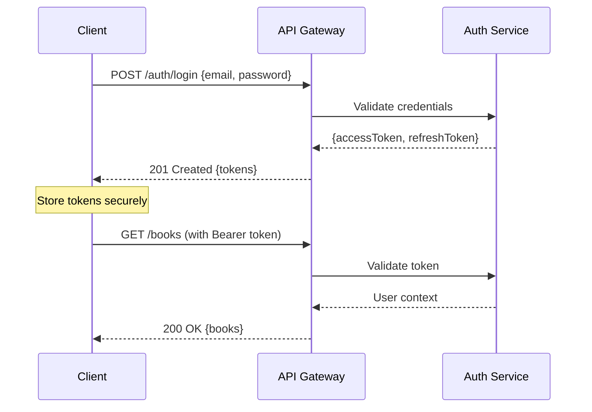

# 🔌 API Specification - Ebook Publishing Platform

## Table of Contents

1. [API Overview](#api-overview)
2. [Authentication](#authentication)
3. [Error Handling](#error-handling)
4. [Rate Limiting](#rate-limiting)
5. [Auth Endpoints](#auth-endpoints)
6. [Book Management](#book-management)
7. [Review System](#review-system)
8. [User Management](#user-management)
9. [Analytics](#analytics-endpoints)
10. [WebSocket API](#websocket-api)

---

## API Overview

### **Base Information**

- **Base URL**: `https://api.ebook-platform.com/v1`
- **Protocol**: HTTPS only
- **Authentication**: Bearer JWT tokens
- **Content Type**: `application/json`
- **API Version**: v1.0

### **HTTP Status Codes**

| Code | Description           | Usage                                           |
| ---- | --------------------- | ----------------------------------------------- |
| 200  | OK                    | Successful GET, PUT, PATCH                      |
| 201  | Created               | Successful POST                                 |
| 204  | No Content            | Successful DELETE                               |
| 400  | Bad Request           | Invalid request data                            |
| 401  | Unauthorized          | Missing or invalid authentication               |
| 403  | Forbidden             | Insufficient permissions                        |
| 404  | Not Found             | Resource not found                              |
| 409  | Conflict              | Resource conflict (duplicate, version mismatch) |
| 429  | Too Many Requests     | Rate limit exceeded                             |
| 500  | Internal Server Error | Server error                                    |

### **Request Headers**

```http
Content-Type: application/json
Authorization: Bearer <jwt_token>
X-Request-ID: <uuid>
User-Agent: <client_info>
```

### **Response Format**

```typescript
// Success Response
interface SuccessResponse<T> {
  data: T;
  meta?: {
    total?: number;
    page?: number;
    pageSize?: number;
    hasMore?: boolean;
  };
  timestamp: string;
  requestId: string;
}

// Error Response
interface ErrorResponse {
  error: {
    code: string;
    message: string;
    details?: any;
  };
  timestamp: string;
  requestId: string;
}
```

---

## Authentication

### **JWT Token Structure**

```typescript
interface AccessToken {
  sub: string; // User ID
  email: string; // User email
  role: string; // User role
  permissions: string[]; // User permissions
  iat: number; // Issued at
  exp: number; // Expires at (15 minutes)
  aud: string; // Audience
  iss: string; // Issuer
}
```

### **Authentication Flow**



---

## Error Handling

### **Error Codes**

```typescript
enum ErrorCodes {
  // Authentication errors
  INVALID_CREDENTIALS = 'AUTH_001',
  TOKEN_EXPIRED = 'AUTH_002',
  TOKEN_INVALID = 'AUTH_003',
  INSUFFICIENT_PERMISSIONS = 'AUTH_004',

  // Validation errors
  INVALID_INPUT = 'VAL_001',
  MISSING_REQUIRED_FIELD = 'VAL_002',
  INVALID_FORMAT = 'VAL_003',

  // Resource errors
  RESOURCE_NOT_FOUND = 'RES_001',
  RESOURCE_CONFLICT = 'RES_002',
  RESOURCE_LOCKED = 'RES_003',

  // Rate limiting
  RATE_LIMIT_EXCEEDED = 'RATE_001',

  // Server errors
  INTERNAL_ERROR = 'SRV_001',
  SERVICE_UNAVAILABLE = 'SRV_002',
}
```

### **Error Response Examples**

```json
// Validation Error
{
  "error": {
    "code": "VAL_001",
    "message": "Invalid input data",
    "details": [
      {
        "field": "title",
        "message": "Title is required"
      },
      {
        "field": "email",
        "message": "Invalid email format"
      }
    ]
  },
  "timestamp": "2024-01-15T10:30:00Z",
  "requestId": "req_abc123"
}

// Permission Error
{
  "error": {
    "code": "AUTH_004",
    "message": "Insufficient permissions",
    "details": {
      "required": "books:update",
      "userRole": "READER"
    }
  },
  "timestamp": "2024-01-15T10:30:00Z",
  "requestId": "req_def456"
}
```

---

## Rate Limiting

### **Rate Limits by Role**

| Role      | Requests/Minute | Burst Limit |
| --------- | --------------- | ----------- |
| READER    | 100             | 150         |
| AUTHOR    | 200             | 300         |
| EDITOR    | 300             | 450         |
| PUBLISHER | 500             | 750         |

### **Rate Limit Headers**

```http
X-RateLimit-Limit: 200
X-RateLimit-Remaining: 195
X-RateLimit-Reset: 1642248600
X-RateLimit-Window: 60
```

---

## Auth Endpoints

### **POST /auth/login**

Authenticate user and receive JWT tokens.

#### **Request**

```typescript
interface LoginRequest {
  email: string; // User email
  password: string; // User password
  remember?: boolean; // Extend refresh token expiry
}
```

#### **Response**

```typescript
interface LoginResponse {
  user: {
    userId: string;
    email: string;
    firstName: string;
    lastName: string;
    role: UserRole;
  };
  tokens: {
    accessToken: string;
    refreshToken: string;
    expiresIn: number;
  };
}
```

#### **Example**

```bash
curl -X POST "https://api.ebook-platform.com/v1/auth/login" \
  -H "Content-Type: application/json" \
  -d '{
    "email": "author@example.com",
    "password": "securepassword123"
  }'
```

---

### **POST /auth/register**

Register a new user account.

#### **Request**

```typescript
interface RegisterRequest {
  email: string;
  password: string; // Min 8 chars, complexity required
  firstName: string;
  lastName: string;
  role: 'AUTHOR' | 'EDITOR' | 'PUBLISHER' | 'READER';
}
```

#### **Response**

```typescript
interface RegisterResponse {
  userId: string;
  message: string;
  emailVerificationRequired: boolean;
}
```

---

### **POST /auth/refresh**

Refresh access token using refresh token.

#### **Request**

```typescript
interface RefreshRequest {
  refreshToken: string;
}
```

#### **Response**

```typescript
interface RefreshResponse {
  accessToken: string;
  refreshToken: string; // New refresh token (rotation)
  expiresIn: number;
}
```

---

### **POST /auth/logout**

Invalidate user session and tokens.

#### **Request**

```bash
curl -X POST "https://api.ebook-platform.com/v1/auth/logout" \
  -H "Authorization: Bearer <access_token>"
```

#### **Response**

```typescript
interface LogoutResponse {
  message: string;
}
```

---

## Book Management

### **GET /books**

Retrieve books based on user role and permissions.

#### **Query Parameters**

```typescript
interface BooksQuery {
  status?:
    | 'DRAFT'
    | 'SUBMITTED_FOR_EDITING'
    | 'READY_FOR_PUBLICATION'
    | 'PUBLISHED';
  genre?: string;
  author?: string;
  search?: string; // Full-text search
  page?: number; // Default: 1
  pageSize?: number; // Default: 20, Max: 100
  sortBy?: 'createdAt' | 'updatedAt' | 'title' | 'rating';
  sortOrder?: 'asc' | 'desc';
}
```

#### **Response**

```typescript
interface BooksResponse {
  books: Book[];
  meta: {
    total: number;
    page: number;
    pageSize: number;
    hasMore: boolean;
  };
}

interface Book {
  bookId: string;
  title: string;
  description: string;
  author: {
    userId: string;
    name: string;
  };
  status: BookStatus;
  genre: string;
  tags: string[];
  coverImageUrl?: string;
  wordCount: number;
  averageRating?: number;
  reviewCount: number;
  createdAt: string;
  updatedAt: string;
  publishedAt?: string;
}
```

#### **Role-based Filtering**

- **AUTHOR**: Own books in any state
- **EDITOR**: Books in SUBMITTED_FOR_EDITING state
- **PUBLISHER**: Books in READY_FOR_PUBLICATION state
- **READER**: Only PUBLISHED books

#### **Example**

```bash
curl -X GET "https://api.ebook-platform.com/v1/books?status=PUBLISHED&genre=fiction&page=1&pageSize=20" \
  -H "Authorization: Bearer <access_token>"
```

---

### **POST /books**

Create a new book (Authors only).

#### **Request**

```typescript
interface CreateBookRequest {
  title: string; // Max 200 chars
  description?: string; // Max 2000 chars
  content: string; // Max 2MB
  genre: string;
  tags?: string[]; // Max 10 tags
}
```

#### **Response**

```typescript
interface CreateBookResponse {
  bookId: string;
  title: string;
  status: 'DRAFT';
  createdAt: string;
}
```

#### **Example**

```bash
curl -X POST "https://api.ebook-platform.com/v1/books" \
  -H "Content-Type: application/json" \
  -H "Authorization: Bearer <access_token>" \
  -d '{
    "title": "My New Book",
    "description": "An exciting adventure story",
    "content": "Chapter 1: The Beginning...",
    "genre": "fiction",
    "tags": ["adventure", "young-adult"]
  }'
```

---

### **GET /books/{bookId}**

Retrieve specific book details.

#### **Response**

```typescript
interface BookDetailResponse extends Book {
  content?: string; // Only if user has read permission
  editorialComments?: EditorialComment[]; // Only for authors/editors
  workflowHistory?: WorkflowEntry[]; // Only for privileged users
}

interface EditorialComment {
  commentId: string;
  editorId: string;
  editorName: string;
  comment: string;
  createdAt: string;
}

interface WorkflowEntry {
  timestamp: string;
  fromStatus: BookStatus;
  toStatus: BookStatus;
  actionBy: string;
  action: string;
  comments?: string;
}
```

#### **Access Rules**

- **Authors**: Full access to own books
- **Editors**: Full access to assigned/submitted books
- **Publishers**: Access to ready-for-publication books
- **Readers**: Access to published books only (no editorial data)

---

### **PUT /books/{bookId}**

Update book content and metadata.

#### **Request**

```typescript
interface UpdateBookRequest {
  title?: string;
  description?: string;
  content?: string;
  genre?: string;
  tags?: string[];
  version: number; // For optimistic concurrency
}
```

#### **Authorization**

- **Authors**: Can update own books in DRAFT state only
- **Editors**: Can update books in SUBMITTED_FOR_EDITING state

---

### **POST /books/{bookId}/transition**

Transition book to next state in workflow.

#### **Request**

```typescript
interface TransitionRequest {
  action:
    | 'SUBMIT_FOR_EDITING'
    | 'APPROVE_FOR_PUBLICATION'
    | 'PUBLISH'
    | 'REQUEST_REVISIONS'
    | 'WITHDRAW';
  comments?: string;
  assignee?: string; // For editor assignment
}
```

#### **Workflow Actions by Role**

- **AUTHOR**: `SUBMIT_FOR_EDITING`, `WITHDRAW`
- **EDITOR**: `APPROVE_FOR_PUBLICATION`, `REQUEST_REVISIONS`
- **PUBLISHER**: `PUBLISH`

#### **Response**

```typescript
interface TransitionResponse {
  bookId: string;
  previousStatus: BookStatus;
  newStatus: BookStatus;
  transitionedAt: string;
  notifications?: {
    sent: string[]; // List of notified user IDs
  };
}
```

---

### **DELETE /books/{bookId}**

Delete a book (Authors only, DRAFT state only).

#### **Response**

```typescript
interface DeleteBookResponse {
  bookId: string;
  message: string;
  deletedAt: string;
}
```

---

## Review System

### **GET /books/{bookId}/reviews**

Retrieve reviews for a published book.

#### **Query Parameters**

```typescript
interface ReviewsQuery {
  rating?: number; // Filter by specific rating
  sortBy?: 'createdAt' | 'rating' | 'helpful';
  sortOrder?: 'asc' | 'desc';
  page?: number;
  pageSize?: number;
}
```

#### **Response**

```typescript
interface ReviewsResponse {
  reviews: Review[];
  summary: {
    averageRating: number;
    totalReviews: number;
    ratingDistribution: {
      1: number;
      2: number;
      3: number;
      4: number;
      5: number;
    };
  };
}

interface Review {
  reviewId: string;
  userId: string;
  userName: string; // First name only for privacy
  rating: number; // 1-5 stars
  comment: string;
  helpful: number; // Helpful votes count
  createdAt: string;
  updatedAt: string;
}
```

---

### **POST /books/{bookId}/reviews**

Create a review for a published book (Readers only).

#### **Request**

```typescript
interface CreateReviewRequest {
  rating: number; // 1-5 (required)
  comment: string; // Max 2000 chars
  anonymous?: boolean; // Hide reviewer name
}
```

#### **Validation**

- User can only review each book once
- Book must be in PUBLISHED state
- Rating must be 1-5
- Comment undergoes content moderation

#### **Response**

```typescript
interface CreateReviewResponse {
  reviewId: string;
  rating: number;
  comment: string;
  createdAt: string;
  moderationStatus: 'APPROVED' | 'PENDING' | 'FLAGGED';
}
```

---

### **PUT /reviews/{reviewId}**

Update own review.

#### **Request**

```typescript
interface UpdateReviewRequest {
  rating?: number;
  comment?: string;
  version: number;
}
```

#### **Authorization**

- Users can only update their own reviews
- Reviews can be updated within 30 days of creation

---

### **DELETE /reviews/{reviewId}**

Delete own review.

#### **Authorization**

- Users can only delete their own reviews

---

### **POST /reviews/{reviewId}/helpful**

Mark a review as helpful.

#### **Request**

```typescript
interface MarkHelpfulRequest {
  helpful: boolean;
}
```

#### **Rules**

- Users can only vote once per review
- Cannot vote on own reviews

---

## User Management

### **GET /users/profile**

Get current user's profile.

#### **Response**

```typescript
interface UserProfile {
  userId: string;
  email: string;
  firstName: string;
  lastName: string;
  role: UserRole;
  preferences: {
    notifications: NotificationPreferences;
    privacy: PrivacySettings;
  };
  stats: {
    booksCreated?: number; // Authors
    booksEdited?: number; // Editors
    booksPublished?: number; // Publishers
    reviewsWritten?: number; // Readers
  };
  createdAt: string;
  lastLoginAt: string;
}
```

---

### **PUT /users/profile**

Update user profile.

#### **Request**

```typescript
interface UpdateProfileRequest {
  firstName?: string;
  lastName?: string;
  preferences?: {
    notifications?: NotificationPreferences;
    privacy?: PrivacySettings;
  };
  version: number;
}
```

---

### **GET /users/data-export**

Export user's personal data (GDPR compliance).

#### **Query Parameters**

```typescript
interface DataExportQuery {
  format?: 'JSON' | 'CSV' | 'XML';
}
```

#### **Response**

```typescript
interface DataExportResponse {
  exportId: string;
  status: 'PROCESSING' | 'COMPLETED' | 'FAILED';
  downloadUrl?: string;
  expiresAt?: string;
  estimatedCompletionTime?: string;
}
```

---

### **DELETE /users/profile**

Delete user account and personal data.

#### **Request**

```typescript
interface DeleteAccountRequest {
  confirmation: string; // Must be "DELETE_MY_ACCOUNT"
  reason?: string;
  password: string; // Confirm with password
}
```

---

## Analytics Endpoints

### **GET /analytics/books/{bookId}**

Get analytics for a specific book.

#### **Query Parameters**

```typescript
interface BookAnalyticsQuery {
  period?: '7d' | '30d' | '90d' | '1y';
  metrics?: 'views' | 'downloads' | 'reviews' | 'ratings' | 'all';
}
```

#### **Response**

```typescript
interface BookAnalytics {
  bookId: string;
  period: string;
  metrics: {
    views: {
      total: number;
      daily: Array<{ date: string; count: number }>;
    };
    downloads: {
      total: number;
      daily: Array<{ date: string; count: number }>;
    };
    reviews: {
      total: number;
      averageRating: number;
      daily: Array<{ date: string; count: number }>;
    };
    demographics: {
      countries: Array<{ country: string; percentage: number }>;
      ageGroups: Array<{ ageGroup: string; percentage: number }>;
    };
  };
  generatedAt: string;
}
```

#### **Authorization**

- **Authors**: Can view analytics for their own books
- **Publishers**: Can view analytics for all published books
- **Editors**: Can view analytics for books they've edited

---

### **GET /analytics/users/dashboard**

Get user-specific analytics dashboard.

#### **Response (varies by role)**

```typescript
// Author Dashboard
interface AuthorDashboard {
  totalBooks: number;
  publishedBooks: number;
  totalViews: number;
  totalDownloads: number;
  averageRating: number;
  recentActivity: Activity[];
  topPerformingBooks: Book[];
}

// Publisher Dashboard
interface PublisherDashboard {
  totalBooksPublished: number;
  pendingApprovals: number;
  totalRevenue: number;
  topGenres: Array<{ genre: string; count: number }>;
  publishingPipeline: {
    submitted: number;
    inReview: number;
    approved: number;
    scheduled: number;
  };
}
```

---

## WebSocket API

### **Connection**

```
wss://ws.ebook-platform.com/v1/ws
```

### **Authentication**

```typescript
// Send authentication message after connection
{
  "type": "auth",
  "token": "jwt_access_token"
}

// Response
{
  "type": "auth_response",
  "status": "success",
  "userId": "user_123"
}
```

### **Real-time Collaboration**

```typescript
// Subscribe to book editing session
{
  "type": "subscribe",
  "resource": "book",
  "resourceId": "book_456",
  "action": "editing"
}

// Receive real-time edits
{
  "type": "book_edit",
  "bookId": "book_456",
  "userId": "user_789",
  "operation": {
    "type": "insert",
    "position": 1250,
    "content": "new text",
    "timestamp": "2024-01-15T10:30:00Z"
  }
}

// Send edit operation
{
  "type": "book_edit",
  "bookId": "book_456",
  "operation": {
    "type": "delete",
    "position": 1250,
    "length": 10,
    "timestamp": "2024-01-15T10:30:05Z"
  }
}
```

### **Notifications**

```typescript
// Real-time notification
{
  "type": "notification",
  "notificationId": "notif_123",
  "title": "Book Approved",
  "message": "Your book 'My Novel' has been approved for publication",
  "data": {
    "bookId": "book_456",
    "action": "view_book"
  },
  "timestamp": "2024-01-15T10:30:00Z"
}
```

### **Presence Tracking**

```typescript
// User joined editing session
{
  "type": "presence",
  "action": "user_joined",
  "bookId": "book_456",
  "userId": "user_789",
  "userName": "Editor Smith"
}

// User left editing session
{
  "type": "presence",
  "action": "user_left",
  "bookId": "book_456",
  "userId": "user_789"
}
```

---

## API Usage Examples

### **Complete Book Publishing Flow**

```bash
# 1. Author creates a book
curl -X POST "https://api.ebook-platform.com/v1/books" \
  -H "Authorization: Bearer $AUTHOR_TOKEN" \
  -H "Content-Type: application/json" \
  -d '{
    "title": "The Great Adventure",
    "description": "An epic journey through unknown lands",
    "content": "Chapter 1: The Beginning...",
    "genre": "adventure",
    "tags": ["adventure", "fantasy"]
  }'

# Response: {"bookId": "book_123", "status": "DRAFT", ...}

# 2. Author submits for editing
curl -X POST "https://api.ebook-platform.com/v1/books/book_123/transition" \
  -H "Authorization: Bearer $AUTHOR_TOKEN" \
  -H "Content-Type: application/json" \
  -d '{
    "action": "SUBMIT_FOR_EDITING",
    "comments": "Ready for editorial review"
  }'

# 3. Editor approves for publication
curl -X POST "https://api.ebook-platform.com/v1/books/book_123/transition" \
  -H "Authorization: Bearer $EDITOR_TOKEN" \
  -H "Content-Type: application/json" \
  -d '{
    "action": "APPROVE_FOR_PUBLICATION",
    "comments": "Great story, ready to publish"
  }'

# 4. Publisher publishes the book
curl -X POST "https://api.ebook-platform.com/v1/books/book_123/transition" \
  -H "Authorization: Bearer $PUBLISHER_TOKEN" \
  -H "Content-Type: application/json" \
  -d '{
    "action": "PUBLISH"
  }'

# 5. Reader writes a review
curl -X POST "https://api.ebook-platform.com/v1/books/book_123/reviews" \
  -H "Authorization: Bearer $READER_TOKEN" \
  -H "Content-Type: application/json" \
  -d '{
    "rating": 5,
    "comment": "Amazing book! Highly recommend."
  }'
```

---

This comprehensive API specification provides complete documentation for all endpoints, authentication flows, error handling, and real-time features of the ebook publishing platform.

---

## Related Documentation

- **[Requirements](./01-REQUIREMENTS.md)**: Comprehensive project requirements
- **[Architecture](./02-ARCHITECTURE.md)**: System design and component architecture
- **[Implementation](./03-IMPLEMENTATION.md)**: Development roadmap and tasks
- **[Security](./04-SECURITY.md)**: Security and compliance framework
- **[Data Model](./06-DATA.md)**: Database design and access patterns
- **[Development](./07-DEVELOPMENT.md)**: Local development setup and workflow
- **[Deployment](./08-DEPLOYMENT.md)**: Infrastructure deployment and management
