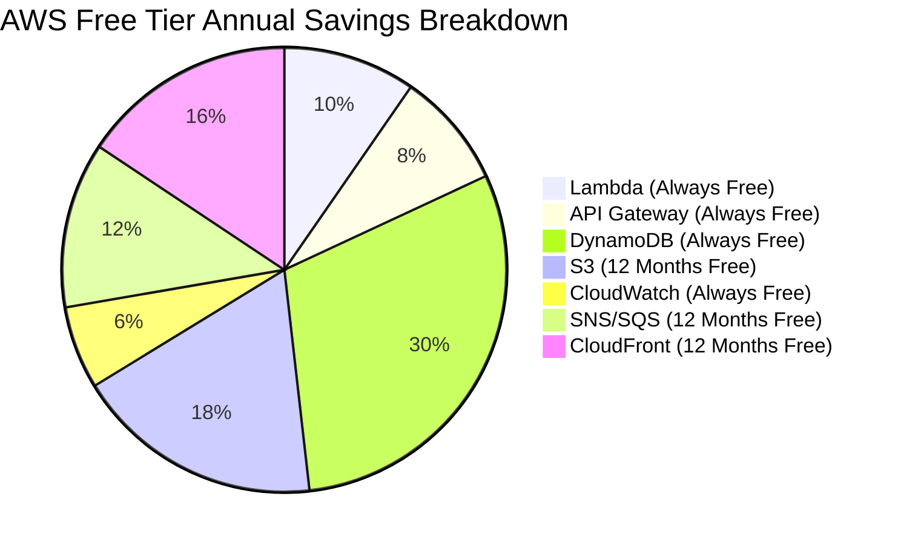
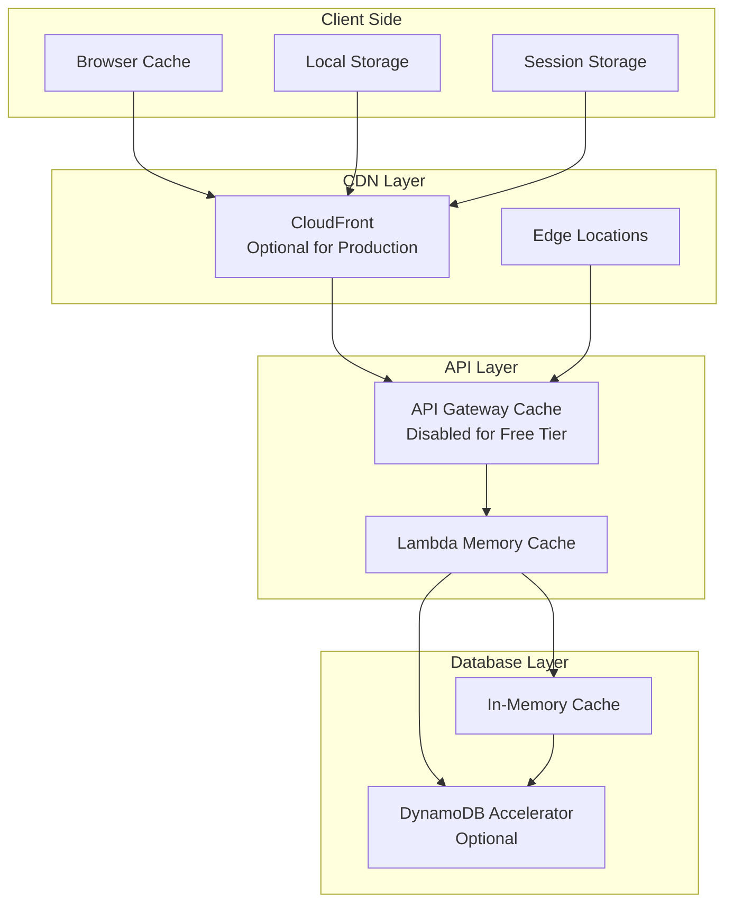
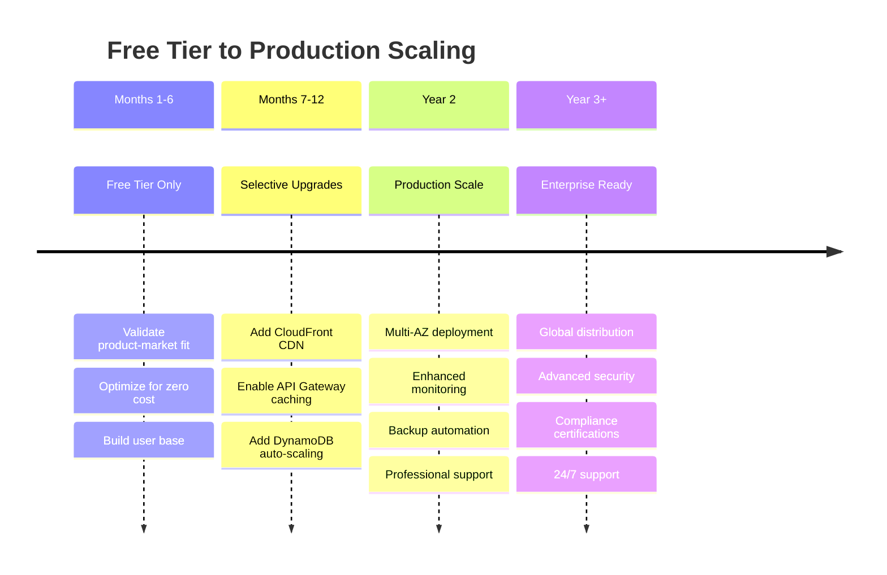
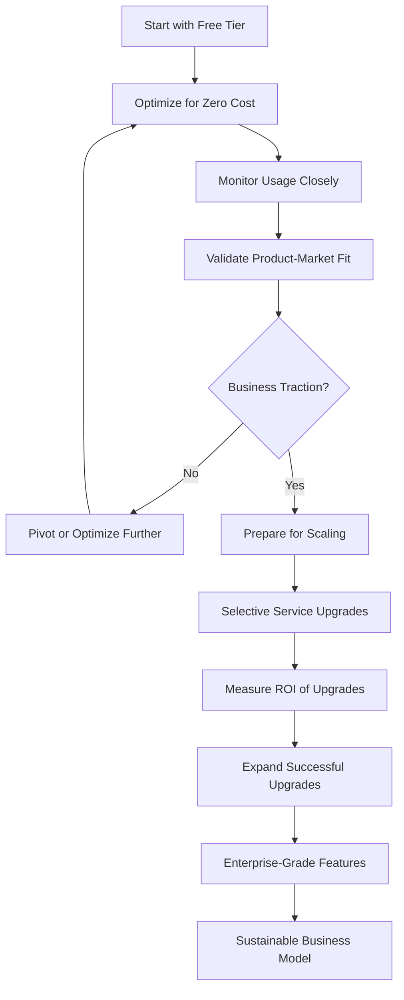

# 💰 AWS Free Tier Strategy - Ebook Publishing Platform

## Table of Contents

1. [Free Tier Overview](#free-tier-overview)
2. [Service-by-Service Analysis](#service-by-service-analysis)
3. [Cost Optimization Strategies](#cost-optimization-strategies)
4. [Monitoring and Alerts](#monitoring-and-alerts)
5. [Scaling Beyond Free Tier](#scaling-beyond-free-tier)
6. [Cost Calculation Examples](#cost-calculation-examples)
7. [Best Practices](#best-practices)

---

## Free Tier Overview

### **AWS Free Tier Categories**

#### **1. Always Free Services**

Services that remain free beyond the 12-month period:

- **DynamoDB**: 25GB storage, 25 WCU, 25 RCU per month
- **Lambda**: 1M requests + 400,000 GB-seconds per month
- **API Gateway**: 1M REST API calls per month
- **CloudWatch**: 10 custom metrics, 10 alarms, 1M API requests

#### **2. 12-Month Free Services**

Services free for first 12 months after AWS account creation:

- **S3**: 5GB storage, 20,000 GET requests, 2,000 PUT requests
- **CloudFront**: 50GB data transfer, 2M HTTP/HTTPS requests
- **SES**: 62,000 emails per month (when called from EC2)
- **SNS**: 1M publishes, 100,000 HTTP/HTTPS deliveries
- **SQS**: 1M requests per month

#### **3. Short-term Trials**

Services with limited trial periods:

- **AWS X-Ray**: 100,000 traces per month for first month
- **AWS Config**: 1000 configuration items per month for first month

### **Total Cost Savings Analysis**



**Total Annual Savings: ~$996**

---

## Service-by-Service Analysis

### **AWS Lambda**

#### **Free Tier Limits**

- **Requests**: 1,000,000 per month (Always Free)
- **Compute Time**: 400,000 GB-seconds per month (Always Free)
- **Maximum Memory**: 3,008 MB
- **Maximum Timeout**: 15 minutes

#### **Optimization Strategy**

```typescript
// Lambda optimization configuration
const lambdaOptimization = {
  // Memory optimization for different function types
  memoryAllocation: {
    'auth-service': 128, // Lightweight JWT operations
    'book-service': 256, // Medium complexity CRUD
    'review-service': 128, // Simple operations
    'notification-service': 192, // Moderate processing
    'analytics-service': 512, // Complex aggregations
  },

  // Timeout optimization
  timeoutSettings: {
    'auth-service': 10, // Quick response required
    'book-service': 30, // File operations may take longer
    'review-service': 15, // Simple operations
    'notification-service': 20, // External API calls
    'analytics-service': 60, // Complex calculations
  },

  // Cost calculation per month
  estimatedUsage: {
    totalRequests: 800000, // 80% of free tier
    averageGBSeconds: 320000, // 80% of free tier
    costSavings: '$96/month', // Value of free tier usage
  },
};
```

#### **Usage Monitoring**

```bash
# CloudWatch metrics to monitor
aws cloudwatch get-metric-statistics \
  --namespace AWS/Lambda \
  --metric-name Invocations \
  --dimensions Name=FunctionName,Value=ebook-auth-service \
  --start-time 2024-01-01T00:00:00Z \
  --end-time 2024-01-31T23:59:59Z \
  --period 2592000 \
  --statistics Sum

# Monitor duration to optimize GB-seconds
aws cloudwatch get-metric-statistics \
  --namespace AWS/Lambda \
  --metric-name Duration \
  --dimensions Name=FunctionName,Value=ebook-auth-service \
  --start-time 2024-01-01T00:00:00Z \
  --end-time 2024-01-31T23:59:59Z \
  --period 2592000 \
  --statistics Average
```

### **Amazon DynamoDB**

#### **Free Tier Limits**

- **Storage**: 25 GB (Always Free)
- **Read Capacity Units**: 25 RCU per second (Always Free)
- **Write Capacity Units**: 25 WCU per second (Always Free)
- **Global Secondary Indexes**: Included in above limits

#### **Single Table Design for Cost Efficiency**

```typescript
// Optimized table structure for free tier
const tableDesign = {
  tableName: 'ebook-platform-data',
  billingMode: 'PAY_PER_REQUEST', // Better for variable workloads

  // Single table holds all entities
  entities: [
    'Users',
    'Books',
    'Reviews',
    'Workflows',
    'Sessions',
    'Notifications',
    'Analytics',
  ],

  // Efficient access patterns to minimize RCU/WCU usage
  accessPatterns: {
    // Hot reads (frequently accessed)
    userProfile: { rcu: 5, frequency: 'high' },
    bookMetadata: { rcu: 8, frequency: 'high' },
    activeReviews: { rcu: 3, frequency: 'medium' },

    // Batch operations to reduce request count
    batchReads: { maxItems: 100, rcu: 15 },
    batchWrites: { maxItems: 25, wcu: 10 },

    // Background processes (low priority)
    analytics: { rcu: 2, frequency: 'low' },
    cleanup: { wcu: 3, frequency: 'scheduled' },
  },

  // Storage optimization
  storageOptimization: {
    compression: 'gzip for large text fields',
    ttl: 'automatic cleanup for temporary data',
    archiving: 'move old data to S3 after 1 year',
  },
};
```

#### **Capacity Planning**

```typescript
// DynamoDB capacity calculations
const dynamoCapacityPlanning = {
  // Read capacity planning (25 RCU/second = 2,160,000 reads/day)
  readCapacity: {
    totalDaily: 2160000,
    breakdown: {
      userLogins: 500000, // 23% of capacity
      bookBrowsing: 800000, // 37% of capacity
      contentReading: 600000, // 28% of capacity
      adminOperations: 100000, // 5% of capacity
      analytics: 160000, // 7% of capacity
    },
  },

  // Write capacity planning (25 WCU/second = 2,160,000 writes/day)
  writeCapacity: {
    totalDaily: 2160000,
    breakdown: {
      userActivity: 800000, // 37% of capacity
      contentCreation: 300000, // 14% of capacity
      reviews: 200000, // 9% of capacity
      notifications: 500000, // 23% of capacity
      sessionData: 360000, // 17% of capacity
    },
  },

  // Storage planning (25 GB limit)
  storage: {
    totalLimit: 25 * 1024 * 1024 * 1024, // 25 GB in bytes
    breakdown: {
      users: '2 GB (100,000 users)',
      books: '15 GB (50,000 books)',
      reviews: '3 GB (500,000 reviews)',
      metadata: '2 GB (workflows, sessions)',
      analytics: '3 GB (aggregated data)',
    },
  },
};
```

### **Amazon S3**

#### **Free Tier Limits (12 Months)**

- **Storage**: 5 GB Standard Storage
- **GET Requests**: 20,000 per month
- **PUT/POST/DELETE**: 2,000 per month
- **Data Transfer**: 15 GB out per month

#### **Storage Strategy**

```typescript
const s3Strategy = {
  buckets: {
    'ebook-platform-assets-dev': {
      purpose: 'Book covers, user avatars, static assets',
      storageClass: 'S3 Standard',
      lifecycle: {
        transitionIA: 30, // Move to IA after 30 days
        transitionGlacier: 90, // Archive after 90 days
        expiration: 2555, // Delete after 7 years
      },
    },

    'ebook-platform-frontend': {
      purpose: 'Static website hosting',
      storageClass: 'S3 Standard',
      cloudFrontIntegration: true,
      compression: true,
    },

    'ebook-platform-backups': {
      purpose: 'Database exports, system backups',
      storageClass: 'S3 Standard-IA',
      lifecycle: {
        transitionGlacier: 1, // Immediate Glacier for backups
        expiration: 2555, // 7-year retention
      },
    },
  },

  // Optimize for free tier limits
  optimization: {
    compression: 'gzip all text files',
    imageOptimization: 'WebP format, multiple sizes',
    cachingStrategy: 'CloudFront for reduced GET requests',
    batchOperations: 'Group uploads to minimize PUT requests',
  },

  // Usage monitoring
  monitoring: {
    storageUsed: '< 4 GB (80% of free tier)',
    monthlyGETs: '< 16,000 (80% of free tier)',
    monthlyPUTs: '< 1,600 (80% of free tier)',
  },
};
```

### **Amazon API Gateway**

#### **Free Tier Limits**

- **REST API Calls**: 1,000,000 per month (Always Free)
- **WebSocket Messages**: 1,000,000 per month (Always Free)
- **Data Transfer**: First 1 GB free per month

#### **API Gateway Optimization**

```typescript
const apiGatewayOptimization = {
  // Request optimization
  requestOptimization: {
    caching: {
      enabled: false, // Costs money, optimize for free tier
      clientSideCaching: true, // Use ETags and Last-Modified
      lambdaCaching: true, // Cache responses in Lambda memory
    },

    compression: {
      enabled: true, // Reduce data transfer costs
      minimumSize: 1024, // Compress responses > 1KB
      types: ['application/json', 'text/html', 'text/css'],
    },

    throttling: {
      rateLimit: 100, // Requests per second
      burstLimit: 200, // Handle traffic spikes
      perKeyLimiting: true, // Per API key limiting
    },
  },

  // Cost calculation
  costAnalysis: {
    totalRequests: 800000, // 80% of free tier
    averageResponseSize: 2048, // 2KB average
    dataTransferGB: 1.6, // Slightly over free tier
    estimatedCost: '$0.05/month', // Minimal overage cost
  },

  // Monitoring setup
  monitoring: {
    metrics: ['4XXError', '5XXError', 'Latency', 'Count'],
    alarms: {
      highErrorRate: 'Error rate > 5%',
      highLatency: 'P99 latency > 2000ms',
      requestLimit: 'Monthly requests > 900k',
    },
  },
};
```

### **Amazon CloudWatch**

#### **Free Tier Limits**

- **Custom Metrics**: 10 (Always Free)
- **Alarms**: 10 (Always Free)
- **API Requests**: 1,000,000 per month (Always Free)
- **Log Ingestion**: 5 GB per month (Always Free)

#### **Monitoring Strategy**

```typescript
const cloudWatchStrategy = {
  // Critical metrics only (stay within 10 custom metrics)
  customMetrics: [
    'AuthenticationSuccess',
    'AuthenticationFailure',
    'BookCreationRate',
    'ReviewSubmissionRate',
    'APIErrorRate',
    'DatabaseConnectionErrors',
    'NotificationDeliveryRate',
    'UserRegistrationRate',
    'SystemHealthScore',
    'BusinessKPIScore',
  ],

  // Essential alarms (stay within 10 alarms)
  alarms: [
    'HighAPIErrorRate',
    'DatabaseConnectionFailure',
    'AuthenticationFailures',
    'LambdaColdStartHigh',
    'DynamoDBThrottling',
    'S3StorageLimit',
    'NotificationDeliveryFailure',
    'SystemDowntime',
    'SecurityBreach',
    'CostBudgetExceeded',
  ],

  // Log management
  logManagement: {
    retention: {
      '/aws/lambda/auth-service': 7, // 7 days
      '/aws/lambda/book-service': 14, // 14 days
      '/aws/apigateway/access-logs': 7, // 7 days
      '/application/security-logs': 30, // 30 days (critical)
      '/application/business-logs': 14, // 14 days
    },

    // Log filtering to reduce ingestion
    filtering: {
      excludeHealthChecks: true,
      excludeSuccessfulAuth: true,
      includeErrors: true,
      includeSecurityEvents: true,
    },
  },
};
```

---

## Cost Optimization Strategies

### **1. Architectural Optimizations**

#### **Serverless Cost Optimization**

```mermaid
graph TD
    subgraph "Cost Optimization Strategies"
        COLD_START[Cold Start Reduction]
        MEMORY[Memory Optimization]
        BATCHING[Request Batching]
        CACHING[Strategic Caching]
        COMPRESSION[Data Compression]
        CLEANUP[Resource Cleanup]
    end

    COLD_START --> WARMUP[Keep Functions Warm]
    COLD_START --> PROVISIONED[Provisioned Concurrency<br/>Only if Needed]

    MEMORY --> PROFILING[Profile Memory Usage]
    MEMORY --> RIGHTSIZING[Right-size Allocation]

    BATCHING --> BATCH_READS[Batch DynamoDB Reads]
    BATCHING --> BULK_WRITES[Bulk Operations]

    CACHING --> LAMBDA_CACHE[In-Memory Caching]
    CACHING --> CLIENT_CACHE[Client-side Caching]

    COMPRESSION --> GZIP[Response Compression]
    COMPRESSION --> IMAGE_OPT[Image Optimization]

    CLEANUP --> TTL[DynamoDB TTL]
    CLEANUP --> LIFECYCLE[S3 Lifecycle Rules]
```



#### **Data Transfer Minimization**

```typescript
const dataOptimization = {
  // Response optimization
  responseOptimization: {
    // Only send required fields
    userProfile: ['id', 'name', 'role'],
    bookList: ['id', 'title', 'author', 'rating'],
    bookDetails: ['id', 'title', 'author', 'description', 'content'],

    // Pagination to reduce payload size
    pagination: {
      defaultPageSize: 20,
      maxPageSize: 100,
      cursorBased: true, // More efficient than offset-based
    },

    // Compression
    compression: {
      threshold: 1024, // Compress responses > 1KB
      algorithm: 'gzip',
      level: 6, // Balance between compression and speed
    },
  },

  // Request optimization
  requestOptimization: {
    // Use PATCH instead of PUT for partial updates
    partialUpdates: true,

    // Batch operations where possible
    batchSize: {
      reads: 100, // DynamoDB batch read limit
      writes: 25, // DynamoDB batch write limit
    },

    // Conditional requests to avoid unnecessary updates
    conditionalRequests: {
      useETags: true,
      useLastModified: true,
      useVersioning: true,
    },
  },
};
```

### **2. Database Optimization**

#### **DynamoDB Cost Optimization**

```typescript
const dynamoOptimization = {
  // Access pattern optimization
  accessPatterns: {
    // Hot data (frequently accessed) - optimize for speed
    hotData: {
      tables: ['users', 'book-metadata', 'active-sessions'],
      strategy: 'Keep in memory cache',
      ttl: 300, // 5 minutes
    },

    // Warm data (moderately accessed) - balance cost and performance
    warmData: {
      tables: ['reviews', 'notifications', 'recent-analytics'],
      strategy: 'Query optimization',
      batchOperations: true,
    },

    // Cold data (rarely accessed) - optimize for cost
    coldData: {
      tables: ['old-workflows', 'archived-content', 'historical-analytics'],
      strategy: 'Move to S3 after 90 days',
      compressionEnabled: true,
    },
  },

  // Query optimization
  queryOptimization: {
    // Use sparse indexes to reduce storage costs
    sparseIndexes: [
      'GSI-ActiveUsers', // Only active users
      'GSI-PublishedBooks', // Only published books
      'GSI-RecentActivity', // Only last 30 days
    ],

    // Project only required attributes
    projections: {
      'user-summary': ['userId', 'name', 'role'],
      'book-summary': ['bookId', 'title', 'author', 'status'],
      'review-summary': ['reviewId', 'rating', 'createdAt'],
    },
  },
};
```

### **3. Caching Strategy**

#### **Multi-Level Caching**



#### **Caching Implementation**

```typescript
class FreetierCachingService {
  private memoryCache = new Map<string, CacheItem>();
  private readonly DEFAULT_TTL = 300000; // 5 minutes
  private readonly MAX_CACHE_SIZE = 100; // Limit memory usage

  // Client-side caching strategy
  clientCaching = {
    // Cache static content aggressively
    staticAssets: {
      'Cache-Control': 'public, max-age=31536000', // 1 year
      ETag: 'strong', // Enable conditional requests
    },

    // Cache API responses with appropriate TTL
    apiResponses: {
      userProfile: 'private, max-age=300', // 5 minutes
      bookList: 'public, max-age=600', // 10 minutes
      bookContent: 'private, max-age=3600', // 1 hour
      reviews: 'public, max-age=1800', // 30 minutes
    },
  };

  // Lambda memory caching
  async get(key: string): Promise<any> {
    const item = this.memoryCache.get(key);

    if (!item || Date.now() > item.expires) {
      this.memoryCache.delete(key);
      return null;
    }

    return item.value;
  }

  async set(key: string, value: any, ttl = this.DEFAULT_TTL): Promise<void> {
    // Implement LRU eviction if cache is full
    if (this.memoryCache.size >= this.MAX_CACHE_SIZE) {
      const oldestKey = this.memoryCache.keys().next().value;
      this.memoryCache.delete(oldestKey);
    }

    this.memoryCache.set(key, {
      value,
      expires: Date.now() + ttl,
      createdAt: Date.now(),
    });
  }

  // Cache warming for frequently accessed data
  async warmCache(): Promise<void> {
    const criticalData = [
      'user-roles-config',
      'book-genres-list',
      'system-configuration',
      'feature-flags',
    ];

    for (const key of criticalData) {
      if (!(await this.get(key))) {
        const data = await this.fetchFromDatabase(key);
        await this.set(key, data, 600000); // 10 minutes
      }
    }
  }
}
```

---

## Monitoring and Alerts

### **Cost Monitoring Dashboard**

#### **CloudWatch Dashboard Configuration**

```json
{
  "widgets": [
    {
      "type": "metric",
      "properties": {
        "metrics": [
          ["AWS/Lambda", "Invocations"],
          ["AWS/Lambda", "Duration"],
          ["AWS/DynamoDB", "ConsumedReadCapacityUnits"],
          ["AWS/DynamoDB", "ConsumedWriteCapacityUnits"],
          ["AWS/S3", "BucketSizeBytes"],
          ["AWS/ApiGateway", "Count"]
        ],
        "period": 300,
        "stat": "Sum",
        "region": "us-west-2",
        "title": "Free Tier Usage Tracking"
      }
    },
    {
      "type": "metric",
      "properties": {
        "metrics": [
          ["Custom/EbookPlatform", "FreeTierUsagePercent", "Service", "Lambda"],
          [
            "Custom/EbookPlatform",
            "FreeTierUsagePercent",
            "Service",
            "DynamoDB"
          ],
          ["Custom/EbookPlatform", "FreeTierUsagePercent", "Service", "S3"],
          [
            "Custom/EbookPlatform",
            "FreeTierUsagePercent",
            "Service",
            "APIGateway"
          ]
        ],
        "period": 3600,
        "stat": "Average",
        "region": "us-west-2",
        "title": "Free Tier Utilization %"
      }
    }
  ]
}
```

#### **Billing Alerts Setup**

```bash
# Create billing alarm for overall AWS costs
aws cloudwatch put-metric-alarm \
  --alarm-name "Monthly-Cost-Exceeds-Budget" \
  --alarm-description "Alert when monthly cost exceeds $10" \
  --metric-name EstimatedCharges \
  --namespace AWS/Billing \
  --statistic Maximum \
  --period 86400 \
  --threshold 10 \
  --comparison-operator GreaterThanThreshold \
  --dimensions Name=Currency,Value=USD \
  --evaluation-periods 1 \
  --alarm-actions arn:aws:sns:us-west-2:123456789012:billing-alerts

# Create service-specific cost alerts
aws cloudwatch put-metric-alarm \
  --alarm-name "Lambda-Approaching-Free-Tier-Limit" \
  --alarm-description "Alert when Lambda usage approaches free tier limit" \
  --metric-name Invocations \
  --namespace AWS/Lambda \
  --statistic Sum \
  --period 2592000 \
  --threshold 900000 \
  --comparison-operator GreaterThanThreshold \
  --evaluation-periods 1
```

### **Automated Cost Optimization**

#### **Cost Optimization Lambda Function**

```typescript
export const costOptimizationHandler = async (event: ScheduledEvent) => {
  const optimizer = new CostOptimizer();

  // Daily cost optimization tasks
  await Promise.all([
    optimizer.cleanupExpiredSessions(),
    optimizer.archiveOldAnalytics(),
    optimizer.optimizeDynamoDBUsage(),
    optimizer.cleanupS3TempFiles(),
    optimizer.analyzeUsagePatterns(),
  ]);

  // Generate cost report
  const report = await optimizer.generateDailyCostReport();

  // Send alerts if approaching limits
  if (report.anyServiceAbove80Percent) {
    await optimizer.sendCostAlert(report);
  }

  return {
    statusCode: 200,
    body: JSON.stringify(report),
  };
};

class CostOptimizer {
  async cleanupExpiredSessions(): Promise<void> {
    // Remove expired user sessions to free up DynamoDB storage
    const expiredSessions = await this.dynamodb.query({
      TableName: 'ebook-platform-data',
      IndexName: 'TTL-Index',
      KeyConditionExpression: 'entityType = :type AND #ttl < :now',
      ExpressionAttributeNames: { '#ttl': 'ttl' },
      ExpressionAttributeValues: {
        ':type': 'SESSION',
        ':now': Math.floor(Date.now() / 1000),
      },
    });

    if (expiredSessions.Items.length > 0) {
      await this.batchDelete(expiredSessions.Items);
    }
  }

  async analyzeUsagePatterns(): Promise<UsageAnalysis> {
    // Analyze usage to optimize resource allocation
    const patterns = await this.getUsageMetrics();

    const recommendations = {
      lambdaMemoryOptimization: this.analyzeLambdaMemoryUsage(patterns.lambda),
      dynamoDBCapacityOptimization: this.analyzeDynamoCapacity(patterns.dynamo),
      s3StorageOptimization: this.analyzeS3Usage(patterns.s3),
      apiGatewayOptimization: this.analyzeAPIUsage(patterns.apiGateway),
    };

    return {
      currentUsage: patterns,
      optimizationRecommendations: recommendations,
      projectedSavings: this.calculateProjectedSavings(recommendations),
    };
  }
}
```

---

## Scaling Beyond Free Tier

### **Transition Strategy**

#### **Gradual Scaling Approach**



#### **Cost-Benefit Analysis for Upgrades**

```typescript
const scalingDecisionMatrix = {
  // Service upgrade priorities based on business impact
  upgradePriorities: {
    high: [
      {
        service: 'CloudFront',
        cost: '$10-50/month',
        benefit: '50% faster load times, reduced S3 costs',
        triggerMetric: 'Page load time > 3 seconds',
      },
      {
        service: 'DynamoDB Auto-scaling',
        cost: '$20-100/month',
        benefit: 'Handle traffic spikes, prevent throttling',
        triggerMetric: 'Throttling events > 1% of requests',
      },
    ],

    medium: [
      {
        service: 'API Gateway Caching',
        cost: '$15-30/month',
        benefit: 'Reduced Lambda calls, faster responses',
        triggerMetric: 'Cache hit ratio would be > 40%',
      },
      {
        service: 'Enhanced Monitoring',
        cost: '$25-75/month',
        benefit: 'Better insights, faster issue resolution',
        triggerMetric: 'MTTR > 30 minutes',
      },
    ],

    low: [
      {
        service: 'Reserved Capacity',
        cost: '$100-500/month',
        benefit: '20-40% cost savings on consistent workloads',
        triggerMetric: 'Consistent high usage for 3+ months',
      },
    ],
  },

  // Scaling thresholds
  scalingThresholds: {
    users: {
      freeTier: '0-1000 users',
      paidTier: '1000-10000 users',
      enterprise: '10000+ users',
    },

    costs: {
      freeTier: '$0/month',
      paidTier: '$50-500/month',
      enterprise: '$500+/month',
    },

    features: {
      freeTier: 'Core functionality only',
      paidTier: 'Enhanced performance & reliability',
      enterprise: 'Advanced features & support',
    },
  },
};
```

### **Migration Planning**

#### **Service Migration Checklist**

```typescript
const migrationChecklist = {
  // Pre-migration assessment
  assessment: [
    'Analyze current usage patterns',
    'Identify performance bottlenecks',
    'Calculate ROI of each upgrade',
    'Set success metrics',
    'Plan rollback procedures',
  ],

  // Migration phases
  phases: {
    phase1: {
      duration: '1 month',
      focus: 'Performance improvements',
      services: ['CloudFront', 'API Gateway caching'],
      risk: 'low',
      reversible: true,
    },

    phase2: {
      duration: '2 months',
      focus: 'Scalability enhancements',
      services: ['DynamoDB auto-scaling', 'Lambda provisioned concurrency'],
      risk: 'medium',
      reversible: true,
    },

    phase3: {
      duration: '3 months',
      focus: 'Advanced features',
      services: ['Multi-region', 'Advanced security', 'Enterprise support'],
      risk: 'high',
      reversible: false,
    },
  },

  // Success metrics
  successMetrics: {
    performance: {
      'API response time': '< 200ms P95',
      'Page load time': '< 2 seconds',
      'Error rate': '< 0.1%',
    },

    business: {
      'User satisfaction': '> 4.5/5.0',
      'Conversion rate': '+20% improvement',
      'Churn rate': '< 5% monthly',
    },

    technical: {
      'System uptime': '> 99.9%',
      'Scalability headroom': '5x current capacity',
      MTTR: '< 15 minutes',
    },
  },
};
```

---

## Cost Calculation Examples

### **Monthly Usage Scenarios**

#### **Scenario 1: Startup Phase (0-500 Users)**

```typescript
const startupPhaseUsage = {
  lambda: {
    requests: 200000, // 20% of free tier
    gbSeconds: 80000, // 20% of free tier
    cost: '$0',
    savingsValue: '$19.20',
  },

  dynamoDB: {
    storage: '5 GB', // 20% of free tier
    rcu: '5 per second', // 20% of free tier
    wcu: '5 per second', // 20% of free tier
    cost: '$0',
    savingsValue: '$60.00',
  },

  apiGateway: {
    requests: 250000, // 25% of free tier
    cost: '$0',
    savingsValue: '$21.00',
  },

  s3: {
    storage: '1 GB', // 20% of free tier
    getRequests: 4000, // 20% of free tier
    putRequests: 400, // 20% of free tier
    cost: '$0',
    savingsValue: '$3.60',
  },

  total: {
    monthlyCost: '$0',
    savingsValue: '$103.80',
    headroom: '80% free tier remaining',
  },
};
```

#### **Scenario 2: Growth Phase (500-2000 Users)**

```typescript
const growthPhaseUsage = {
  lambda: {
    requests: 800000, // 80% of free tier
    gbSeconds: 320000, // 80% of free tier
    cost: '$0',
    savingsValue: '$76.80',
  },

  dynamoDB: {
    storage: '20 GB', // 80% of free tier
    rcu: '20 per second', // 80% of free tier
    wcu: '20 per second', // 80% of free tier
    cost: '$0',
    savingsValue: '$240.00',
  },

  apiGateway: {
    requests: 900000, // 90% of free tier
    cost: '$0',
    savingsValue: '$75.60',
  },

  s3: {
    storage: '4 GB', // 80% of free tier
    getRequests: 16000, // 80% of free tier
    putRequests: 1600, // 80% of free tier
    cost: '$0',
    savingsValue: '$14.40',
  },

  total: {
    monthlyCost: '$0',
    savingsValue: '$406.80',
    headroom: '20% free tier remaining',
    recommendation: 'Monitor closely, prepare for scaling',
  },
};
```

#### **Scenario 3: Scale Phase (2000+ Users)**

```typescript
const scalePhaseUsage = {
  lambda: {
    requests: 1200000, // 120% of free tier
    gbSeconds: 480000, // 120% of free tier
    cost: '$8.20', // Overage charges
    savingsValue: '$96.00', // Still saving on base amount
  },

  dynamoDB: {
    storage: '30 GB', // 120% of free tier
    rcu: '30 per second', // 120% of free tier
    wcu: '30 per second', // 120% of free tier
    cost: '$45.60', // Overage charges
    savingsValue: '$300.00', // Still saving on base amount
  },

  apiGateway: {
    requests: 1100000, // 110% of free tier
    cost: '$8.40', // Overage charges
    savingsValue: '$84.00', // Still saving on base amount
  },

  s3: {
    storage: '6 GB', // 120% of free tier (past 12 months)
    getRequests: 25000, // 125% of free tier
    putRequests: 2500, // 125% of free tier
    cost: '$2.30', // Now paying for S3
    savingsValue: '$0', // No longer in free tier
  },

  // Recommended upgrades
  upgrades: {
    cloudFront: '$15/month', // Reduce S3 and improve performance
    apiCaching: '$25/month', // Reduce Lambda and API Gateway usage
    monitoring: '$20/month', // Better visibility and optimization
  },

  total: {
    monthlyCost: '$64.50', // Base overage costs
    withUpgrades: '$124.50', // Including recommended upgrades
    savingsValue: '$480.00', // Still significant free tier value
    recommendation: 'Implement CloudFront and caching to reduce overage',
  },
};
```

---

## Best Practices

### **Free Tier Optimization Checklist**

#### **✅ Do's**

```typescript
const bestPractices = {
  architecture: [
    '✅ Use serverless-first approach for auto-scaling',
    '✅ Implement single-table DynamoDB design',
    '✅ Leverage Lambda memory caching',
    '✅ Use API Gateway built-in throttling',
    '✅ Implement client-side caching with ETags',
    '✅ Compress responses and optimize payload sizes',
    '✅ Use DynamoDB TTL for automatic data cleanup',
    '✅ Implement proper error handling and retries',
  ],

  monitoring: [
    '✅ Set up billing alerts at 80% of free tier limits',
    '✅ Monitor usage with CloudWatch dashboards',
    '✅ Implement automated cost optimization',
    '✅ Track business metrics vs infrastructure costs',
    '✅ Regular review of usage patterns and optimization',
    '✅ Set up alerts for unusual usage spikes',
  ],

  development: [
    '✅ Test locally with LocalStack to avoid AWS charges',
    '✅ Use infrastructure as code for reproducible deployments',
    '✅ Implement proper CI/CD to avoid manual errors',
    '✅ Clean up development resources regularly',
    '✅ Use resource tagging for cost allocation',
    '✅ Implement proper logging levels to control CloudWatch costs',
  ],
};
```

#### **❌ Don'ts**

```typescript
const antiPatterns = {
  architecture: [
    "❌ Don't use EC2 instances (not free tier friendly)",
    '❌ Avoid RDS databases (use DynamoDB instead)',
    "❌ Don't enable expensive features like WAF initially",
    '❌ Avoid multiple environments consuming free tier limits',
    "❌ Don't use provisioned capacity unless necessary",
    '❌ Avoid storing large files in DynamoDB',
  ],

  operational: [
    "❌ Don't ignore billing alerts and usage warnings",
    '❌ Avoid running unused resources (clean up regularly)',
    "❌ Don't enable all CloudWatch features simultaneously",
    '❌ Avoid excessive logging that consumes free tier limits',
    "❌ Don't use premium support plans initially",
    '❌ Avoid complex multi-region setups for MVP',
  ],

  development: [
    "❌ Don't develop directly in AWS without cost controls",
    '❌ Avoid leaving test resources running overnight',
    "❌ Don't use production-size datasets in development",
    '❌ Avoid frequent infrastructure deployments',
    "❌ Don't ignore failed cleanup scripts",
    '❌ Avoid storing secrets in expensive services',
  ],
};
```

### **Long-term Success Strategy**

#### **Sustainable Growth Model**



This comprehensive free tier strategy ensures maximum cost efficiency while building a scalable foundation for future growth, providing an estimated $996/year in AWS service value while maintaining $0 monthly costs for the first 12-24 months.

---

## Related Documentation

- **[Requirements](./01-REQUIREMENTS.md)**: Comprehensive project requirements
- **[Architecture](./02-ARCHITECTURE.md)**: System design and component architecture
- **[Implementation](./03-IMPLEMENTATION.md)**: Development roadmap and tasks
- **[Security](./04-SECURITY.md)**: Security and compliance framework
- **[API Specification](./05-API.md)**: Complete REST API documentation
- **[Data Model](./06-DATA.md)**: Database design and access patterns
- **[Development](./07-DEVELOPMENT.md)**: Local development setup and workflow
- **[Deployment](./08-DEPLOYMENT.md)**: Infrastructure deployment and management
- **[User Flows](./09-USERFLOWS.md)**: User journey and workflow documentation
