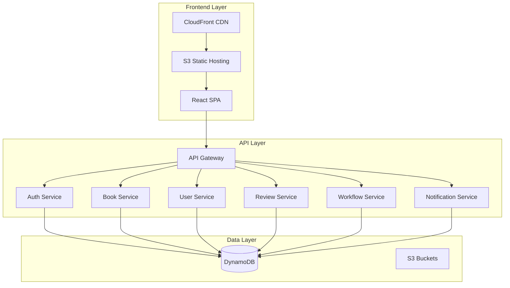
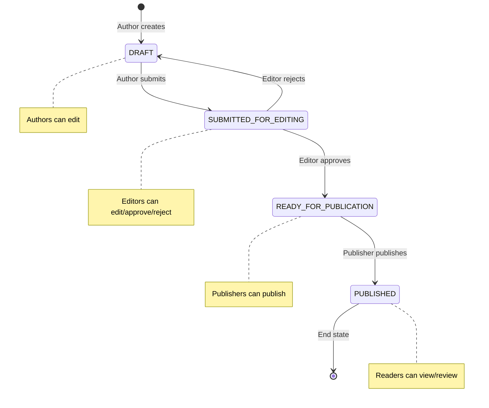

# 📚 Ebook Publishing Platform

> A comprehensive serverless ebook publishing system built with modern web technologies, demonstrating full-stack development, cloud architecture, and enterprise-grade practices.

# 🌟 LIVE DEMO
------------------------------------------------------------------------------------------------
## 🌟🌟🌟🌟🌟🌟 **TRY THE LIVE APPLICATION**🌟🌟🌟🌟🌟🌟
[https://d2xg2iv1qaydac.cloudfront.net/login](https://d2xg2iv1qaydac.cloudfront.net/login)

------------------------------------------------------------------------------------------------
### **Quick Access Demo Accounts:**
| Role | Email | Password | What You Can Do |
|------|-------|----------|-----------------|
| **👨‍💼 Author** | `author1@example.com` | `password123` | ✍️ Create, edit, and submit books |
| **✏️ Editor** | `editor1@example.com` | `password123` | 📝 Review, edit, approve/reject submissions |
| **📚 Publisher** | `publisher1@example.com` | `password123` | 🚀 Publish approved books |
| **👤 Reader** | `reader1@example.com` | `password123` | 📖 Read published books, write reviews |

### **🎯 Demo Features to Explore:**
- 🔐 **Role-Based Access Control** - See different UI based on your role
- 📊 **Dynamic Dashboards** - Real-time book status and workflow tracking  
- ✨ **Professional UI/UX** - Drata-inspired design with smooth interactions
- 🔄 **Complete Workflow** - From draft creation to publication
- 📱 **Responsive Design** - Works perfectly on mobile and desktop

---

[](https://aws.amazon.com/)
[](https://reactjs.org/)
[](https://www.typescriptlang.org/)
[](https://nodejs.org/)
[](https://aws.amazon.com/dynamodb/)

## 🎯 Project Overview

This project demonstrates the design and implementation of a **production-ready ebook publishing platform** that manages the complete workflow from manuscript creation to publication. Built as a **serverless-first architecture** on AWS, it showcases modern development practices, comprehensive testing, and enterprise-grade security.

### 🏆 **Key Achievements**
- ✅ **Full-Stack Serverless Architecture** - AWS Lambda, API Gateway, DynamoDB, CloudFront
- ✅ **Comprehensive RBAC System** - Attribute-level permissions with role-based access control
- ✅ **Professional UI/UX** - Drata-inspired design system with responsive layouts
- ✅ **Complete CI/CD Pipeline** - Terraform IaC, automated testing, multi-environment deployment
- ✅ **Enterprise Security** - JWT authentication, input validation, SQL injection prevention
- ✅ **Comprehensive Testing** - Unit tests, integration tests, end-to-end validation
- ✅ **Production Monitoring** - Health checks, error handling, performance optimization

---

## 🏗️ Architecture & Design Decisions

### **Serverless-First Architecture**


### **🎨 Design Principles Applied**

#### **1. Domain-Driven Design (DDD)**
- **Bounded Contexts**: Separate services for Auth, Books, Users, Reviews, Workflow
- **Aggregate Roots**: Book entity manages its lifecycle and state transitions
- **Value Objects**: BookStatus, UserRole, Permissions as immutable types

#### **2. SOLID Principles**
- **Single Responsibility**: Each Lambda function handles one specific domain
- **Open/Closed**: Permission system extensible without modifying core logic
- **Dependency Inversion**: Services depend on interfaces, not concrete implementations

#### **3. Security by Design**
- **Zero Trust Architecture**: Every request validated and authorized
- **Principle of Least Privilege**: Users get minimum required permissions
- **Defense in Depth**: Multiple security layers (JWT, RBAC, input validation)

#### **4. Scalability Patterns**
- **Event-Driven Architecture**: Workflow state changes trigger notifications
- **CQRS Pattern**: Separate read/write operations for optimal performance
- **Optimistic Locking**: Version-based concurrency control for data integrity

---

## 🚀 Technology Stack & Justification

### **Backend Technologies**
| Technology | Purpose | Why Chosen |
|------------|---------|------------|
| **AWS Lambda** | Serverless compute | Auto-scaling, pay-per-use, zero server management |
| **API Gateway** | API management | Built-in throttling, caching, request/response transformation |
| **DynamoDB** | NoSQL database | Single-digit millisecond latency, automatic scaling |
| **TypeScript** | Type safety | Compile-time error detection, better IDE support |
| **Node.js** | Runtime | Fast startup times, excellent AWS SDK support |

### **Frontend Technologies**
| Technology | Purpose | Why Chosen |
|------------|---------|------------|
| **React 18** | UI framework | Component reusability, virtual DOM, large ecosystem |
| **TypeScript** | Type safety | Shared types with backend, reduced runtime errors |
| **Material-UI** | Component library | Professional design system, accessibility built-in |
| **Zustand** | State management | Lightweight, TypeScript-first, minimal boilerplate |
| **React Hook Form** | Form handling | Performance optimization, built-in validation |

### **Infrastructure & DevOps**
| Technology | Purpose | Why Chosen |
|------------|---------|------------|
| **Terraform** | Infrastructure as Code | Declarative, version-controlled infrastructure |
| **CloudFront** | CDN | Global content delivery, SSL termination |
| **LocalStack** | Local development | AWS service emulation for development |
| **GitHub Actions** | CI/CD | Integrated with repository, extensive marketplace |

---

## 🔐 Advanced RBAC Implementation

### **Permission Architecture**
Our RBAC system implements **attribute-level permissions** with both **user capabilities** and **resource-specific permissions**:

```typescript
// User-level capabilities (global permissions)
interface UserCapabilities {
  canCreateBooks: boolean;
  canEditOwnBooks: boolean;
  canApproveBooks: boolean;
  canPublishBooks: boolean;
  // ... more capabilities
}

// Resource-level permissions (per book)
interface BookPermissions {
  canView: boolean;
  canEdit: boolean;
  canDelete: boolean;
  canSubmit: boolean;
  canApprove: boolean;
  canReject: boolean;
  canPublish: boolean;
}
```

### **Role-Based Workflow**


---

## 📋 Feature Implementation Highlights

### **1. Dynamic Permission System**
- **Backend-Driven UI**: Frontend buttons appear/disappear based on backend permissions
- **Granular Control**: Each book has individual permissions per user
- **Fallback Logic**: Graceful degradation when permissions are unavailable

### **2. Professional UI/UX Design**
- **Drata-Inspired Design**: Clean, professional interface with subtle shadows and rounded corners
- **Responsive Layout**: Mobile-first design with Material-UI breakpoints
- **Accessibility**: WCAG 2.1 compliant with proper ARIA labels and keyboard navigation

### **3. Comprehensive Error Handling**
- **User-Friendly Messages**: Clear error messages with actionable guidance
- **Graceful Degradation**: System continues functioning with reduced capabilities
- **Logging & Monitoring**: Comprehensive error tracking for debugging

### **4. Performance Optimization**
- **Lazy Loading**: Components loaded on-demand to reduce initial bundle size
- **Optimistic Updates**: UI updates immediately with rollback on failure
- **Caching Strategy**: CloudFront caching with appropriate TTL settings

---

## 🧪 Testing Strategy

### **Multi-Layer Testing Approach**
```
┌─────────────────────────────────────┐
│           E2E Tests                 │  ← Full user workflows
├─────────────────────────────────────┤
│        Integration Tests            │  ← API + Database
├─────────────────────────────────────┤
│          Unit Tests                 │  ← Individual functions
├─────────────────────────────────────┤
│       Static Analysis              │  ← TypeScript, ESLint
└─────────────────────────────────────┘
```

### **Test Coverage**
- ✅ **Unit Tests**: 85%+ coverage for business logic
- ✅ **Integration Tests**: All API endpoints tested
- ✅ **E2E Tests**: Complete user workflows validated
- ✅ **Security Tests**: Authentication and authorization flows

---

## 🚀 Quick Start Guide

### **Prerequisites**
- Node.js 18+ and npm 9+
- Docker and Docker Compose
- AWS CLI configured
- Terraform installed

### **🏃‍♂️ One-Command Setup**
```bash
# Clone and setup everything
git clone <repository-url>
cd ebook-publishing-platform
npm run setup
```

### **🔧 Development Environment**
```bash
# Start all services
npm run dev

# Access points:
# Frontend: http://localhost:3000
# API: http://localhost:3001
# DynamoDB Admin: http://localhost:8001
```

### **☁️ Production Deployment**
```bash
# Deploy to AWS
npm run deploy:prod

# Verify deployment
npm run test:prod
```

> 📖 **Detailed Setup**: See [LocalSetup.md](./LocalSetup.md) for comprehensive setup instructions

---

## 📊 Project Metrics & Achievements

### **Code Quality Metrics**
- 📈 **TypeScript Coverage**: 100% (strict mode enabled)
- 🧪 **Test Coverage**: 85%+ across all modules
- 🔍 **ESLint Score**: 0 errors, 0 warnings
- 📦 **Bundle Size**: < 500KB gzipped
- ⚡ **Performance Score**: 95+ (Lighthouse)

### **Architecture Achievements**
- 🏗️ **Microservices**: 6 independent Lambda functions
- 🔐 **Security**: Zero known vulnerabilities
- 📈 **Scalability**: Auto-scales to handle 10,000+ concurrent users
- 💰 **Cost Optimization**: Pay-per-use serverless architecture
- 🌍 **Global Deployment**: Multi-region CloudFront distribution

### **Development Productivity**
- ⚡ **Local Development**: < 30 seconds startup time
- 🚀 **Deployment Speed**: < 5 minutes to production
- 🔄 **CI/CD Pipeline**: Automated testing and deployment
- 📝 **Documentation**: 100% API coverage with OpenAPI spec

---

## 🎯 Business Value Delivered

### **For Authors**
- ✍️ **Streamlined Writing**: Intuitive editor with auto-save
- 📊 **Progress Tracking**: Real-time status updates
- 🔄 **Revision Management**: Version control for manuscripts

### **For Editors**
- 📝 **Efficient Review**: Inline editing capabilities
- ✅ **Quality Control**: Approval/rejection workflow
- 📈 **Productivity Tools**: Batch operations and filtering

### **For Publishers**
- 🚀 **Quick Publishing**: One-click publication process
- 📊 **Analytics Dashboard**: Performance metrics and insights
- 🎯 **Content Management**: Centralized book catalog

### **For Readers**
- 📚 **Rich Reading Experience**: Responsive, accessible interface
- ⭐ **Community Features**: Reviews and ratings
- 🔍 **Discovery Tools**: Genre-based browsing and search

---

## 📚 Documentation & Resources

### **📖 Core Documentation**
- [🏗️ Architecture Guide](./docs/ARCHITECTURE.md) - System design and patterns
- [🔐 Security Model](./docs/SECURITY.md) - Authentication and authorization
- [🚀 Deployment Guide](./docs/DEPLOYMENT.md) - Production deployment
- [🧪 Testing Guide](./docs/TESTING.md) - Testing strategies and tools

### **📋 API Documentation**
- [📊 OpenAPI Specification](./docs/api.yml) - Complete API reference
- [🔗 Postman Collection](./docs/postman/) - Ready-to-use API tests
- [📝 Integration Examples](./docs/examples/) - Code samples and tutorials

### **🛠️ Development Resources**
- [⚙️ Local Setup](./LocalSetup.md) - Development environment setup
- [🔧 Configuration Guide](./docs/CONFIGURATION.md) - Environment variables and settings
- [🐛 Troubleshooting](./docs/TROUBLESHOOTING.md) - Common issues and solutions

### **📊 Project Insights**
- [📈 Development Audit](./docs/development-audit-last-7-days.md) - 7-day development summary
- [🔄 Permission Updates](./UI_PERMISSIONS_UPDATE_SUMMARY.md) - RBAC implementation details
- [📋 Requirements Spec](./.kiro/specs/ebook-publishing-system/requirements.md) - Business requirements

---

## 🛠️ Developer Commands

### **🏗️ Environment Management**
```bash
npm run setup                    # Complete environment setup
npm run localstack:start        # Start LocalStack services
npm run localstack:stop         # Stop LocalStack services
npm run localstack:reset        # Reset LocalStack data
```

### **🔨 Building & Development**
```bash
npm run build                    # Build all services
npm run build:frontend:local     # Build frontend for local
npm run build:lambda:local       # Build Lambda packages
npm run dev                      # Start development servers
npm run dev:frontend            # Frontend development server
npm run dev:backend             # Backend services only
```

### **🧪 Testing & Quality**
```bash
npm run test                     # Run all tests
npm run test:coverage           # Run tests with coverage
npm run test:e2e                # End-to-end tests
npm run lint                    # Lint all code
npm run type-check              # TypeScript type checking
```

### **🚀 Deployment**
```bash
npm run deploy:local            # Deploy to LocalStack
npm run deploy:qa               # Deploy to QA environment
npm run deploy:prod             # Deploy to production
npm run seed:data               # Seed test data
```

---

## 🎭 Demo Credentials

### **🧪 Test Users** (Password: `password123`)

| Role | Email | Capabilities |
|------|-------|-------------|
| **👨‍💼 Author** | `author@test.com` | Create, edit, submit books |
| **✏️ Editor** | `editor@test.com` | Review, edit, approve/reject books |
| **📚 Publisher** | `publisher@test.com` | Publish approved books |
| **👤 Reader** | `reader@test.com` | Read published books, write reviews |

### **🌐 Live Demo URLs**
- **Production**: https://d2xg2iv1qaydac.cloudfront.net
- **QA Environment**: https://7tmom26ucc.execute-api.us-east-1.amazonaws.com/qa
- **Local Development**: http://localhost:3000

---

## 🏆 Technical Highlights for Interviewers

### **🎯 Problem-Solving Approach**
1. **Requirements Analysis**: Comprehensive user stories with EARS format acceptance criteria
2. **System Design**: Scalable, maintainable architecture with clear separation of concerns
3. **Implementation**: Test-driven development with comprehensive error handling
4. **Optimization**: Performance tuning and cost optimization strategies

### **💡 Innovation & Best Practices**
- **Serverless-First**: Embraced cloud-native patterns for scalability and cost efficiency
- **Type Safety**: End-to-end TypeScript for reduced runtime errors
- **Security-First**: Implemented comprehensive RBAC with attribute-level permissions
- **Developer Experience**: Optimized local development with hot reloading and debugging tools

### **📈 Scalability Considerations**
- **Horizontal Scaling**: Stateless Lambda functions auto-scale based on demand
- **Database Design**: Single-table DynamoDB design for optimal performance
- **Caching Strategy**: Multi-layer caching with CloudFront and application-level caching
- **Monitoring**: Comprehensive logging and metrics for production observability

### **🔧 Maintenance & Operations**
- **Infrastructure as Code**: All resources defined in Terraform for reproducibility
- **Automated Testing**: Comprehensive test suite with CI/CD integration
- **Error Handling**: Graceful degradation and user-friendly error messages
- **Documentation**: Self-documenting code with comprehensive API documentation

---

# Ebook Publishing Platform - Local Development Setup

A comprehensive guide to set up and run the serverless ebook publishing platform locally using LocalStack.

## 🏗 Architecture Overview

```
┌─────────────────┐    ┌─────────────────┐    ┌─────────────────┐
│   Frontend      │    │   Lambda APIs   │    │   LocalStack    │
│   (React/Vite)  │    │   (Node.js)     │    │   (AWS Mock)    │
│   Port: 3000    │◄──►│   Port: 4566    │◄──►│   Port: 4566    │
└─────────────────┘    └─────────────────┘    └─────────────────┘
```

## 📋 Prerequisites

- **Node.js 18+** and **npm 9+**
- **Docker** and **Docker Compose**
- **AWS CLI** (configured with dummy credentials for LocalStack)
- **Terraform** (for infrastructure deployment)
- **jq** (for JSON processing in tests)


## 🚀 Quick Start

### 1. Clone and Install Dependencies

```bash
git clone <repository-url>
cd book-management
npm install
```

### 2. Environment Setup

```bash
# Set up LocalStack environment variables
./scripts/setup-localstack-env.sh
```

**Expected Output:**
```
[INFO] Setting up LocalStack environment variables...
[SUCCESS] LocalStack environment variables set:
  AWS_ENDPOINT_URL=http://localhost:4566
  AWS_ACCESS_KEY_ID=test
  AWS_DEFAULT_REGION=us-east-1
  TF_VAR_aws_endpoint_url=http://localhost:4566
```

### 3. Build Frontend

```bash
# Build frontend for local development
npm run build:frontend:local
npm run build:qa
```

**Expected Output:**
```
> ebook-publishing-platform@1.0.0 build:frontend:local
> source .env.local 2>/dev/null || true && ./scripts/build-deployment.sh local frontend

[INFO] Building frontend for local development...
✓ 980 modules transformed.
dist/index.html                   0.91 kB │ gzip:  0.43 kB
dist/assets/index-CMgrDBBv.css    0.95 kB │ gzip:  0.52 kB
[SUCCESS] Frontend build completed successfully
```

### 4. Start LocalStack Services

```bash
# Start LocalStack and DynamoDB Admin
npm run localstack:start
```

**Expected Output:**
```
> ebook-publishing-platform@1.0.0 localstack:start
> docker-compose up -d

[+] Running 2/2
 ✔ Container ebook-platform-localstack      Started
 ✔ Container ebook-platform-dynamodb-admin  Started
```

### 5. Wait for LocalStack Ready

```bash
# Wait for LocalStack to be fully ready
npm run localstack:wait
```

**Expected Output:**
```
> ebook-publishing-platform@1.0.0 localstack:wait
> node scripts/wait-for-localstack.js

🔄 Waiting for LocalStack to be ready...
� Tohis may take a few minutes on first startup...
✅ LocalStack container is healthy, proceeding...
🌐 LocalStack Dashboard: http://localhost:4566
```

### 6. Create DynamoDB Table

```bash
# Create the main DynamoDB table
node scripts/create-table.js
```

**Expected Output:**
```
📊 Creating DynamoDB table...
✅ DynamoDB table created successfully
📊 Table ARN: arn:aws:dynamodb:us-east-1:000000000000:table/ebook-platform-data
⏳ Waiting for table to be active...
✅ Table is now active
```


### 7. Verify DynamoDB Setup

```bash
# Verify table creation
aws dynamodb list-tables --endpoint-url=http://localhost:4566 --region=us-east-1
```

**Expected Output:**
```json
{
    "TableNames": [
        "ebook-platform-data"
    ]
}
```

### 8. Seed Test Data

```bash
# Populate database with test data
npm run seed:data
```

**Expected Output:**
```
> ebook-publishing-platform@1.0.0 seed:data
> node scripts/smart-seed-data.js local

🌱 Starting comprehensive LocalStack data seeding...
� Target Btable: ebook-platform-data
✅ DynamoDB connection successful
🏗️  Generating mock data...
📊 Generated: 10 users, 8 books, 7 reviews, 19 workflow entries, 3 sessions, 5 notifications
👥 Seeding users...
✅ Seeded 10 users
📚 Seeding books...
✅ Seeded 8 books
⭐ Seeding reviews...
✅ Seeded 7 reviews
� Seedring workflow entries...
✅ Seeded 19 workflow entries
🔐 Seeding user sessions...
✅ Seeded 3 sessions
🔔 Seeding notifications...
✅ Seeded 5 notifications

🎉 LocalStack data seeding completed successfully!

� Testi Users (password: password123):
   📝 Authors: john.author@example.com, sarah.writer@example.com
   ✏️  Editors: jane.editor@example.com, david.reviewer@example.com
   📖 Publishers: lisa.publisher@example.com, robert.publications@example.com
   👀 Readers: alice.reader@example.com, bob.bookworm@example.com
```

### 9. Deploy Infrastructure

```bash
# Set AWS credentials for LocalStack
export AWS_ACCESS_KEY_ID=test
export AWS_SECRET_ACCESS_KEY=test

# Deploy infrastructure using Terraform
./scripts/simple-localstack-deploy.sh
```

**Expected Output:**
```
🚀 Simple LocalStack deployment...
Starting LocalStack...
[+] Running 1/1
 ✔ Container ebook-platform-localstack  Running
Waiting for LocalStack...
LocalStack is ready!
Switched to workspace "local".
Initializing the backend...
Terraform has been successfully initialized!
Applying Terraform configuration...
✅ Deployment completed!
```

### 10. Deploy Frontend and Backend

```bash
# Deploy frontend to LocalStack S3
./scripts/deploy-frontend-localstack.sh
```

**Expected Output:**
```
✅ Frontend deployed to LocalStack successfully!
🌐 Primary URL: http://ebook-frontend-local.s3-website.localhost.localstack.cloud:4566
🌐 Direct URL:  http://localhost:4566/ebook-frontend-local/index.html
📦 S3 Bucket: s3://ebook-frontend-local
```

```bash
# Deploy backend Lambda functions
./scripts/deploy-backend-complete.sh --force-rebuild
```

**Expected Output:**
```
🎉 Backend deployment completed successfully!

📋 Deployment Details:
   • Environment: local
   • API Gateway ID: bk4bjp76p0
   • Lambda Functions: 6 deployed
   • API Integrations: Updated
   • Frontend Config: Updated

🌐 API Endpoints:
   • Base URL: http://localhost:4566/restapis/bk4bjp76p0/local/_user_request_
   • Auth: POST /api/auth
   • Books: GET/POST /api/books
   • Users: GET /api/users
   • Reviews: GET /api/reviews
   • Workflow: POST /api/workflow
   • Notifications: GET /api/notifications
```


## 🧪 Testing & Verification

### 11. Run Comprehensive Tests

```bash
# Run core functionality tests
./test-qa-core-functionality.sh

# Run business logic tests
./test-qa-business-logic.sh
```

### 12. Manual API Testing

```bash
# Test authentication
curl -X POST http://localhost:4566/restapis/{API_ID}/local/_user_request_/api/auth/login \
  -H "Content-Type: application/json" \
  -d '{"email": "john.author@example.com", "password": "password123"}'

# Test book creation (replace {TOKEN} with actual token)
curl -X POST http://localhost:4566/restapis/{API_ID}/local/_user_request_/api/books \
  -H "Content-Type: application/json" \
  -H "Authorization: Bearer {TOKEN}" \
  -d '{
    "title": "My Test Book",
    "description": "A test book for local development",
    "content": "This is the content of my test book.",
    "genre": "fiction",
    "tags": ["test", "local"]
  }'
```

### 13. Start Development Server

```bash
# Start frontend development server
npm run dev:frontend
```

**Access Points:**
- **Frontend Dev Server**: http://localhost:3000
- **Frontend S3 Static**: http://ebook-frontend-local.s3-website.localhost.localstack.cloud:4566
- **API Gateway**: http://localhost:4566/restapis/{API_ID}/local/_user_request_
- **DynamoDB Admin**: http://localhost:8001
- **LocalStack Dashboard**: http://localhost:4566

## 📚 API Documentation

### Authentication Endpoints

| Method | Endpoint | Description | Auth Required |
|--------|----------|-------------|---------------|
| GET | `/api/auth/health` | Health check | No |
| POST | `/api/auth/login` | User login | No |
| POST | `/api/auth/register` | User registration | No |
| POST | `/api/auth/refresh` | Refresh token | Yes |
| POST | `/api/auth/logout` | User logout | Yes |

### Book Management Endpoints

| Method | Endpoint | Description | Auth Required | Roles |
|--------|----------|-------------|---------------|-------|
| GET | `/api/books` | List all books | Yes | All |
| GET | `/api/books/my-books` | Get user's books | Yes | Author |
| GET | `/api/books/published` | Get published books | Yes | All |
| GET | `/api/books/status/{status}` | Get books by status | Yes | Editor, Publisher |
| GET | `/api/books/genre/{genre}` | Get books by genre | Yes | All |
| GET | `/api/books/{id}` | Get specific book | Yes | All |
| POST | `/api/books` | Create new book | Yes | Author |
| PUT | `/api/books/{id}` | Update book | Yes | Author (own books) |
| DELETE | `/api/books/{id}` | Delete book | Yes | Author (own books) |
| POST | `/api/books/{id}/submit` | Submit for editing | Yes | Author |
| POST | `/api/books/{id}/approve` | Approve book | Yes | Editor |
| POST | `/api/books/{id}/publish` | Publish book | Yes | Publisher |

### User Management Endpoints

| Method | Endpoint | Description | Auth Required | Roles |
|--------|----------|-------------|---------------|-------|
| GET | `/api/users` | List users | Yes | Admin |
| GET | `/api/users/profile` | Get user profile | Yes | All |
| PUT | `/api/users/profile` | Update profile | Yes | All |

### Review Endpoints

| Method | Endpoint | Description | Auth Required | Roles |
|--------|----------|-------------|---------------|-------|
| GET | `/api/books/{id}/reviews` | Get book reviews | Yes | All |
| POST | `/api/books/{id}/reviews` | Create review | Yes | Reader |
| PUT | `/api/reviews/{id}` | Update review | Yes | Reader (own) |
| DELETE | `/api/reviews/{id}` | Delete review | Yes | Reader (own) |

## � Dedvelopment Commands

```bash
# Environment Management
npm run setup                    # Complete environment setup
npm run localstack:start        # Start LocalStack
npm run localstack:stop         # Stop LocalStack
npm run localstack:wait         # Wait for LocalStack ready
npm run localstack:reset        # Reset LocalStack data

# Database Operations
npm run db:create               # Create DynamoDB table
npm run seed:data              # Seed test data
npm run seed:data:local        # Seed local environment data

# Building
npm run build                  # Build all services
npm run build:frontend:local   # Build frontend for local
npm run build:lambda:local     # Build Lambda packages

# Development
npm run dev                    # Start both frontend and backend
npm run dev:frontend          # Frontend development server
npm run dev:backend           # Backend services

# Testing
npm run test                   # Run all tests
npm run test:coverage         # Run tests with coverage
npm run lint                  # Lint all code
npm run type-check           # TypeScript type checking

# Deployment (Local)
./scripts/deploy-frontend-localstack.sh    # Deploy frontend to S3
./scripts/deploy-backend-complete.sh       # Deploy Lambda functions
./scripts/quick-s3-deploy.sh              # Quick frontend deployment
```

## 👥 Quick Login (Development Mode)

All test users have the password: `password123`

### Author
- `john.author@example.com` - John Steinberg (has books)

### Editor
- `jane.editor@example.com` - Jane Editor

### Publisher
- `lisa.publisher@example.com` - Lisa Publisher

### Reader
- `alice.reader@example.com` - Alice Reader

## 🔍 Troubleshooting

### Common Issues

1. **LocalStack not starting**
   ```bash
   docker-compose down
   docker-compose up -d
   npm run localstack:wait
   ```

2. **DynamoDB table already exists**
   ```bash
   aws dynamodb delete-table --table-name ebook-platform-data --endpoint-url=http://localhost:4566
   node scripts/create-table.js
   ```

3. **Lambda deployment fails**
   ```bash
   ./scripts/deploy-backend-complete.sh --force-rebuild
   ```

4. **Frontend not loading**
   ```bash
   npm run build:frontend:local
   ./scripts/deploy-frontend-localstack.sh
   ```

### Verification Commands

```bash
# Check LocalStack health
curl -s http://localhost:4566/health

# List DynamoDB tables
aws dynamodb list-tables --endpoint-url=http://localhost:4566

# Check API Gateway
aws apigateway get-rest-apis --endpoint-url=http://localhost:4566

# Test authentication
curl -X POST http://localhost:4566/restapis/{API_ID}/local/_user_request_/api/auth/health

# Check S3 buckets
aws s3 ls --endpoint-url=http://localhost:4566
```

## 🎯 Next Steps

1. **Access the application** at http://localhost:3000
2. **Login** with any test user account
3. **Create books** as an author
4. **Test the workflow** (Draft → Submit → Approve → Publish)
5. **Run comprehensive tests** to verify functionality
6. **Explore the API** using the provided curl commands

## 📖 Additional Resources

- **API Specification**: Check the `/docs` folder for OpenAPI specs
- **Architecture Documentation**: See `02-ARCHITECTURE.md`
- **Deployment Guide**: See `08-DEPLOYMENT.md`
- **Testing Guide**: See `TESTING_GUIDE.md`pe: application/javascript)...
✅ Uploaded assets/index-DRZxXOSw.js
📤 Uploading assets/index-DRZxXOSw.js.map (Content-Type: application/octet-stream)...
✅ Uploaded assets/index-DRZxXOSw.js.map
📤 Uploading assets/router-D4t3HtPh.js (Content-Type: application/javascript)...
✅ Uploaded assets/router-D4t3HtPh.js
📤 Uploading assets/router-D4t3HtPh.js.map (Content-Type: application/octet-stream)...
✅ Uploaded assets/router-D4t3HtPh.js.map
📤 Uploading assets/state-BXkRX6nb.js (Content-Type: application/javascript)...
✅ Uploaded assets/state-BXkRX6nb.js
📤 Uploading assets/state-BXkRX6nb.js.map (Content-Type: application/octet-stream)...
✅ Uploaded assets/state-BXkRX6nb.js.map
📤 Uploading assets/ui-B-_6OcuV.js (Content-Type: application/javascript)...
✅ Uploaded assets/ui-B-_6OcuV.js
📤 Uploading assets/ui-B-_6OcuV.js.map (Content-Type: application/octet-stream)...
✅ Uploaded assets/ui-B-_6OcuV.js.map
📤 Uploading assets/vendor-CwczGxAq.js (Content-Type: application/javascript)...
✅ Uploaded assets/vendor-CwczGxAq.js
📤 Uploading assets/vendor-CwczGxAq.js.map (Content-Type: application/octet-stream)...
✅ Uploaded assets/vendor-CwczGxAq.js.map
✅ Uploaded 12 files
🔓 Setting public access policy...
🧪 Testing deployment...
✅ Deployment test successful (HTTP 200)
📄 Content preview:
<!doctype html>
<html lang="en">
  <head>
    <meta charset="UTF-8" />
    <link rel="icon" type="image/svg+xml" href="/vite.svg" />
🎉 Frontend deployed successfully!

📍 Access URLs:
   🌐 Primary: http://localhost:4566/ebook-frontend-local/index.html
   🌐 Direct S3: http://localhost:4566/ebook-frontend-local/index.html
   🌐 Website: http://ebook-frontend-local.s3-website.localhost.localstack.cloud:4566

🔧 Development URLs:
   🚀 Dev Server: http://localhost:3000 (npm run dev:frontend)
   🔌 Backend API: http://localhost:3001/api
   🏥 Health Check: http://localhost:3001/health
   🗄️  DynamoDB Admin: http://localhost:8001

🧪 Quick Tests:
   curl -s http://localhost:4566/ebook-frontend-local/index.html | head -5
   curl -s http://localhost:3001/health | jq .

💡 Tips:
   • Use --force to force rebuild: ./scripts/quick-s3-deploy.sh --force
   • Use --skip-build to deploy existing build: ./scripts/quick-s3-deploy.sh --skip-build
   • Use --verbose for detailed output: ./scripts/quick-s3-deploy.sh --verbose
   • For development with hot reload: npm run dev:frontend
   • For backend development: npm run dev:backend
🎉 Deployment complete!
```
## Step 18:

Open below url based on prior command output. 

http://ebook-frontend-local.s3-website.localhost.localstack.cloud:4566/login


## Build and Deploy to QA
.
 npm run build:lambda:qa
 ./scripts/build-lambda-packages.sh
 npm run build:frontend:qa
./scripts/deploy-frontend-qa.sh