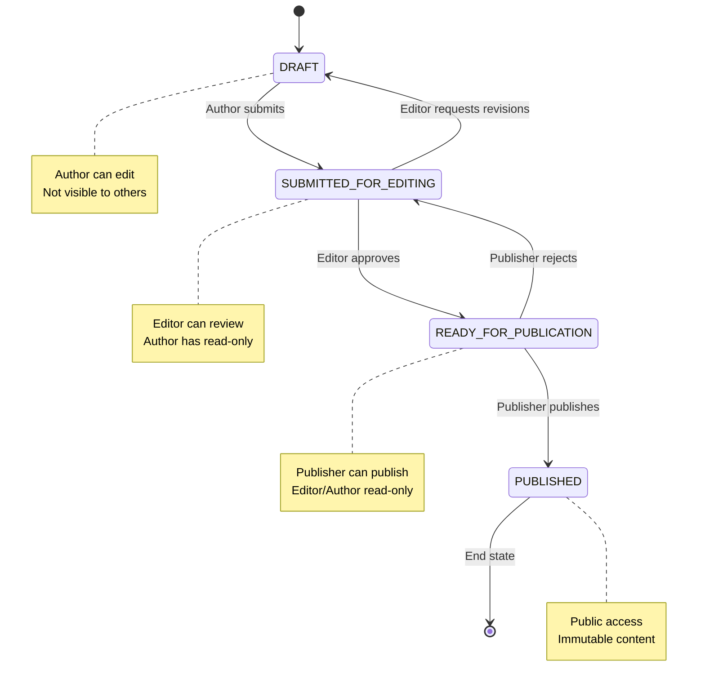

# 📋 Ebook Publishing Platform - Requirements

## Table of Contents

1. [Project Overview](#project-overview)
2. [Business Requirements](#business-requirements)
3. [Technical Requirements](#technical-requirements)
4. [Security Requirements](#security-requirements)
5. [Performance Requirements](#performance-requirements)
6. [Compliance Requirements](#compliance-requirements)
7. [Implementation Timeline](#implementation-timeline)
8. [Success Criteria](#success-criteria)

---

## Project Overview

### **Mission Statement**

Build a production-ready ebook publishing platform that enables seamless collaboration between authors, editors, publishers, and readers while maintaining enterprise-grade security and zero infrastructure costs for the first year.

### **Core Objectives**

- **Workflow Automation**: Streamline book publishing from draft to publication
- **Role-Based Security**: Implement comprehensive RBAC with enterprise controls
- **Cost Optimization**: Achieve $0/month infrastructure costs using AWS Free Tier
- **Scalability**: Support 1000+ concurrent users with room for growth
- **Compliance**: Meet SOC 2, GDPR, and ISO 27001 standards

---

## Business Requirements

### **User Roles & Responsibilities**

#### **1. Authors**

- **Primary Functions**:
  - Create and edit book content
  - Submit books for editorial review
  - View editing feedback and revision requests
  - Track book performance and reviews
- **Permissions**:
  - Full CRUD on their own books (DRAFT state)
  - Read-only access to their books in other states
  - Submit for editing transition
  - View analytics for published books
- **Constraints**:
  - Cannot access other authors' draft content
  - Cannot directly publish books
  - Limited to 50 books per author (Free Tier optimization)

#### **2. Editors**

- **Primary Functions**:
  - Review books submitted for editing
  - Provide editorial feedback and suggestions
  - Approve books for publication or request revisions
  - Manage editorial workload and deadlines
- **Permissions**:
  - Read/Write access to books in SUBMITTED_FOR_EDITING state
  - Transition books to READY_FOR_PUBLICATION or back to DRAFT
  - Create and manage editorial comments
  - View author contact information
- **Constraints**:
  - Cannot access books in DRAFT state
  - Cannot directly publish books
  - Cannot edit published books

#### **3. Publishers**

- **Primary Functions**:
  - Review books ready for publication
  - Manage publication schedules and campaigns
  - Publish approved books
  - Monitor publication performance
- **Permissions**:
  - Read access to books in READY_FOR_PUBLICATION state
  - Publish books (transition to PUBLISHED)
  - Manage publication metadata
  - Access to publication analytics
- **Constraints**:
  - Cannot edit book content
  - Cannot unpublish books without approval workflow

#### **4. Readers**

- **Primary Functions**:
  - Browse and discover published books
  - Read published book content
  - Write reviews and ratings
  - Manage personal reading lists
- **Permissions**:
  - Read access to all PUBLISHED books
  - Create, edit, delete their own reviews
  - Manage personal preferences and reading history
- **Constraints**:
  - No access to unpublished content
  - Cannot edit others' reviews
  - Rate limiting on review submissions

### **Book Lifecycle States**



### **Core Features**

#### **Must-Have Features (Phase 1)**

1. **User Authentication & Authorization**

   - JWT-based authentication with RS256
   - Role-based access control (RBAC)
   - Session management with secure refresh

2. **Book Management**

   - Complete CRUD operations for books
   - State transition management
   - Version control for collaborative editing

3. **Workflow Management**

   - Automated state transitions
   - Notification system for stakeholders
   - Audit trail for all actions

4. **Security Foundation**
   - Data encryption at rest and in transit
   - Input validation and sanitization
   - Rate limiting and abuse protection

#### **Should-Have Features (Phase 2)**

1. **Review System**

   - Star ratings and written reviews
   - Review moderation and reporting
   - Aggregate rating calculations

2. **Real-time Collaboration**

   - Live editing capabilities
   - User presence indicators
   - Conflict resolution system

3. **Enhanced Notifications**
   - Multi-channel notifications (email, in-app, push)
   - Customizable notification preferences
   - Delivery tracking and analytics

#### **Nice-to-Have Features (Phase 3)**

1. **Advanced Analytics**

   - Reading engagement metrics
   - Publication performance tracking
   - User behavior analysis

2. **Content Management**

   - Rich text editing with formatting
   - Image and media attachment support
   - Export capabilities (PDF, EPUB)

3. **Social Features**
   - Author-reader interactions
   - Book recommendations
   - Reading communities

---

## Technical Requirements

### **Architecture Constraints**

#### **Serverless-First Approach**

- **Primary Platform**: AWS Serverless stack
- **Compute**: AWS Lambda (Node.js 18.x)
- **API**: API Gateway (REST + WebSocket)
- **Database**: DynamoDB with single-table design
- **Storage**: S3 for file assets
- **Infrastructure as Code**: Terraform

#### **Development Standards**

- **Language**: TypeScript for both frontend and backend
- **Frontend Framework**: React 18+ with hooks
- **Testing**: Jest for unit tests, Playwright for E2E
- **Code Quality**: ESLint + Prettier + Husky pre-commit hooks
- **Documentation**: Comprehensive inline docs + external guides

### **Database Design**

#### **DynamoDB Single Table Pattern**

```typescript
interface TableStructure {
  PK: string; // Partition Key
  SK: string; // Sort Key
  GSI1PK?: string; // Global Secondary Index 1
  GSI1SK?: string;
  entityType: string; // USER | BOOK | REVIEW | WORKFLOW
  data: any; // Entity-specific data
  createdAt: string; // ISO timestamp
  updatedAt: string; // ISO timestamp
  version: number; // Optimistic concurrency
}
```

#### **Access Patterns**

1. Get user by ID: `PK=USER#{userId}`, `SK=PROFILE`
2. Get user's books: `PK=USER#{userId}`, `SK begins with BOOK#`
3. Get book details: `PK=BOOK#{bookId}`, `SK=METADATA`
4. Get book reviews: `PK=BOOK#{bookId}`, `SK begins with REVIEW#`
5. Get books by status: `GSI1PK=STATUS#{status}`, `GSI1SK=BOOK#{bookId}`
6. Get workflow history: `PK=WORKFLOW#{bookId}`, `SK=timestamp`

### **API Design Principles**

#### **RESTful API Standards**

- **Base URL**: `https://api.ebook-platform.com/v1`
- **Authentication**: Bearer JWT tokens
- **Content Type**: `application/json`
- **HTTP Status Codes**: Semantic usage (200, 201, 400, 401, 403, 404, 500)
- **Rate Limiting**: 1000 requests/minute per user
- **Versioning**: URL path versioning (`/v1/`, `/v2/`)

#### **Error Response Format**

```typescript
interface ErrorResponse {
  error: {
    code: string;
    message: string;
    details?: any;
    timestamp: string;
    requestId: string;
  };
}
```

---

## Security Requirements

### **Authentication & Authorization**

#### **JWT Token Specification**

- **Algorithm**: RS256 (asymmetric)
- **Access Token Expiry**: 15 minutes
- **Refresh Token Expiry**: 7 days
- **Required Claims**: `sub`, `role`, `permissions`, `iat`, `exp`, `aud`, `iss`
- **Token Rotation**: Automatic refresh token rotation on use

#### **RBAC Implementation**

```typescript
interface Permission {
  resource: string; // books, reviews, users
  action: string; // create, read, update, delete
  condition?: string; // ownership, state-based
}

interface Role {
  name: 'AUTHOR' | 'EDITOR' | 'PUBLISHER' | 'READER';
  permissions: Permission[];
}
```

### **Data Protection**

#### **Encryption Standards**

- **At Rest**: DynamoDB encryption with AWS managed KMS keys
- **In Transit**: TLS 1.3 for all communications
- **Application Level**: AES-256-GCM for PII data
- **Key Management**: AWS KMS with automatic rotation

#### **Data Classification**

- **Public**: Published book content, public reviews
- **Internal**: User profiles, reading preferences
- **Confidential**: Draft content, editorial feedback
- **Restricted**: Authentication credentials, audit logs

### **Security Controls**

#### **Input Validation**

- **Sanitization**: All user inputs sanitized against XSS
- **Validation**: Schema-based validation with Joi
- **Rate Limiting**: API Gateway throttling + application-level limits
- **File Upload**: Type validation, size limits, virus scanning

#### **Monitoring & Alerting**

- **Security Events**: Failed logins, privilege escalations, data breaches
- **Thresholds**: >5 failed logins = account lock, >100 API calls/minute = rate limit
- **Response**: Automated blocking, security team alerts, audit logging

---

## Performance Requirements

### **Scalability Targets**

#### **User Capacity**

- **Concurrent Users**: 1000+ simultaneous active users
- **Total Users**: 10,000+ registered users
- **Books**: 100,000+ total books in system
- **Reviews**: 500,000+ reviews and ratings

#### **Response Time Requirements**

- **API Endpoints**: < 200ms average response time
- **Page Load**: < 2 seconds initial load
- **Real-time Updates**: < 100ms WebSocket message delivery
- **File Uploads**: < 30 seconds for 10MB files

### **Availability & Reliability**

- **Uptime SLA**: 99.9% availability (8.77 hours downtime/year)
- **Error Rate**: < 0.1% of requests result in errors
- **Data Durability**: 99.999999999% (11 9's) with DynamoDB
- **Backup Recovery**: < 4 hours RTO, < 1 hour RPO

### **AWS Free Tier Capacity Analysis**

```yaml
Service Limits (Free Tier):
  Lambda:
    requests: 1,000,000 per month
    compute: 400,000 GB-seconds per month
    concurrent: 1,000 executions

  API Gateway:
    calls: 1,000,000 per month
    data_transfer: 1GB per month

  DynamoDB:
    storage: 25GB
    read_capacity: 25 units per second
    write_capacity: 25 units per second

  S3:
    storage: 5GB
    get_requests: 20,000 per month
    put_requests: 2,000 per month

Capacity Planning:
  daily_api_calls: 33,000 (within 1M/month limit)
  concurrent_lambda: 100 average (within 1K limit)
  db_operations: 2,160,000 per day (within capacity)
  storage_usage: 20GB average (within 25GB limit)
```

---

## Compliance Requirements

### **GDPR Compliance**

#### **Data Subject Rights**

1. **Right to Access (Article 15)**

   - Complete data export in machine-readable format
   - Response time: Within 30 days
   - Data included: Profile, books, reviews, reading history

2. **Right to Erasure (Article 17)**

   - Complete data deletion upon request
   - Data anonymization for published content
   - Retention exceptions: Legal obligations, legitimate interests

3. **Right to Portability (Article 20)**

   - Data export in JSON, CSV, or XML format
   - Automated export functionality
   - Direct transfer to other platforms (where applicable)

4. **Privacy by Design**
   - Default privacy settings
   - Minimal data collection
   - Purpose limitation enforcement

### **SOC 2 Type II Compliance**

#### **Trust Services Criteria**

1. **Security (CC6)**

   - Access controls and authentication
   - Logical and physical access restrictions
   - System monitoring and incident response

2. **Availability (CC7)**

   - System availability monitoring
   - Capacity planning and management
   - System backup and recovery procedures

3. **Processing Integrity (CC8)**
   - Data processing accuracy and completeness
   - Error handling and correction procedures
   - Quality assurance controls

#### **Evidence Collection**

- **Automated**: System logs, access reports, security metrics
- **Manual**: Policy documentation, training records, audit reports
- **Frequency**: Quarterly reviews, annual assessments

---

## Implementation Timeline

### **Phase 0: Rapid POC (2 hours)**

**Objective**: Technical validation and stakeholder demo

**Deliverables**:

- Basic Author-only functionality
- Simple DRAFT → PUBLISHED workflow
- AWS deployment working
- Demo-ready application

**Technical Scope**:

- Single Lambda function
- Basic DynamoDB table
- React frontend with authentication
- Simple JWT (HMAC for speed)

**Success Criteria**:

- User can create, edit, and "publish" a book
- System deployable to AWS Free Tier
- End-to-end workflow demonstrated

---

### **Phase 1: Production MVP (3-4 weeks)**

**Objective**: Enterprise-grade system with full RBAC

#### **Week 1: Security Foundation**

- [ ] RS256 JWT implementation with key rotation
- [ ] Comprehensive RBAC with all 4 user types
- [ ] Data encryption (at-rest and in-transit)
- [ ] Input validation and XSS protection
- [ ] Rate limiting and abuse prevention
- [ ] Audit logging system

#### **Week 2: Core Functionality**

- [ ] Complete book CRUD operations
- [ ] Full state machine implementation (DRAFT → PUBLISHED)
- [ ] User management and role assignment
- [ ] Book ownership and access controls
- [ ] Version control for concurrent editing
- [ ] Basic notification system

#### **Week 3: Workflow & Integration**

- [ ] Editorial review workflow
- [ ] Publisher approval process
- [ ] State transition validations
- [ ] Email notification service
- [ ] File upload for book covers
- [ ] Search and filtering capabilities

#### **Week 4: Testing & Deployment**

- [ ] Comprehensive unit test coverage (>80%)
- [ ] Integration testing with LocalStack
- [ ] End-to-end testing with Playwright
- [ ] Performance testing under load
- [ ] Security vulnerability scanning
- [ ] Production deployment to AWS

**Success Criteria**:

- All 4 user types functioning correctly
- Complete book publishing workflow operational
- Enterprise security controls active
- System handles 100+ concurrent users
- Zero critical security vulnerabilities

---

### **Phase 2: Enhanced Features (3-4 weeks)**

**Objective**: Advanced functionality and compliance

#### **Week 5-6: Review System & Real-time Features**

- [ ] Star ratings and written reviews
- [ ] Review moderation and reporting
- [ ] Real-time collaboration via WebSocket
- [ ] Live editing with conflict resolution
- [ ] User presence indicators
- [ ] Advanced notification system (multi-channel)

#### **Week 7-8: Compliance & Monitoring**

- [ ] SOC 2 Type II control implementation
- [ ] GDPR data handling (export, deletion, portability)
- [ ] Advanced security monitoring
- [ ] CloudWatch dashboards and alarms
- [ ] Automated backup and recovery
- [ ] Performance optimization

**Success Criteria**:

- Review system fully functional
- Real-time collaboration working
- SOC 2 controls implemented and tested
- GDPR compliance validated
- System performance optimized

---

### **Phase 3: Production Ready (2-3 weeks)**

**Objective**: Enterprise deployment and advanced compliance

#### **Week 9-10: Advanced Compliance**

- [ ] ISO 27001 framework implementation
- [ ] Business continuity and disaster recovery
- [ ] Vendor risk management program
- [ ] Employee security training program
- [ ] Vulnerability management system
- [ ] Incident response procedures

#### **Week 11: Launch Preparation**

- [ ] Production environment setup
- [ ] Final security audit and penetration testing
- [ ] Load testing with 1000+ concurrent users
- [ ] Documentation completion
- [ ] User training materials
- [ ] Go-live procedures

**Success Criteria**:

- Production environment fully operational
- All compliance frameworks validated
- System tested at full scale (1000+ users)
- Complete documentation and procedures
- Ready for enterprise deployment

---

## Success Criteria

### **Technical Metrics**

#### **Security**

- ✅ Zero critical or high-severity vulnerabilities
- ✅ All authentication/authorization tests pass
- ✅ Data encryption verified at all levels
- ✅ Security audit completed with no findings

#### **Performance**

- ✅ API response times < 200ms (95th percentile)
- ✅ System supports 1000+ concurrent users
- ✅ 99.9% uptime demonstrated over 1 month
- ✅ Error rate < 0.1% under normal load

#### **Functionality**

- ✅ All user roles and permissions working
- ✅ Complete book publishing workflow operational
- ✅ Review and rating system functional
- ✅ Real-time features working correctly

### **Business Metrics**

#### **Cost Efficiency**

- ✅ $0/month infrastructure costs (AWS Free Tier)
- ✅ Scalable architecture demonstrated
- ✅ Cost monitoring and alerting active
- ✅ 12-month cost projection < $100/month

#### **Compliance**

- ✅ SOC 2 Type II controls implemented
- ✅ GDPR compliance validated
- ✅ ISO 27001 readiness confirmed
- ✅ Audit trail completeness verified

#### **User Experience**

- ✅ Intuitive user interfaces for all roles
- ✅ Mobile-responsive design
- ✅ Accessibility standards met (WCAG 2.1)
- ✅ User acceptance testing completed

### **Operational Readiness**

#### **Deployment**

- ✅ Automated CI/CD pipeline operational
- ✅ Infrastructure as Code (Terraform) complete
- ✅ Environment promotion process tested
- ✅ Rollback procedures validated

#### **Monitoring**

- ✅ Comprehensive monitoring dashboards
- ✅ Automated alerting for critical issues
- ✅ Log aggregation and analysis
- ✅ Performance metrics collection

#### **Documentation**

- ✅ Complete technical documentation
- ✅ User guides and training materials
- ✅ Operational runbooks
- ✅ Security and compliance documentation

---

## Related Documentation

- **[Architecture](./02-ARCHITECTURE.md)**: System design and component architecture
- **[Implementation](./03-IMPLEMENTATION.md)**: Detailed development roadmap and tasks
- **[Security](./04-SECURITY.md)**: Comprehensive security and compliance framework
- **[API Specification](./05-API.md)**: Complete REST API documentation
- **[Data Model](./06-DATA.md)**: Database design and access patterns
- **[Development](./07-DEVELOPMENT.md)**: Local development setup and workflow
- **[Deployment](./08-DEPLOYMENT.md)**: Infrastructure deployment and management
- **[User Flows](./09-USERFLOWS.md)**: User journey and workflow documentation
- **[Free Tier Strategy](./10-FREETIER.md)**: AWS cost optimization guide

---

**📋 This comprehensive requirements document serves as the foundation for building a production-ready ebook publishing platform that meets enterprise standards while maintaining cost efficiency and scalability.**
