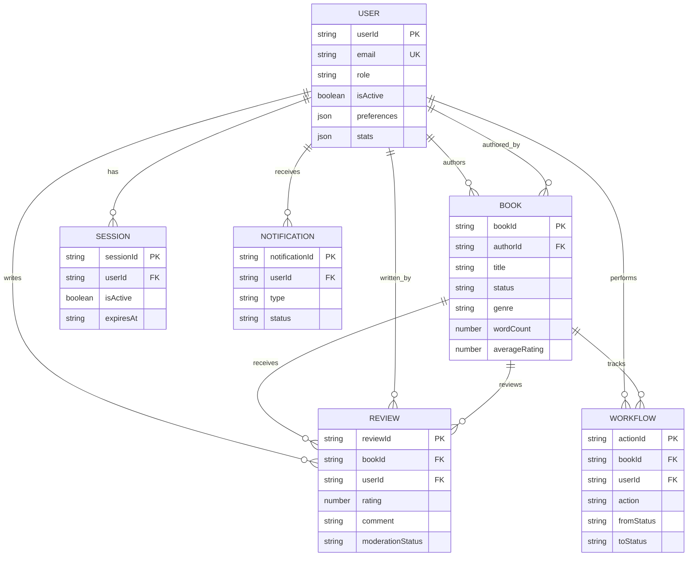

# 🗄️ Data Model - Ebook Publishing Platform

## Table of Contents

1. [Data Model Overview](#data-model-overview)
2. [DynamoDB Single Table Design](#dynamodb-single-table-design)
3. [Entity Patterns](#entity-patterns)
4. [Access Patterns](#access-patterns)
5. [Global Secondary Indexes](#global-secondary-indexes)
6. [Data Relationships](#data-relationships)
7. [Data Validation](#data-validation)
8. [Performance Considerations](#performance-considerations)

---

## Data Model Overview

### **Design Philosophy**

- **Single Table Design**: All entities in one DynamoDB table for optimal performance
- **Access Pattern Driven**: Schema designed around query requirements
- **Scalability First**: Designed to handle millions of books and users
- **Cost Optimized**: Minimizes DynamoDB costs through efficient key design

### **Entity Types**

```typescript
enum EntityType {
  USER = 'USER',
  BOOK = 'BOOK',
  REVIEW = 'REVIEW',
  WORKFLOW = 'WORKFLOW',
  SESSION = 'SESSION',
  NOTIFICATION = 'NOTIFICATION',
  ANALYTICS = 'ANALYTICS',
  CONSENT = 'CONSENT',
}
```

### **Core Table Structure**

```typescript
interface EbookPlatformEntity {
  PK: string; // Partition Key
  SK: string; // Sort Key
  GSI1PK?: string; // Global Secondary Index 1 PK
  GSI1SK?: string; // Global Secondary Index 1 SK
  GSI2PK?: string; // Global Secondary Index 2 PK
  GSI2SK?: string; // Global Secondary Index 2 SK
  entityType: EntityType;
  data: any; // Entity-specific data
  createdAt: string; // ISO 8601 timestamp
  updatedAt: string; // ISO 8601 timestamp
  version: number; // Optimistic concurrency control
  ttl?: number; // TTL for temporary data (Unix timestamp)
}
```

---

## DynamoDB Single Table Design

### **Table Configuration**

```typescript
const tableConfig = {
  TableName: 'ebook-platform-data',
  BillingMode: 'PAY_PER_REQUEST',
  AttributeDefinitions: [
    { AttributeName: 'PK', AttributeType: 'S' },
    { AttributeName: 'SK', AttributeType: 'S' },
    { AttributeName: 'GSI1PK', AttributeType: 'S' },
    { AttributeName: 'GSI1SK', AttributeType: 'S' },
    { AttributeName: 'GSI2PK', AttributeType: 'S' },
    { AttributeName: 'GSI2SK', AttributeType: 'S' },
  ],
  KeySchema: [
    { AttributeName: 'PK', KeyType: 'HASH' },
    { AttributeName: 'SK', KeyType: 'RANGE' },
  ],
  GlobalSecondaryIndexes: [
    {
      IndexName: 'GSI1',
      KeySchema: [
        { AttributeName: 'GSI1PK', KeyType: 'HASH' },
        { AttributeName: 'GSI1SK', KeyType: 'RANGE' },
      ],
      Projection: { ProjectionType: 'ALL' },
    },
    {
      IndexName: 'GSI2',
      KeySchema: [
        { AttributeName: 'GSI2PK', KeyType: 'HASH' },
        { AttributeName: 'GSI2SK', KeyType: 'RANGE' },
      ],
      Projection: { ProjectionType: 'ALL' },
    },
  ],
  StreamSpecification: {
    StreamEnabled: true,
    StreamViewType: 'NEW_AND_OLD_IMAGES',
  },
  SSESpecification: {
    Enabled: true,
    SSEType: 'KMS',
    KMSMasterKeyId: 'alias/aws/dynamodb',
  },
  PointInTimeRecoverySpecification: {
    PointInTimeRecoveryEnabled: true,
  },
};
```

### **Key Design Patterns**

#### **Primary Key Patterns**

```typescript
// User entities
PK: `USER#{userId}`;
SK: `PROFILE` | `BOOK#{bookId}` | `NOTIFICATION#{notificationId}`;

// Book entities
PK: `BOOK#{bookId}`;
SK: `METADATA` | `REVIEW#{reviewId}` | `ANALYTICS#{date}`;

// Workflow entities
PK: `WORKFLOW#{bookId}`;
SK: `{timestamp}#{actionId}`;

// Global entities
PK: `GLOBAL#{entityType}`;
SK: `{identifier}`;
```

#### **GSI Key Patterns**

```typescript
// GSI1: Query by status, genre, role
GSI1PK: `STATUS#{status}` | `GENRE#{genre}` | `ROLE#{role}`;
GSI1SK: `BOOK#{bookId}` | `USER#{userId}` | `{timestamp}`;

// GSI2: Query by date, rating, author
GSI2PK: `DATE#{YYYY-MM-DD}` | `RATING#{rating}` | `AUTHOR#{userId}`;
GSI2SK: `BOOK#{bookId}` | `REVIEW#{reviewId}` | `{score}`;
```

---

## Entity Patterns

### **User Entity**

```typescript
interface UserEntity {
  PK: `USER#{userId}`;
  SK: 'PROFILE';
  entityType: 'USER';
  GSI1PK: `ROLE#{role}`;
  GSI1SK: `USER#{userId}`;
  GSI2PK: `CREATED#{YYYY-MM-DD}`;
  GSI2SK: `USER#{userId}`;
  data: {
    userId: string;
    email: string;           // Encrypted
    firstName: string;       // Encrypted
    lastName: string;        // Encrypted
    role: UserRole;
    isActive: boolean;
    isEmailVerified: boolean;
    lastLoginAt?: string;
    preferences: {
      notifications: {
        email: boolean;
        push: boolean;
        inApp: boolean;
      };
      privacy: {
        showProfile: boolean;
        showActivity: boolean;
      };
    };
    stats: {
      booksCreated?: number;
      booksEdited?: number;
      booksPublished?: number;
      reviewsWritten?: number;
    };
  };
  createdAt: string;
  updatedAt: string;
  version: number;
}

// Example
{
  "PK": "USER#user_123",
  "SK": "PROFILE",
  "entityType": "USER",
  "GSI1PK": "ROLE#AUTHOR",
  "GSI1SK": "USER#user_123",
  "GSI2PK": "CREATED#2024-01-15",
  "GSI2SK": "USER#user_123",
  "data": {
    "userId": "user_123",
    "email": "encrypted_email_data",
    "firstName": "encrypted_first_name",
    "lastName": "encrypted_last_name",
    "role": "AUTHOR",
    "isActive": true,
    "isEmailVerified": true,
    "preferences": {
      "notifications": {
        "email": true,
        "push": false,
        "inApp": true
      }
    },
    "stats": {
      "booksCreated": 5,
      "booksPublished": 2
    }
  },
  "createdAt": "2024-01-15T10:00:00Z",
  "updatedAt": "2024-01-20T15:30:00Z",
  "version": 3
}
```

### **Book Entity**

```typescript
interface BookEntity {
  PK: `BOOK#{bookId}`;
  SK: 'METADATA';
  entityType: 'BOOK';
  GSI1PK: `STATUS#{status}`;
  GSI1SK: `BOOK#{bookId}`;
  GSI2PK: `GENRE#{genre}`;
  GSI2SK: `BOOK#{bookId}`;
  data: {
    bookId: string;
    title: string;
    description: string;
    content: string;         // Main book content
    authorId: string;
    authorName: string;      // Denormalized for performance
    status: BookStatus;
    genre: string;
    tags: string[];
    isbn?: string;
    language: string;
    wordCount: number;
    pageCount?: number;
    coverImageUrl?: string;
    previewText: string;     // First few paragraphs

    // Publishing metadata
    submittedAt?: string;
    submittedBy?: string;
    approvedAt?: string;
    approvedBy?: string;
    publishedAt?: string;
    publishedBy?: string;

    // Editorial data
    assignedEditor?: string;
    editorialComments?: EditorialComment[];

    // Analytics
    viewCount: number;
    downloadCount: number;
    averageRating: number;
    reviewCount: number;

    // SEO and discovery
    searchKeywords: string[];
    marketingTags: string[];
  };
  createdAt: string;
  updatedAt: string;
  version: number;
}

// Example
{
  "PK": "BOOK#book_456",
  "SK": "METADATA",
  "entityType": "BOOK",
  "GSI1PK": "STATUS#PUBLISHED",
  "GSI1SK": "BOOK#book_456",
  "GSI2PK": "GENRE#FICTION",
  "GSI2SK": "BOOK#book_456",
  "data": {
    "bookId": "book_456",
    "title": "The Great Adventure",
    "description": "An epic journey through unknown lands",
    "content": "Chapter 1: The Beginning...",
    "authorId": "user_123",
    "authorName": "John Smith",
    "status": "PUBLISHED",
    "genre": "fiction",
    "tags": ["adventure", "fantasy", "young-adult"],
    "language": "en",
    "wordCount": 75000,
    "coverImageUrl": "https://s3.../covers/book_456.jpg",
    "previewText": "In a land far away...",
    "publishedAt": "2024-01-20T10:00:00Z",
    "publishedBy": "publisher_789",
    "viewCount": 1250,
    "downloadCount": 890,
    "averageRating": 4.2,
    "reviewCount": 47,
    "searchKeywords": ["adventure", "fantasy", "journey", "lands"]
  },
  "createdAt": "2024-01-10T09:00:00Z",
  "updatedAt": "2024-01-20T10:00:00Z",
  "version": 8
}
```

### **Review Entity**

```typescript
interface ReviewEntity {
  PK: `BOOK#{bookId}`;
  SK: `REVIEW#{reviewId}`;
  entityType: 'REVIEW';
  GSI1PK: `RATING#{rating}`;
  GSI1SK: `REVIEW#{reviewId}`;
  GSI2PK: `USER#{userId}`;
  GSI2SK: `REVIEW#{reviewId}`;
  data: {
    reviewId: string;
    bookId: string;
    userId: string;
    userName: string;        // First name only for privacy
    rating: number;          // 1-5 stars
    comment: string;
    anonymous: boolean;

    // Moderation
    moderationStatus: 'APPROVED' | 'PENDING' | 'FLAGGED' | 'REJECTED';
    moderatedBy?: string;
    moderationReason?: string;

    // Community engagement
    helpfulVotes: number;
    reportCount: number;

    // Metadata
    ipAddress?: string;      // For spam prevention
    userAgent?: string;
    editCount: number;
    lastEditedAt?: string;
  };
  createdAt: string;
  updatedAt: string;
  version: number;
}

// Example
{
  "PK": "BOOK#book_456",
  "SK": "REVIEW#review_789",
  "entityType": "REVIEW",
  "GSI1PK": "RATING#5",
  "GSI1SK": "REVIEW#review_789",
  "GSI2PK": "USER#user_321",
  "GSI2SK": "REVIEW#review_789",
  "data": {
    "reviewId": "review_789",
    "bookId": "book_456",
    "userId": "user_321",
    "userName": "Jane",
    "rating": 5,
    "comment": "Amazing book! The story kept me engaged from start to finish.",
    "anonymous": false,
    "moderationStatus": "APPROVED",
    "helpfulVotes": 12,
    "reportCount": 0,
    "editCount": 1,
    "lastEditedAt": "2024-01-22T14:30:00Z"
  },
  "createdAt": "2024-01-21T16:45:00Z",
  "updatedAt": "2024-01-22T14:30:00Z",
  "version": 2
}
```

### **Workflow Entity**

```typescript
interface WorkflowEntity {
  PK: `WORKFLOW#{bookId}`;
  SK: `{timestamp}#{actionId}`;
  entityType: 'WORKFLOW';
  GSI1PK: `BOOK#{bookId}`;
  GSI1SK: `{timestamp}`;
  GSI2PK: `USER#{userId}`;
  GSI2SK: `{timestamp}`;
  data: {
    actionId: string;
    bookId: string;
    userId: string;
    userName: string;
    userRole: UserRole;
    action: WorkflowAction;
    fromStatus: BookStatus;
    toStatus: BookStatus;
    comments?: string;
    metadata?: {
      assignedTo?: string;
      reason?: string;
      urgency?: 'LOW' | 'MEDIUM' | 'HIGH';
      estimatedCompletionTime?: string;
    };
  };
  createdAt: string;
  updatedAt: string;
  version: number;
}

// Example
{
  "PK": "WORKFLOW#book_456",
  "SK": "2024-01-15T10:30:00Z#action_001",
  "entityType": "WORKFLOW",
  "GSI1PK": "BOOK#book_456",
  "GSI1SK": "2024-01-15T10:30:00Z",
  "GSI2PK": "USER#user_123",
  "GSI2SK": "2024-01-15T10:30:00Z",
  "data": {
    "actionId": "action_001",
    "bookId": "book_456",
    "userId": "user_123",
    "userName": "John Smith",
    "userRole": "AUTHOR",
    "action": "SUBMIT_FOR_EDITING",
    "fromStatus": "DRAFT",
    "toStatus": "SUBMITTED_FOR_EDITING",
    "comments": "Ready for editorial review. Please focus on character development.",
    "metadata": {
      "urgency": "MEDIUM"
    }
  },
  "createdAt": "2024-01-15T10:30:00Z",
  "updatedAt": "2024-01-15T10:30:00Z",
  "version": 1
}
```

### **Session Entity**

```typescript
interface SessionEntity {
  PK: `SESSION#{sessionId}`;
  SK: 'METADATA';
  entityType: 'SESSION';
  GSI1PK: `USER#{userId}`;
  GSI1SK: `SESSION#{sessionId}`;
  data: {
    sessionId: string;
    userId: string;
    refreshTokenHash: string;
    deviceInfo: {
      userAgent: string;
      ipAddress: string;
      deviceType: 'desktop' | 'mobile' | 'tablet';
      location?: {
        country: string;
        city: string;
        region: string;
      };
    };
    isActive: boolean;
    lastAccessAt: string;
    expiresAt: string;
  };
  createdAt: string;
  updatedAt: string;
  version: number;
  ttl: number; // Auto-expire sessions
}
```

### **Notification Entity**

```typescript
interface NotificationEntity {
  PK: `USER#{userId}`;
  SK: `NOTIFICATION#{notificationId}`;
  entityType: 'NOTIFICATION';
  GSI1PK: `TYPE#{type}`;
  GSI1SK: `NOTIFICATION#{notificationId}`;
  GSI2PK: `STATUS#{status}`;
  GSI2SK: `USER#{userId}`;
  data: {
    notificationId: string;
    userId: string;
    type: NotificationType;
    title: string;
    message: string;
    status: 'UNREAD' | 'READ' | 'ARCHIVED';
    priority: 'LOW' | 'MEDIUM' | 'HIGH';
    actionUrl?: string;
    actionText?: string;
    relatedEntityType?: EntityType;
    relatedEntityId?: string;
    metadata?: any;
    readAt?: string;
    channels: {
      email: boolean;
      push: boolean;
      inApp: boolean;
    };
    deliveryStatus: {
      email?: 'PENDING' | 'SENT' | 'DELIVERED' | 'FAILED';
      push?: 'PENDING' | 'SENT' | 'DELIVERED' | 'FAILED';
      inApp?: 'PENDING' | 'SENT' | 'DELIVERED' | 'FAILED';
    };
  };
  createdAt: string;
  updatedAt: string;
  version: number;
  ttl?: number; // Auto-expire old notifications
}
```

---

## Access Patterns

### **Primary Access Patterns**

| Pattern              | Keys Used                                  | Description               | Example                  |
| -------------------- | ------------------------------------------ | ------------------------- | ------------------------ |
| Get user profile     | `PK=USER#{userId}, SK=PROFILE`             | Retrieve user information | User login, profile page |
| Get user's books     | `PK=USER#{userId}, SK begins_with BOOK#`   | List books owned by user  | Author dashboard         |
| Get book details     | `PK=BOOK#{bookId}, SK=METADATA`            | Retrieve book information | Book detail page         |
| Get book reviews     | `PK=BOOK#{bookId}, SK begins_with REVIEW#` | List reviews for book     | Book review section      |
| Get workflow history | `PK=WORKFLOW#{bookId}`                     | Book's workflow history   | Editorial tracking       |

### **GSI Access Patterns**

#### **GSI1: Status and Role-based Queries**

| Pattern         | Keys Used                | Description                   | Example               |
| --------------- | ------------------------ | ----------------------------- | --------------------- |
| Books by status | `GSI1PK=STATUS#{status}` | Find books in specific state  | Editor queue          |
| Users by role   | `GSI1PK=ROLE#{role}`     | Find users with specific role | Admin user management |
| Books by genre  | `GSI1PK=GENRE#{genre}`   | Find books in genre           | Book discovery        |

#### **GSI2: Date and Rating-based Queries**

| Pattern                   | Keys Used                                      | Description              | Example         |
| ------------------------- | ---------------------------------------------- | ------------------------ | --------------- |
| Books by publication date | `GSI2PK=DATE#{YYYY-MM-DD}`                     | Recently published books | Homepage feed   |
| High-rated books          | `GSI2PK=RATING#5`                              | Top-rated books          | Recommendations |
| User's reviews            | `GSI2PK=USER#{userId}, SK begins_with REVIEW#` | User's review history    | Profile page    |

### **Complex Query Examples**

#### **Editor Dashboard - Books Awaiting Review**

```typescript
const getEditorQueue = async (editorId: string) => {
  // 1. Get books in SUBMITTED_FOR_EDITING status
  const submittedBooks = await dynamodb.query({
    TableName: TABLE_NAME,
    IndexName: 'GSI1',
    KeyConditionExpression: 'GSI1PK = :status',
    ExpressionAttributeValues: {
      ':status': 'STATUS#SUBMITTED_FOR_EDITING',
    },
  });

  // 2. Filter by assignment or availability
  const availableBooks = submittedBooks.Items.filter(
    (book) => !book.data.assignedEditor || book.data.assignedEditor === editorId
  );

  return availableBooks;
};
```

#### **Reader Discovery - Popular Books by Genre**

```typescript
const getPopularBooksByGenre = async (genre: string, limit: number = 20) => {
  // 1. Get books by genre
  const booksByGenre = await dynamodb.query({
    TableName: TABLE_NAME,
    IndexName: 'GSI2',
    KeyConditionExpression: 'GSI2PK = :genre',
    ExpressionAttributeValues: {
      ':genre': `GENRE#${genre.toUpperCase()}`,
    },
  });

  // 2. Sort by popularity (view count + rating)
  const sortedBooks = booksByGenre.Items.filter(
    (book) => book.data.status === 'PUBLISHED'
  )
    .sort((a, b) => {
      const scoreA = a.data.viewCount + a.data.averageRating * 100;
      const scoreB = b.data.viewCount + b.data.averageRating * 100;
      return scoreB - scoreA;
    })
    .slice(0, limit);

  return sortedBooks;
};
```

#### **Analytics - User Activity Timeline**

```typescript
const getUserActivityTimeline = async (userId: string, days: number = 30) => {
  const startDate = new Date();
  startDate.setDate(startDate.getDate() - days);

  // Get user's workflow actions
  const activities = await dynamodb.query({
    TableName: TABLE_NAME,
    IndexName: 'GSI2',
    KeyConditionExpression: 'GSI2PK = :userId AND GSI2SK >= :startDate',
    ExpressionAttributeValues: {
      ':userId': `USER#${userId}`,
      ':startDate': startDate.toISOString(),
    },
    ScanIndexForward: false, // Most recent first
  });

  return activities.Items;
};
```

---

## Global Secondary Indexes

### **GSI1: Status and Type-based Queries**

```typescript
interface GSI1Pattern {
  GSI1PK:
    | `STATUS#{BookStatus}` // Books by status
    | `ROLE#{UserRole}` // Users by role
    | `TYPE#{NotificationType}` // Notifications by type
    | `GENRE#{genre}`; // Books by genre

  GSI1SK:
    | `BOOK#{bookId}` // Book identifier
    | `USER#{userId}` // User identifier
    | `NOTIFICATION#{id}` // Notification identifier
    | `{timestamp}`; // Time-based sorting
}

// Usage examples
const patterns = {
  draftBooks: 'GSI1PK = STATUS#DRAFT',
  authors: 'GSI1PK = ROLE#AUTHOR',
  fictionBooks: 'GSI1PK = GENRE#FICTION',
  urgentNotifications: 'GSI1PK = TYPE#URGENT',
};
```

### **GSI2: Time and Rating-based Queries**

```typescript
interface GSI2Pattern {
  GSI2PK:
    | `DATE#{YYYY-MM-DD}` // Date-based queries
    | `RATING#{1-5}` // Rating-based queries
    | `USER#{userId}` // User-centric queries
    | `AUTHOR#{authorId}`; // Author-centric queries

  GSI2SK:
    | `BOOK#{bookId}` // Book identifier
    | `REVIEW#{reviewId}` // Review identifier
    | `{score}#{id}` // Scored sorting
    | `{timestamp}`; // Time-based sorting
}

// Usage examples
const patterns = {
  todaysBooks: 'GSI2PK = DATE#2024-01-15',
  fiveStarReviews: 'GSI2PK = RATING#5',
  userReviews: 'GSI2PK = USER#user_123',
  authorBooks: 'GSI2PK = AUTHOR#author_456',
};
```

---

## Data Relationships

### **Entity Relationship Diagram**



### **Data Consistency Patterns**

#### **Optimistic Concurrency Control**

```typescript
const updateBookWithVersion = async (
  bookId: string,
  updates: any,
  expectedVersion: number
) => {
  try {
    await dynamodb.update({
      TableName: TABLE_NAME,
      Key: { PK: `BOOK#${bookId}`, SK: 'METADATA' },
      UpdateExpression:
        'SET #data = :data, #version = #version + :inc, updatedAt = :now',
      ConditionExpression: '#version = :expectedVersion',
      ExpressionAttributeNames: {
        '#data': 'data',
        '#version': 'version',
      },
      ExpressionAttributeValues: {
        ':data': updates,
        ':expectedVersion': expectedVersion,
        ':inc': 1,
        ':now': new Date().toISOString(),
      },
    });
  } catch (error) {
    if (error.code === 'ConditionalCheckFailedException') {
      throw new ConflictError('Book was modified by another user');
    }
    throw error;
  }
};
```

#### **Transactional Operations**

```typescript
const publishBook = async (bookId: string, publisherId: string) => {
  const timestamp = new Date().toISOString();

  await dynamodb.transactWrite({
    TransactItems: [
      // Update book status
      {
        Update: {
          TableName: TABLE_NAME,
          Key: { PK: `BOOK#${bookId}`, SK: 'METADATA' },
          UpdateExpression:
            'SET #data.#status = :status, #data.publishedAt = :now, #data.publishedBy = :publisher',
          ConditionExpression: '#data.#status = :currentStatus',
          ExpressionAttributeNames: {
            '#data': 'data',
            '#status': 'status',
          },
          ExpressionAttributeValues: {
            ':status': 'PUBLISHED',
            ':currentStatus': 'READY_FOR_PUBLICATION',
            ':now': timestamp,
            ':publisher': publisherId,
          },
        },
      },
      // Create workflow entry
      {
        Put: {
          TableName: TABLE_NAME,
          Item: {
            PK: `WORKFLOW#${bookId}`,
            SK: `${timestamp}#${uuidv4()}`,
            entityType: 'WORKFLOW',
            GSI1PK: `BOOK#${bookId}`,
            GSI1SK: timestamp,
            GSI2PK: `USER#${publisherId}`,
            GSI2SK: timestamp,
            data: {
              bookId,
              userId: publisherId,
              action: 'PUBLISH',
              fromStatus: 'READY_FOR_PUBLICATION',
              toStatus: 'PUBLISHED',
            },
            createdAt: timestamp,
            updatedAt: timestamp,
            version: 1,
          },
        },
      },
    ],
  });
};
```

---

## Data Validation

### **Schema Validation**

```typescript
const bookSchema = Joi.object({
  title: Joi.string().min(1).max(200).required(),
  description: Joi.string().max(2000),
  content: Joi.string().min(100).max(2000000).required(),
  authorId: Joi.string().uuid().required(),
  status: Joi.string().valid(
    'DRAFT',
    'SUBMITTED_FOR_EDITING',
    'READY_FOR_PUBLICATION',
    'PUBLISHED'
  ),
  genre: Joi.string()
    .valid(
      'fiction',
      'non-fiction',
      'science-fiction',
      'mystery',
      'romance',
      'fantasy'
    )
    .required(),
  tags: Joi.array().items(Joi.string().max(50)).max(10),
  language: Joi.string().length(2).default('en'),
  isbn: Joi.string().pattern(/^(?:\d{9}X|\d{10}|\d{13})$/),
  wordCount: Joi.number().integer().min(0).max(2000000),
  coverImageUrl: Joi.string().uri(),
});

const reviewSchema = Joi.object({
  bookId: Joi.string().uuid().required(),
  userId: Joi.string().uuid().required(),
  rating: Joi.number().integer().min(1).max(5).required(),
  comment: Joi.string().min(10).max(2000).required(),
  anonymous: Joi.boolean().default(false),
});
```

### **Data Sanitization**

```typescript
class DataSanitizer {
  static sanitizeBook(book: any): SanitizedBook {
    return {
      title: this.sanitizeText(book.title),
      description: this.sanitizeText(book.description),
      content: this.sanitizeHtml(book.content),
      genre: book.genre.toLowerCase(),
      tags:
        book.tags?.map((tag: string) => this.sanitizeText(tag.toLowerCase())) ||
        [],
      searchKeywords: this.extractKeywords(book.title + ' ' + book.description),
    };
  }

  static sanitizeReview(review: any): SanitizedReview {
    return {
      rating: Math.max(1, Math.min(5, parseInt(review.rating))),
      comment: this.sanitizeText(review.comment),
      anonymous: Boolean(review.anonymous),
    };
  }

  private static sanitizeText(text: string): string {
    return text
      .trim()
      .replace(/[<>\"']/g, '')
      .replace(/\s+/g, ' ')
      .substring(0, 2000);
  }

  private static sanitizeHtml(html: string): string {
    return DOMPurify.sanitize(html, {
      ALLOWED_TAGS: ['p', 'br', 'strong', 'em', 'h1', 'h2', 'h3'],
      ALLOWED_ATTR: [],
    });
  }
}
```

---

## Performance Considerations

### **Hot Partitions Prevention**

```typescript
// Avoid hot partitions by distributing writes
const generateDistributedKey = (baseKey: string): string => {
  const hash = crypto.createHash('md5').update(baseKey).digest('hex');
  const shard = hash.substring(0, 2); // Use first 2 hex chars as shard
  return `${shard}#${baseKey}`;
};

// For high-write entities like analytics
const analyticsKey = generateDistributedKey(`ANALYTICS#${bookId}#${date}`);
```

### **Read Optimization**

```typescript
// Batch get operations for efficiency
const getBooksWithDetails = async (bookIds: string[]) => {
  const keys = bookIds.map((id) => ({
    PK: `BOOK#${id}`,
    SK: 'METADATA',
  }));

  const result = await dynamodb.batchGet({
    RequestItems: {
      [TABLE_NAME]: {
        Keys: keys,
      },
    },
  });

  return result.Responses[TABLE_NAME];
};

// Parallel queries for related data
const getBookWithReviews = async (bookId: string) => {
  const [book, reviews] = await Promise.all([
    getBook(bookId),
    getBookReviews(bookId),
  ]);

  return { book, reviews };
};
```

### **Write Optimization**

```typescript
// Batch write operations
const createMultipleReviews = async (reviews: Review[]) => {
  const putRequests = reviews.map((review) => ({
    PutRequest: {
      Item: {
        PK: `BOOK#${review.bookId}`,
        SK: `REVIEW#${review.reviewId}`,
        entityType: 'REVIEW',
        GSI1PK: `RATING#${review.rating}`,
        GSI1SK: `REVIEW#${review.reviewId}`,
        data: review,
        createdAt: new Date().toISOString(),
        version: 1,
      },
    },
  }));

  // Process in batches of 25 (DynamoDB limit)
  const batches = chunk(putRequests, 25);

  for (const batch of batches) {
    await dynamodb.batchWrite({
      RequestItems: {
        [TABLE_NAME]: batch,
      },
    });
  }
};
```

### **Caching Strategy**

```typescript
class DataCache {
  private cache = new Map();
  private readonly DEFAULT_TTL = 300000; // 5 minutes

  async getBook(bookId: string): Promise<Book> {
    const cacheKey = `book:${bookId}`;

    // Check cache first
    if (this.cache.has(cacheKey)) {
      const cached = this.cache.get(cacheKey);
      if (Date.now() < cached.expires) {
        return cached.data;
      }
    }

    // Fetch from database
    const book = await this.fetchBookFromDB(bookId);

    // Cache for future requests
    this.cache.set(cacheKey, {
      data: book,
      expires: Date.now() + this.DEFAULT_TTL,
    });

    return book;
  }

  invalidateBook(bookId: string): void {
    this.cache.delete(`book:${bookId}`);
  }
}
```

---

This comprehensive data model provides a scalable, efficient, and cost-effective foundation for the ebook publishing platform while maintaining ACID properties and supporting complex query patterns.

---

## Related Documentation

- **[Requirements](./01-REQUIREMENTS.md)**: Comprehensive project requirements
- **[Architecture](./02-ARCHITECTURE.md)**: System design and component architecture
- **[Implementation](./03-IMPLEMENTATION.md)**: Development roadmap and tasks
- **[Security](./04-SECURITY.md)**: Security and compliance framework
- **[API Specification](./05-API.md)**: Complete REST API documentation
- **[Development](./07-DEVELOPMENT.md)**: Local development setup and workflow
- **[Deployment](./08-DEPLOYMENT.md)**: Infrastructure deployment and management
