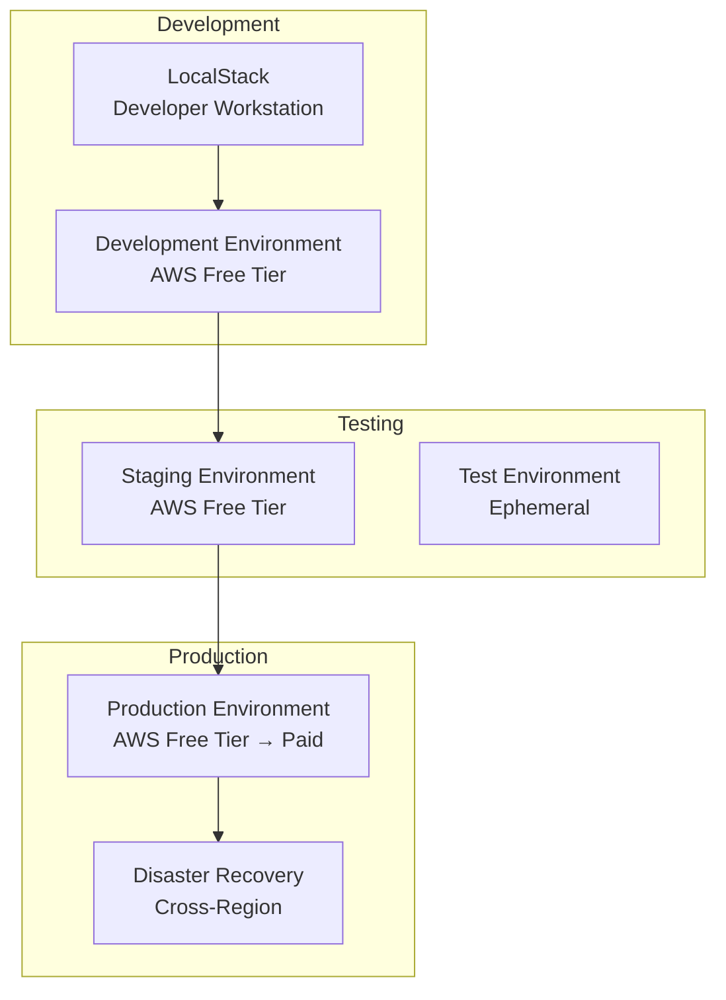

# 🚀 Deployment Guide - Ebook Publishing Platform

## Table of Contents

1. [Deployment Overview](#deployment-overview)
2. [Infrastructure as Code](#infrastructure-as-code)
3. [Environment Configuration](#environment-configuration)
4. [Local Deployment (LocalStack)](#local-deployment-localstack)
5. [AWS Free Tier Deployment](#aws-free-tier-deployment)
6. [Production Deployment](#production-deployment)
7. [CI/CD Pipeline](#cicd-pipeline)
8. [Monitoring and Observability](#monitoring-and-observability)
9. [Backup and Recovery](#backup-and-recovery)
10. [Troubleshooting](#troubleshooting)

---

## Deployment Overview

### **Deployment Strategy**

The platform uses a **multi-environment deployment strategy** with Infrastructure as Code (Terraform) to ensure consistency, repeatability, and cost efficiency.



### **Environment Characteristics**

| Environment     | Purpose         | AWS Tier         | Uptime SLA | Cost        |
| --------------- | --------------- | ---------------- | ---------- | ----------- |
| **LocalStack**  | Development     | N/A              | N/A        | $0          |
| **Development** | Feature testing | Free Tier        | 95%        | $0          |
| **Staging**     | Pre-production  | Free Tier        | 98%        | $0          |
| **Production**  | Live system     | Free Tier → Paid | 99.9%      | $0-50/month |

---

## Infrastructure as Code

### **Terraform Directory Structure**

```
infrastructure/
├── terraform/
│   ├── modules/                    # Reusable Terraform modules
│   │   ├── api-gateway/
│   │   │   ├── main.tf
│   │   │   ├── variables.tf
│   │   │   ├── outputs.tf
│   │   │   └── versions.tf
│   │   ├── lambda/
│   │   │   ├── main.tf
│   │   │   ├── variables.tf
│   │   │   ├── outputs.tf
│   │   │   └── versions.tf
│   │   ├── dynamodb/
│   │   ├── s3/
│   │   ├── monitoring/
│   │   └── security/
│   ├── environments/               # Environment-specific configs
│   │   ├── local/                  # LocalStack configuration
│   │   ├── dev/                    # Development environment
│   │   ├── staging/                # Staging environment
│   │   └── prod/                   # Production environment
│   └── shared/                     # Shared resources
│       ├── state-bucket/
│       └── network/
└── scripts/
    ├── deploy.sh
    ├── destroy.sh
    └── validate.sh
```

### **Core Terraform Modules**

#### **Lambda Module**

```hcl
# infrastructure/terraform/modules/lambda/main.tf
terraform {
  required_providers {
    aws = {
      source  = "hashicorp/aws"
      version = "~> 5.0"
    }
    archive = {
      source  = "hashicorp/archive"
      version = "~> 2.4"
    }
  }
}

# Lambda function package
data "archive_file" "lambda_zip" {
  type        = "zip"
  source_dir  = var.source_dir
  output_path = "${path.module}/lambda-${var.function_name}.zip"
}

# Lambda function
resource "aws_lambda_function" "this" {
  filename         = data.archive_file.lambda_zip.output_path
  function_name    = "${var.environment}-${var.function_name}"
  role            = aws_iam_role.lambda_role.arn
  handler         = var.handler
  runtime         = var.runtime
  memory_size     = var.memory_size
  timeout         = var.timeout

  source_code_hash = data.archive_file.lambda_zip.output_base64sha256

  environment {
    variables = var.environment_variables
  }

  tracing_config {
    mode = "Active"
  }

  tags = merge(var.tags, {
    Environment = var.environment
    Function    = var.function_name
  })

  depends_on = [
    aws_iam_role_policy_attachment.lambda_logs,
    aws_cloudwatch_log_group.lambda_logs,
  ]
}

# CloudWatch Log Group
resource "aws_cloudwatch_log_group" "lambda_logs" {
  name              = "/aws/lambda/${var.environment}-${var.function_name}"
  retention_in_days = var.log_retention_days

  tags = var.tags
}

# IAM Role for Lambda
resource "aws_iam_role" "lambda_role" {
  name = "${var.environment}-${var.function_name}-role"

  assume_role_policy = jsonencode({
    Version = "2012-10-17"
    Statement = [
      {
        Action = "sts:AssumeRole"
        Effect = "Allow"
        Principal = {
          Service = "lambda.amazonaws.com"
        }
      }
    ]
  })

  tags = var.tags
}

# IAM Policy for CloudWatch Logs
resource "aws_iam_role_policy_attachment" "lambda_logs" {
  role       = aws_iam_role.lambda_role.name
  policy_arn = "arn:aws:iam::aws:policy/service-role/AWSLambdaBasicExecutionRole"
}

# IAM Policy for DynamoDB
resource "aws_iam_role_policy" "lambda_dynamodb" {
  count = length(var.dynamodb_tables) > 0 ? 1 : 0
  name  = "${var.environment}-${var.function_name}-dynamodb"
  role  = aws_iam_role.lambda_role.id

  policy = jsonencode({
    Version = "2012-10-17"
    Statement = [
      {
        Effect = "Allow"
        Action = [
          "dynamodb:GetItem",
          "dynamodb:PutItem",
          "dynamodb:UpdateItem",
          "dynamodb:DeleteItem",
          "dynamodb:Query",
          "dynamodb:Scan",
          "dynamodb:BatchGetItem",
          "dynamodb:BatchWriteItem"
        ]
        Resource = var.dynamodb_tables
      }
    ]
  })
}
```

#### **API Gateway Module**

```hcl
# infrastructure/terraform/modules/api-gateway/main.tf
resource "aws_api_gateway_rest_api" "this" {
  name        = "${var.environment}-ebook-api"
  description = "Ebook Publishing Platform API - ${var.environment}"

  endpoint_configuration {
    types = ["REGIONAL"]
  }

  tags = var.tags
}

# API Gateway Deployment
resource "aws_api_gateway_deployment" "this" {
  depends_on = [
    aws_api_gateway_method.proxy,
    aws_api_gateway_integration.lambda_proxy,
  ]

  rest_api_id = aws_api_gateway_rest_api.this.id
  stage_name  = var.stage_name

  variables = {
    deployed_at = timestamp()
  }

  lifecycle {
    create_before_destroy = true
  }
}

# API Gateway Stage
resource "aws_api_gateway_stage" "this" {
  deployment_id = aws_api_gateway_deployment.this.id
  rest_api_id   = aws_api_gateway_rest_api.this.id
  stage_name    = var.stage_name

  # Enable caching for Free Tier optimization
  cache_cluster_enabled = var.enable_caching
  cache_cluster_size    = var.cache_cluster_size

  # Enable throttling
  throttle_settings {
    rate_limit  = var.throttle_rate_limit
    burst_limit = var.throttle_burst_limit
  }

  tags = var.tags
}

# Proxy resource
resource "aws_api_gateway_resource" "proxy" {
  rest_api_id = aws_api_gateway_rest_api.this.id
  parent_id   = aws_api_gateway_rest_api.this.root_resource_id
  path_part   = "{proxy+}"
}

# Proxy method
resource "aws_api_gateway_method" "proxy" {
  rest_api_id   = aws_api_gateway_rest_api.this.id
  resource_id   = aws_api_gateway_resource.proxy.id
  http_method   = "ANY"
  authorization = "CUSTOM"
  authorizer_id = aws_api_gateway_authorizer.jwt.id
}

# Lambda integration
resource "aws_api_gateway_integration" "lambda_proxy" {
  rest_api_id = aws_api_gateway_rest_api.this.id
  resource_id = aws_api_gateway_method.proxy.resource_id
  http_method = aws_api_gateway_method.proxy.http_method

  integration_http_method = "POST"
  type                   = "AWS_PROXY"
  uri                    = var.lambda_invoke_arn
}

# Custom JWT Authorizer
resource "aws_api_gateway_authorizer" "jwt" {
  name                   = "${var.environment}-jwt-authorizer"
  rest_api_id           = aws_api_gateway_rest_api.this.id
  authorizer_uri        = var.authorizer_lambda_invoke_arn
  authorizer_credentials = var.authorizer_role_arn
  type                  = "TOKEN"

  # Cache for performance
  authorizer_result_ttl_in_seconds = 300
}
```

#### **DynamoDB Module**

```hcl
# infrastructure/terraform/modules/dynamodb/main.tf
resource "aws_dynamodb_table" "ebook_platform" {
  name           = "${var.environment}-ebook-platform"
  billing_mode   = "PAY_PER_REQUEST"  # Free Tier compatible
  hash_key       = "PK"
  range_key      = "SK"

  attribute {
    name = "PK"
    type = "S"
  }

  attribute {
    name = "SK"
    type = "S"
  }

  attribute {
    name = "GSI1PK"
    type = "S"
  }

  attribute {
    name = "GSI1SK"
    type = "S"
  }

  attribute {
    name = "GSI2PK"
    type = "S"
  }

  attribute {
    name = "GSI2SK"
    type = "S"
  }

  global_secondary_index {
    name     = "GSI1"
    hash_key = "GSI1PK"
    range_key = "GSI1SK"
    projection_type = "ALL"
  }

  global_secondary_index {
    name     = "GSI2"
    hash_key = "GSI2PK"
    range_key = "GSI2SK"
    projection_type = "ALL"
  }

  # Enable encryption at rest
  server_side_encryption {
    enabled     = true
    kms_key_id  = var.kms_key_id
  }

  # Enable point-in-time recovery
  point_in_time_recovery {
    enabled = var.enable_point_in_time_recovery
  }

  # Enable streams for real-time processing
  stream_enabled   = var.enable_streams
  stream_view_type = var.stream_view_type

  # TTL for automatic cleanup
  ttl {
    attribute_name = "ttl"
    enabled        = true
  }

  tags = merge(var.tags, {
    Environment = var.environment
    Service     = "ebook-platform"
  })
}
```

---

## Environment Configuration

### **Development Environment Configuration**

```hcl
# infrastructure/terraform/environments/dev/main.tf
terraform {
  required_version = ">= 1.3"

  backend "s3" {
    bucket = "ebook-platform-terraform-state-dev"
    key    = "dev/terraform.tfstate"
    region = "us-west-2"
  }

  required_providers {
    aws = {
      source  = "hashicorp/aws"
      version = "~> 5.0"
    }
  }
}

provider "aws" {
  region = var.aws_region

  default_tags {
    tags = {
      Project     = "ebook-platform"
      Environment = "dev"
      ManagedBy   = "terraform"
      Owner       = "development-team"
      CostCenter  = "engineering"
    }
  }
}

# Data sources
data "aws_caller_identity" "current" {}
data "aws_region" "current" {}

# Lambda Functions
module "auth_service" {
  source = "../../modules/lambda"

  function_name = "auth-service"
  environment   = "dev"
  source_dir    = "../../../backend/dist"
  handler       = "auth.handler"
  runtime       = "nodejs18.x"
  memory_size   = 128
  timeout       = 30

  environment_variables = {
    TABLE_NAME     = module.dynamodb.table_name
    JWT_SECRET_ARN = module.secrets.jwt_secret_arn
    NODE_ENV       = "development"
  }

  dynamodb_tables = [module.dynamodb.table_arn]

  tags = local.common_tags
}

module "book_service" {
  source = "../../modules/lambda"

  function_name = "book-service"
  environment   = "dev"
  source_dir    = "../../../backend/dist"
  handler       = "books.handler"
  runtime       = "nodejs18.x"
  memory_size   = 256
  timeout       = 30

  environment_variables = {
    TABLE_NAME = module.dynamodb.table_name
    S3_BUCKET  = module.s3.bucket_name
    NODE_ENV   = "development"
  }

  dynamodb_tables = [module.dynamodb.table_arn]

  tags = local.common_tags
}

# API Gateway
module "api_gateway" {
  source = "../../modules/api-gateway"

  environment = "dev"
  stage_name  = "dev"

  lambda_invoke_arn           = module.book_service.invoke_arn
  authorizer_lambda_invoke_arn = module.auth_service.invoke_arn

  # Free Tier optimized settings
  enable_caching        = false  # Disable caching to avoid costs
  throttle_rate_limit   = 100
  throttle_burst_limit  = 200

  tags = local.common_tags
}

# DynamoDB
module "dynamodb" {
  source = "../../modules/dynamodb"

  environment = "dev"

  # Free Tier settings
  enable_point_in_time_recovery = false
  enable_streams                = false

  tags = local.common_tags
}

# S3 Bucket for file storage
module "s3" {
  source = "../../modules/s3"

  environment = "dev"

  # Free Tier optimized
  enable_versioning = false
  lifecycle_rules = [
    {
      id      = "delete_old_files"
      status  = "Enabled"
      expiration_days = 30
    }
  ]

  tags = local.common_tags
}

# Local values
locals {
  common_tags = {
    Project     = "ebook-platform"
    Environment = "dev"
    Team        = "engineering"
    CostCenter  = "development"
  }
}
```

### **Environment Variables**

```bash
# environments/dev/.env
AWS_REGION=us-west-2
ENVIRONMENT=dev
TABLE_NAME=dev-ebook-platform
S3_BUCKET=dev-ebook-platform-assets
JWT_SECRET_ARN=arn:aws:secretsmanager:us-west-2:123456789012:secret:dev/jwt-keys
API_GATEWAY_URL=https://api-dev.ebook-platform.com
CLOUDWATCH_LOG_GROUP=/aws/lambda/dev-ebook-platform
DEBUG=true
```

---

## Local Deployment (LocalStack)

### **LocalStack Setup Script**

```bash
#!/bin/bash
# scripts/deploy-local.sh

set -e

echo "🚀 Starting LocalStack deployment..."

# Check prerequisites
check_prerequisites() {
    echo "Checking prerequisites..."

    if ! command -v docker &> /dev/null; then
        echo "❌ Docker is required but not installed."
        exit 1
    fi

    if ! command -v awslocal &> /dev/null; then
        echo "❌ awslocal is required but not installed."
        echo "Install with: pipx install awscli-local"
        exit 1
    fi

    if ! command -v terraform &> /dev/null; then
        echo "❌ Terraform is required but not installed."
        exit 1
    fi

    echo "✅ Prerequisites check passed"
}

# Start LocalStack services
start_localstack() {
    echo "Starting LocalStack services..."

    docker-compose up -d localstack

    # Wait for LocalStack to be ready
    echo "Waiting for LocalStack to be ready..."
    timeout=60
    counter=0

    while [ $counter -lt $timeout ]; do
        if curl -s http://localhost:4566/health > /dev/null; then
            echo "✅ LocalStack is ready"
            break
        fi
        counter=$((counter + 1))
        sleep 1
    done

    if [ $counter -eq $timeout ]; then
        echo "❌ LocalStack failed to start within ${timeout} seconds"
        exit 1
    fi
}

# Deploy infrastructure
deploy_infrastructure() {
    echo "Deploying infrastructure to LocalStack..."

    cd infrastructure/terraform/local

    # Initialize Terraform
    terraform init -upgrade

    # Plan deployment
    terraform plan -out=tfplan

    # Apply deployment
    terraform apply tfplan

    echo "✅ Infrastructure deployed successfully"

    cd - > /dev/null
}

# Build and deploy Lambda functions
deploy_lambda_functions() {
    echo "Building and deploying Lambda functions..."

    # Build backend
    cd backend
    npm run build
    cd ..

    # Create deployment packages
    mkdir -p dist/lambda-packages

    # Auth service package
    cd backend
    zip -r ../dist/lambda-packages/auth-service.zip dist/ node_modules/ -x "node_modules/.bin/*" "node_modules/aws-sdk/*"
    cd ..

    # Book service package
    cd backend
    zip -r ../dist/lambda-packages/book-service.zip dist/ node_modules/ -x "node_modules/.bin/*" "node_modules/aws-sdk/*"
    cd ..

    # Deploy to LocalStack
    awslocal lambda update-function-code \
        --function-name auth-service \
        --zip-file fileb://dist/lambda-packages/auth-service.zip

    awslocal lambda update-function-code \
        --function-name book-service \
        --zip-file fileb://dist/lambda-packages/book-service.zip

    echo "✅ Lambda functions deployed successfully"
}

# Create mock data
create_mock_data() {
    echo "Creating mock data..."

    node scripts/create-mock-data.js

    echo "✅ Mock data created successfully"
}

# Build and deploy frontend
deploy_frontend() {
    echo "Building and deploying frontend..."

    cd frontend

    # Set environment variables for local development
    cat > .env.local << EOF
REACT_APP_API_URL=http://localhost:4566/restapis/\$(awslocal apigateway get-rest-apis --query 'items[0].id' --output text)/local/_user_request_
REACT_APP_ENVIRONMENT=local
REACT_APP_DEBUG=true
EOF

    # Build frontend
    npm run build

    # Deploy to S3 (LocalStack)
    awslocal s3 sync build/ s3://local-ebook-platform-frontend --delete

    cd ..

    echo "✅ Frontend deployed successfully"
}

# Display deployment information
show_deployment_info() {
    echo ""
    echo "🎉 LocalStack deployment completed successfully!"
    echo ""
    echo "📋 Deployment Information:"
    echo "  • LocalStack Health: http://localhost:4566/health"
    echo "  • API Gateway URL: http://localhost:4566/restapis/$(awslocal apigateway get-rest-apis --query 'items[0].id' --output text)/local/_user_request_"
    echo "  • Frontend URL: http://localhost:3000 (run 'npm run frontend:dev')"
    echo "  • DynamoDB Admin: http://localhost:4566/_localstack/dynamodb"
    echo ""
    echo "🔐 Test Credentials:"
    echo "  • Author: author@test.com / password123"
    echo "  • Editor: editor@test.com / password123"
    echo "  • Publisher: publisher@test.com / password123"
    echo "  • Reader: reader@test.com / password123"
    echo ""
    echo "🧪 Quick Test Commands:"
    echo "  curl -X GET http://localhost:4566/restapis/\$(awslocal apigateway get-rest-apis --query 'items[0].id' --output text)/local/_user_request_/health"
    echo "  awslocal dynamodb scan --table-name local-ebook-platform --max-items 5"
    echo ""
}

# Main deployment flow
main() {
    check_prerequisites
    start_localstack
    deploy_infrastructure
    deploy_lambda_functions
    create_mock_data
    deploy_frontend
    show_deployment_info
}

# Run main function
main
```

---

## AWS Free Tier Deployment

### **Free Tier Deployment Script**

```bash
#!/bin/bash
# scripts/deploy-aws-free-tier.sh

set -e

ENVIRONMENT=${1:-dev}
AWS_REGION=${2:-us-west-2}

echo "🚀 Deploying to AWS Free Tier environment: ${ENVIRONMENT}"

# Validate AWS credentials
check_aws_credentials() {
    echo "Checking AWS credentials..."

    if ! aws sts get-caller-identity &> /dev/null; then
        echo "❌ AWS credentials not configured or invalid"
        echo "Run: aws configure"
        exit 1
    fi

    echo "✅ AWS credentials validated"
}

# Create S3 bucket for Terraform state (if not exists)
setup_terraform_backend() {
    echo "Setting up Terraform backend..."

    BUCKET_NAME="ebook-platform-terraform-state-${ENVIRONMENT}"

    if ! aws s3 ls "s3://${BUCKET_NAME}" 2>&1 | grep -q 'NoSuchBucket'; then
        echo "Creating Terraform state bucket: ${BUCKET_NAME}"

        aws s3 mb "s3://${BUCKET_NAME}" --region ${AWS_REGION}

        # Enable versioning
        aws s3api put-bucket-versioning \
            --bucket ${BUCKET_NAME} \
            --versioning-configuration Status=Enabled

        # Enable server-side encryption
        aws s3api put-bucket-encryption \
            --bucket ${BUCKET_NAME} \
            --server-side-encryption-configuration '{
                "Rules": [{
                    "ApplyServerSideEncryptionByDefault": {
                        "SSEAlgorithm": "AES256"
                    }
                }]
            }'
    fi

    echo "✅ Terraform backend configured"
}

# Build application
build_application() {
    echo "Building application..."

    # Build backend
    cd backend
    npm run build
    cd ..

    # Build frontend
    cd frontend

    # Set production environment variables
    cat > .env.production << EOF
REACT_APP_API_URL=\${API_GATEWAY_URL}
REACT_APP_ENVIRONMENT=${ENVIRONMENT}
REACT_APP_DEBUG=false
EOF

    npm run build
    cd ..

    echo "✅ Application built successfully"
}

# Deploy infrastructure
deploy_infrastructure() {
    echo "Deploying infrastructure..."

    cd infrastructure/terraform/environments/${ENVIRONMENT}

    # Initialize Terraform
    terraform init -upgrade

    # Plan deployment
    terraform plan -out=tfplan \
        -var="aws_region=${AWS_REGION}" \
        -var="environment=${ENVIRONMENT}"

    # Apply deployment
    terraform apply tfplan

    # Capture outputs
    API_GATEWAY_URL=$(terraform output -raw api_gateway_url)
    S3_BUCKET_NAME=$(terraform output -raw frontend_bucket_name)

    echo "✅ Infrastructure deployed successfully"
    echo "  • API Gateway URL: ${API_GATEWAY_URL}"
    echo "  • S3 Bucket: ${S3_BUCKET_NAME}"

    cd - > /dev/null
}

# Deploy Lambda functions
deploy_lambda_functions() {
    echo "Deploying Lambda functions..."

    # Create deployment packages
    mkdir -p dist/lambda-packages

    # Package each Lambda function
    for service in auth-service book-service review-service user-service; do
        echo "Packaging ${service}..."

        cd backend
        zip -r "../dist/lambda-packages/${service}.zip" dist/ node_modules/ -x "node_modules/.bin/*"
        cd ..

        # Update function code
        aws lambda update-function-code \
            --function-name "${ENVIRONMENT}-${service}" \
            --zip-file "fileb://dist/lambda-packages/${service}.zip" \
            --region ${AWS_REGION}
    done

    echo "✅ Lambda functions deployed successfully"
}

# Deploy frontend to S3
deploy_frontend() {
    echo "Deploying frontend to S3..."

    # Update frontend environment with actual API Gateway URL
    cd frontend

    # Replace environment variables in build
    find build/static/js -name "*.js" -exec sed -i.bak "s|\${API_GATEWAY_URL}|${API_GATEWAY_URL}|g" {} \;

    # Sync to S3
    aws s3 sync build/ "s3://${S3_BUCKET_NAME}" --delete --region ${AWS_REGION}

    cd ..

    echo "✅ Frontend deployed successfully"
}

# Setup monitoring and alerting
setup_monitoring() {
    echo "Setting up monitoring and alerting..."

    # Create CloudWatch alarms for Lambda functions
    aws cloudwatch put-metric-alarm \
        --alarm-name "${ENVIRONMENT}-lambda-errors" \
        --alarm-description "Lambda function errors" \
        --metric-name Errors \
        --namespace AWS/Lambda \
        --statistic Sum \
        --period 300 \
        --threshold 5 \
        --comparison-operator GreaterThanThreshold \
        --evaluation-periods 2 \
        --region ${AWS_REGION}

    # Create dashboard
    aws cloudwatch put-dashboard \
        --dashboard-name "${ENVIRONMENT}-ebook-platform" \
        --dashboard-body file://infrastructure/monitoring/cloudwatch-dashboard.json \
        --region ${AWS_REGION}

    echo "✅ Monitoring configured successfully"
}

# Run smoke tests
run_smoke_tests() {
    echo "Running smoke tests..."

    # Test API Gateway health
    if curl -f "${API_GATEWAY_URL}/health" > /dev/null 2>&1; then
        echo "✅ API Gateway health check passed"
    else
        echo "❌ API Gateway health check failed"
        exit 1
    fi

    # Test frontend
    FRONTEND_URL=$(aws cloudformation describe-stacks \
        --stack-name "${ENVIRONMENT}-frontend" \
        --query 'Stacks[0].Outputs[?OutputKey==`WebsiteURL`].OutputValue' \
        --output text \
        --region ${AWS_REGION})

    if curl -f "${FRONTEND_URL}" > /dev/null 2>&1; then
        echo "✅ Frontend health check passed"
    else
        echo "❌ Frontend health check failed"
        exit 1
    fi

    echo "✅ Smoke tests completed successfully"
}

# Display deployment summary
show_deployment_summary() {
    echo ""
    echo "🎉 AWS Free Tier deployment completed successfully!"
    echo ""
    echo "📋 Deployment Summary:"
    echo "  • Environment: ${ENVIRONMENT}"
    echo "  • Region: ${AWS_REGION}"
    echo "  • API Gateway URL: ${API_GATEWAY_URL}"
    echo "  • Frontend URL: ${FRONTEND_URL}"
    echo ""
    echo "💰 Cost Monitoring:"
    echo "  • Current month costs: $(aws ce get-dimension-values --dimension SERVICE --time-period Start=2024-01-01,End=2024-01-31 --query 'DimensionValues[0].Value' --output text)"
    echo "  • Free Tier usage: View in AWS Free Tier dashboard"
    echo ""
    echo "🔍 Monitoring:"
    echo "  • CloudWatch Dashboard: https://console.aws.amazon.com/cloudwatch/home?region=${AWS_REGION}#dashboards:name=${ENVIRONMENT}-ebook-platform"
    echo "  • Logs: /aws/lambda/${ENVIRONMENT}-*"
    echo ""
}

# Main deployment flow
main() {
    check_aws_credentials
    setup_terraform_backend
    build_application
    deploy_infrastructure
    deploy_lambda_functions
    deploy_frontend
    setup_monitoring
    run_smoke_tests
    show_deployment_summary
}

# Error handling
trap 'echo "❌ Deployment failed at line $LINENO"; exit 1' ERR

# Run main function
main
```

---

## Production Deployment

### **Production Deployment Checklist**

#### **Pre-deployment Checklist**

- [ ] Security audit completed
- [ ] Performance testing passed
- [ ] Backup procedures verified
- [ ] Monitoring and alerting configured
- [ ] Documentation updated
- [ ] Change management approval obtained
- [ ] Rollback plan prepared
- [ ] Team notifications sent

#### **Production Infrastructure**

```hcl
# infrastructure/terraform/environments/prod/main.tf
module "production" {
  source = "../../modules"

  environment = "prod"
  aws_region  = "us-west-2"

  # Production-optimized settings
  lambda_memory_size = 512
  lambda_timeout     = 30
  lambda_reserved_concurrency = 1000

  # DynamoDB production settings
  dynamodb_point_in_time_recovery = true
  dynamodb_backup_retention = 35

  # API Gateway production settings
  api_gateway_caching_enabled = true
  api_gateway_cache_ttl = 300
  throttle_rate_limit = 1000
  throttle_burst_limit = 2000

  # S3 production settings
  s3_versioning_enabled = true
  s3_lifecycle_rules = [
    {
      id = "archive_old_versions"
      status = "Enabled"
      noncurrent_version_expiration_days = 90
    }
  ]

  # Monitoring
  cloudwatch_log_retention = 90
  enable_x_ray_tracing = true

  tags = {
    Environment = "prod"
    CriticalLevel = "high"
    BackupRequired = "yes"
  }
}
```

### **Blue-Green Deployment**

```bash
#!/bin/bash
# scripts/blue-green-deploy.sh

set -e

ENVIRONMENT="prod"
CURRENT_COLOR=$(aws ssm get-parameter --name "/${ENVIRONMENT}/current-color" --query 'Parameter.Value' --output text)
NEW_COLOR=$([ "$CURRENT_COLOR" = "blue" ] && echo "green" || echo "blue")

echo "🔄 Starting Blue-Green deployment..."
echo "  Current: $CURRENT_COLOR"
echo "  Target:  $NEW_COLOR"

# Deploy to new environment
deploy_new_environment() {
    echo "Deploying to $NEW_COLOR environment..."

    cd infrastructure/terraform/environments/prod-${NEW_COLOR}

    terraform init -upgrade
    terraform plan -out=tfplan
    terraform apply tfplan

    cd - > /dev/null
}

# Run comprehensive tests
run_tests() {
    echo "Running comprehensive tests on $NEW_COLOR environment..."

    NEW_API_URL=$(aws cloudformation describe-stacks \
        --stack-name "prod-${NEW_COLOR}-api" \
        --query 'Stacks[0].Outputs[?OutputKey==`ApiGatewayUrl`].OutputValue' \
        --output text)

    # Health checks
    if ! curl -f "${NEW_API_URL}/health"; then
        echo "❌ Health check failed"
        exit 1
    fi

    # Load test
    npm run test:load -- --target="${NEW_API_URL}"

    # Security test
    npm run test:security -- --target="${NEW_API_URL}"

    echo "✅ All tests passed"
}

# Switch traffic
switch_traffic() {
    echo "Switching traffic to $NEW_COLOR environment..."

    # Update Route 53 weighted routing
    aws route53 change-resource-record-sets \
        --hosted-zone-id Z123456789 \
        --change-batch file://route53-changeset-${NEW_COLOR}.json

    # Update parameter store
    aws ssm put-parameter \
        --name "/${ENVIRONMENT}/current-color" \
        --value "$NEW_COLOR" \
        --overwrite

    echo "✅ Traffic switched successfully"
}

# Monitor deployment
monitor_deployment() {
    echo "Monitoring deployment for 10 minutes..."

    for i in {1..10}; do
        echo "Monitoring... ${i}/10 minutes"

        # Check error rates
        ERROR_RATE=$(aws cloudwatch get-metric-statistics \
            --namespace AWS/Lambda \
            --metric-name Errors \
            --start-time $(date -u -d '5 minutes ago' +%Y-%m-%dT%H:%M:%S) \
            --end-time $(date -u +%Y-%m-%dT%H:%M:%S) \
            --period 300 \
            --statistics Sum \
            --query 'Datapoints[0].Sum' \
            --output text)

        if [ "$ERROR_RATE" != "None" ] && [ "$ERROR_RATE" -gt 10 ]; then
            echo "❌ High error rate detected: $ERROR_RATE"
            rollback_deployment
            exit 1
        fi

        sleep 60
    done

    echo "✅ Deployment monitoring completed successfully"
}

# Rollback if needed
rollback_deployment() {
    echo "🔄 Rolling back to $CURRENT_COLOR environment..."

    # Switch traffic back
    aws route53 change-resource-record-sets \
        --hosted-zone-id Z123456789 \
        --change-batch file://route53-changeset-${CURRENT_COLOR}.json

    # Update parameter store
    aws ssm put-parameter \
        --name "/${ENVIRONMENT}/current-color" \
        --value "$CURRENT_COLOR" \
        --overwrite

    echo "✅ Rollback completed"
}

# Clean up old environment
cleanup_old_environment() {
    echo "Cleaning up $CURRENT_COLOR environment..."

    # Keep old environment for 24 hours, then destroy
    echo "Scheduling cleanup of $CURRENT_COLOR environment in 24 hours"

    # Schedule cleanup (using EventBridge + Lambda)
    aws events put-rule \
        --name "cleanup-${CURRENT_COLOR}-$(date +%s)" \
        --schedule-expression "rate(24 hours)" \
        --state ENABLED
}

# Main deployment flow
main() {
    deploy_new_environment
    run_tests
    switch_traffic
    monitor_deployment
    cleanup_old_environment

    echo "🎉 Blue-Green deployment completed successfully!"
}

# Run main function
main
```

---

## CI/CD Pipeline

### **Complete GitHub Actions Pipeline**

```yaml
# .github/workflows/deploy.yml
name: Deploy to AWS

on:
  push:
    branches: [main, develop]
  pull_request:
    branches: [main]

env:
  NODE_VERSION: '18'
  TERRAFORM_VERSION: '1.6.0'

jobs:
  validate:
    name: Validate and Test
    runs-on: ubuntu-latest

    steps:
      - name: Checkout code
        uses: actions/checkout@v4

      - name: Setup Node.js
        uses: actions/setup-node@v3
        with:
          node-version: ${{ env.NODE_VERSION }}
          cache: 'npm'

      - name: Install dependencies
        run: |
          npm ci
          cd backend && npm ci
          cd ../frontend && npm ci

      - name: Lint code
        run: |
          npm run lint
          cd backend && npm run lint
          cd ../frontend && npm run lint

      - name: Run unit tests
        run: |
          cd backend && npm run test:coverage
          cd ../frontend && npm run test:coverage

      - name: Upload coverage
        uses: codecov/codecov-action@v3
        with:
          directory: ./coverage/

      - name: Security scan
        uses: snyk/actions/node@master
        env:
          SNYK_TOKEN: ${{ secrets.SNYK_TOKEN }}

  infrastructure-test:
    name: Test Infrastructure
    runs-on: ubuntu-latest
    needs: validate

    steps:
      - name: Checkout code
        uses: actions/checkout@v4

      - name: Setup Terraform
        uses: hashicorp/setup-terraform@v2
        with:
          terraform_version: ${{ env.TERRAFORM_VERSION }}

      - name: Terraform Format Check
        run: |
          cd infrastructure/terraform
          terraform fmt -check=true -recursive

      - name: Terraform Validate
        run: |
          cd infrastructure/terraform/environments/dev
          terraform init -backend=false
          terraform validate

  integration-test:
    name: Integration Tests
    runs-on: ubuntu-latest
    needs: validate

    services:
      localstack:
        image: localstack/localstack:latest
        ports:
          - 4566:4566
        env:
          SERVICES: lambda,apigateway,dynamodb,s3
          DEBUG: 1
          AWS_DEFAULT_REGION: us-west-2

    steps:
      - name: Checkout code
        uses: actions/checkout@v4

      - name: Setup Node.js
        uses: actions/setup-node@v3
        with:
          node-version: ${{ env.NODE_VERSION }}
          cache: 'npm'

      - name: Install dependencies
        run: |
          npm ci
          cd backend && npm ci

      - name: Setup LocalStack
        run: |
          pip install awscli-local
          chmod +x scripts/deploy-local.sh
          ./scripts/deploy-local.sh

      - name: Run integration tests
        run: cd backend && npm run test:integration

  e2e-test:
    name: E2E Tests
    runs-on: ubuntu-latest
    needs: integration-test

    steps:
      - name: Checkout code
        uses: actions/checkout@v4

      - name: Setup Node.js
        uses: actions/setup-node@v3
        with:
          node-version: ${{ env.NODE_VERSION }}
          cache: 'npm'

      - name: Install dependencies
        run: |
          npm ci
          cd backend && npm ci
          cd ../frontend && npm ci

      - name: Install Playwright
        run: npx playwright install --with-deps

      - name: Start test environment
        run: |
          ./scripts/deploy-local.sh
          npm run backend:dev &
          npm run frontend:dev &
          npx wait-on http://localhost:3000

      - name: Run E2E tests
        run: npx playwright test

      - name: Upload test results
        if: always()
        uses: actions/upload-artifact@v3
        with:
          name: playwright-report
          path: playwright-report/

  deploy-dev:
    name: Deploy to Development
    runs-on: ubuntu-latest
    needs: [infrastructure-test, integration-test]
    if: github.ref == 'refs/heads/develop'
    environment: development

    steps:
      - name: Checkout code
        uses: actions/checkout@v4

      - name: Setup Node.js
        uses: actions/setup-node@v3
        with:
          node-version: ${{ env.NODE_VERSION }}
          cache: 'npm'

      - name: Setup Terraform
        uses: hashicorp/setup-terraform@v2
        with:
          terraform_version: ${{ env.TERRAFORM_VERSION }}

      - name: Configure AWS credentials
        uses: aws-actions/configure-aws-credentials@v4
        with:
          aws-access-key-id: ${{ secrets.AWS_ACCESS_KEY_ID }}
          aws-secret-access-key: ${{ secrets.AWS_SECRET_ACCESS_KEY }}
          aws-region: us-west-2

      - name: Deploy to development
        run: |
          chmod +x scripts/deploy-aws-free-tier.sh
          ./scripts/deploy-aws-free-tier.sh dev us-west-2

      - name: Run smoke tests
        run: npm run test:smoke -- --env=dev

  deploy-staging:
    name: Deploy to Staging
    runs-on: ubuntu-latest
    needs: [deploy-dev, e2e-test]
    if: github.ref == 'refs/heads/main'
    environment: staging

    steps:
      - name: Checkout code
        uses: actions/checkout@v4

      - name: Setup Node.js
        uses: actions/setup-node@v3
        with:
          node-version: ${{ env.NODE_VERSION }}
          cache: 'npm'

      - name: Setup Terraform
        uses: hashicorp/setup-terraform@v2
        with:
          terraform_version: ${{ env.TERRAFORM_VERSION }}

      - name: Configure AWS credentials
        uses: aws-actions/configure-aws-credentials@v4
        with:
          aws-access-key-id: ${{ secrets.STAGING_AWS_ACCESS_KEY_ID }}
          aws-secret-access-key: ${{ secrets.STAGING_AWS_SECRET_ACCESS_KEY }}
          aws-region: us-west-2

      - name: Deploy to staging
        run: |
          chmod +x scripts/deploy-aws-free-tier.sh
          ./scripts/deploy-aws-free-tier.sh staging us-west-2

      - name: Run comprehensive tests
        run: |
          npm run test:smoke -- --env=staging
          npm run test:load -- --env=staging
          npm run test:security -- --env=staging

  deploy-production:
    name: Deploy to Production
    runs-on: ubuntu-latest
    needs: deploy-staging
    if: github.ref == 'refs/heads/main'
    environment: production

    steps:
      - name: Checkout code
        uses: actions/checkout@v4

      - name: Setup Node.js
        uses: actions/setup-node@v3
        with:
          node-version: ${{ env.NODE_VERSION }}
          cache: 'npm'

      - name: Setup Terraform
        uses: hashicorp/setup-terraform@v2
        with:
          terraform_version: ${{ env.TERRAFORM_VERSION }}

      - name: Configure AWS credentials
        uses: aws-actions/configure-aws-credentials@v4
        with:
          aws-access-key-id: ${{ secrets.PROD_AWS_ACCESS_KEY_ID }}
          aws-secret-access-key: ${{ secrets.PROD_AWS_SECRET_ACCESS_KEY }}
          aws-region: us-west-2

      - name: Deploy to production (Blue-Green)
        run: |
          chmod +x scripts/blue-green-deploy.sh
          ./scripts/blue-green-deploy.sh

      - name: Post-deployment verification
        run: |
          sleep 300  # Wait 5 minutes for stabilization
          npm run test:production-health

      - name: Notify team
        if: success()
        uses: 8398a7/action-slack@v3
        with:
          status: success
          text: '✅ Production deployment completed successfully'
          webhook_url: ${{ secrets.SLACK_WEBHOOK }}

      - name: Notify on failure
        if: failure()
        uses: 8398a7/action-slack@v3
        with:
          status: failure
          text: '❌ Production deployment failed - investigating'
          webhook_url: ${{ secrets.SLACK_WEBHOOK }}
```

---

This comprehensive deployment guide ensures reliable, scalable, and cost-effective deployment of the ebook publishing platform across all environments while maintaining AWS Free Tier compatibility.

---

## Related Documentation

- **[Requirements](./01-REQUIREMENTS.md)**: Comprehensive project requirements
- **[Architecture](./02-ARCHITECTURE.md)**: System design and component architecture
- **[Implementation](./03-IMPLEMENTATION.md)**: Development roadmap and tasks
- **[Security](./04-SECURITY.md)**: Security and compliance framework
- **[API Specification](./05-API.md)**: Complete REST API documentation
- **[Data Model](./06-DATA.md)**: Database design and access patterns
- **[Development](./07-DEVELOPMENT.md)**: Local development setup and workflow
