# 👥 User Flows - Ebook Publishing Platform

## Table of Contents

1. [User Flow Overview](#user-flow-overview)
2. [Author Workflows](#author-workflows)
3. [Editor Workflows](#editor-workflows)
4. [Publisher Workflows](#publisher-workflows)
5. [Reader Workflows](#reader-workflows)
6. [Notification System](#notification-system)
7. [Real-time Collaboration](#real-time-collaboration)
8. [Error Handling Flows](#error-handling-flows)

---

## User Flow Overview

### **Core User Journey Map**

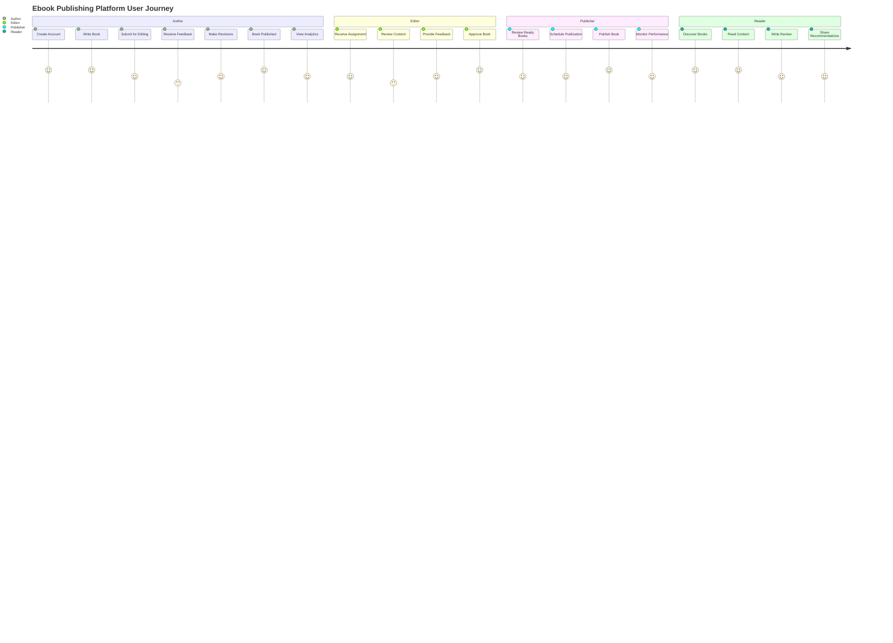
```mermaid
journey
    title Ebook Publishing Platform User Journey
    section Author
      Create Account: 5: Author
      Write Book: 5: Author
      Submit for Editing: 4: Author
      Receive Feedback: 3: Author
      Make Revisions: 4: Author
      Book Published: 5: Author
      View Analytics: 4: Author

    section Editor
      Receive Assignment: 4: Editor
      Review Content: 3: Editor
      Provide Feedback: 4: Editor
      Approve Book: 5: Editor

    section Publisher
      Review Ready Books: 4: Publisher
      Schedule Publication: 4: Publisher
      Publish Book: 5: Publisher
      Monitor Performance: 4: Publisher

    section Reader
      Discover Books: 5: Reader
      Read Content: 5: Reader
      Write Review: 4: Reader
      Share Recommendations: 4: Reader
```

### **High-Level System Flow**

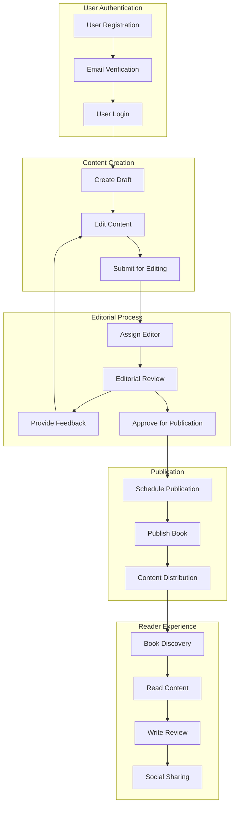
```mermaid
graph TB
    subgraph "User Authentication"
        LOGIN[User Login]
        REGISTER[User Registration]
        VERIFY[Email Verification]
    end

    subgraph "Content Creation"
        DRAFT[Create Draft]
        EDIT[Edit Content]
        SUBMIT[Submit for Editing]
    end

    subgraph "Editorial Process"
        ASSIGN[Assign Editor]
        REVIEW[Editorial Review]
        FEEDBACK[Provide Feedback]
        APPROVE[Approve for Publication]
    end

    subgraph "Publication"
        SCHEDULE[Schedule Publication]
        PUBLISH[Publish Book]
        DISTRIBUTE[Content Distribution]
    end

    subgraph "Reader Experience"
        DISCOVER[Book Discovery]
        READ[Read Content]
        REVIEW_BOOK[Write Review]
        SOCIAL[Social Sharing]
    end

    LOGIN --> DRAFT
    REGISTER --> VERIFY
    VERIFY --> LOGIN
    DRAFT --> EDIT
    EDIT --> SUBMIT
    SUBMIT --> ASSIGN
    ASSIGN --> REVIEW
    REVIEW --> FEEDBACK
    FEEDBACK --> EDIT
    REVIEW --> APPROVE
    APPROVE --> SCHEDULE
    SCHEDULE --> PUBLISH
    PUBLISH --> DISTRIBUTE
    DISTRIBUTE --> DISCOVER
    DISCOVER --> READ
    READ --> REVIEW_BOOK
    REVIEW_BOOK --> SOCIAL
```

---

## Author Workflows

### **1. Book Creation and Management Flow**

#### **Create New Book**

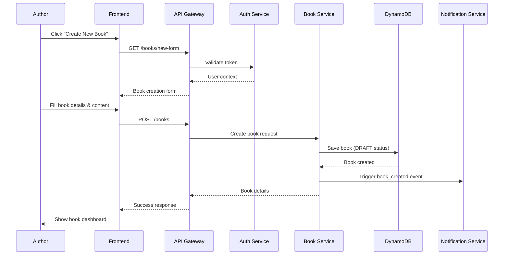
```mermaid
sequenceDiagram
    participant A as Author
    participant UI as Frontend
    participant API as API Gateway
    participant AUTH as Auth Service
    participant BOOK as Book Service
    participant DB as DynamoDB
    participant NOTIF as Notification Service

    A->>UI: Click "Create New Book"
    UI->>API: GET /books/new-form
    API->>AUTH: Validate token
    AUTH-->>API: User context
    API-->>UI: Book creation form

    A->>UI: Fill book details & content
    UI->>API: POST /books
    API->>BOOK: Create book request
    BOOK->>DB: Save book (DRAFT status)
    DB-->>BOOK: Book created
    BOOK->>NOTIF: Trigger book_created event
    BOOK-->>API: Book details
    API-->>UI: Success response
    UI-->>A: Show book dashboard
```

#### **Edit Existing Book**

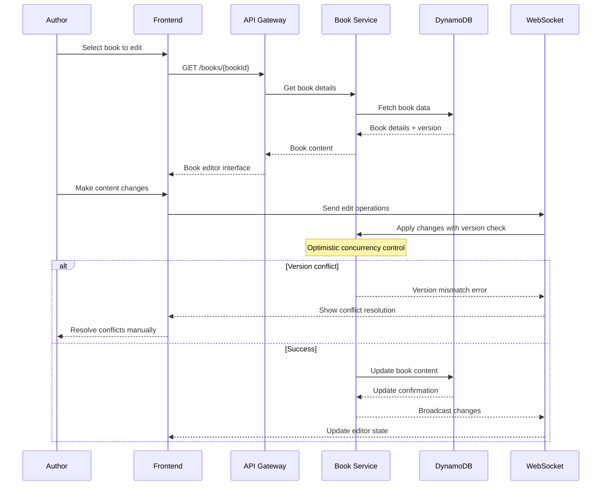
```mermaid
sequenceDiagram
    participant A as Author
    participant UI as Frontend
    participant API as API Gateway
    participant BOOK as Book Service
    participant DB as DynamoDB
    participant WS as WebSocket

    A->>UI: Select book to edit
    UI->>API: GET /books/{bookId}
    API->>BOOK: Get book details
    BOOK->>DB: Fetch book data
    DB-->>BOOK: Book details + version
    BOOK-->>API: Book content
    API-->>UI: Book editor interface

    A->>UI: Make content changes
    UI->>WS: Send edit operations
    WS->>BOOK: Apply changes with version check

    Note over BOOK: Optimistic concurrency control

    alt Version conflict
        BOOK-->>WS: Version mismatch error
        WS-->>UI: Show conflict resolution
        UI-->>A: Resolve conflicts manually
    else Success
        BOOK->>DB: Update book content
        DB-->>BOOK: Update confirmation
        BOOK-->>WS: Broadcast changes
        WS-->>UI: Update editor state
    end
```

### **2. Submission Workflow**

#### **Submit Book for Editing**

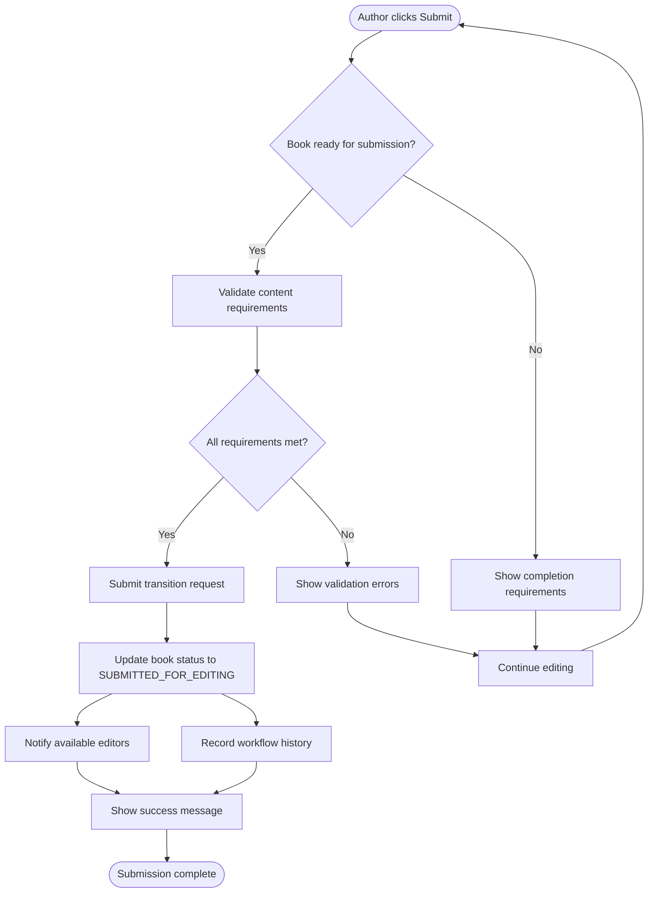
```mermaid
flowchart TD
    START([Author clicks Submit]) --> CHECK_READY{Book ready for submission?}

    CHECK_READY -->|Yes| VALIDATE[Validate content requirements]
    CHECK_READY -->|No| SHOW_REQUIREMENTS[Show completion requirements]

    VALIDATE --> REQUIREMENTS_MET{All requirements met?}

    REQUIREMENTS_MET -->|Yes| SUBMIT_REQUEST[Submit transition request]
    REQUIREMENTS_MET -->|No| SHOW_ERRORS[Show validation errors]

    SUBMIT_REQUEST --> UPDATE_STATUS[Update book status to SUBMITTED_FOR_EDITING]
    UPDATE_STATUS --> NOTIFY_EDITORS[Notify available editors]
    UPDATE_STATUS --> RECORD_WORKFLOW[Record workflow history]

    NOTIFY_EDITORS --> SUCCESS_MESSAGE[Show success message]
    RECORD_WORKFLOW --> SUCCESS_MESSAGE

    SUCCESS_MESSAGE --> END([Submission complete])

    SHOW_REQUIREMENTS --> EDIT_MORE[Continue editing]
    SHOW_ERRORS --> EDIT_MORE
    EDIT_MORE --> START
```

### **3. Revision and Resubmission Flow**

#### **Handle Editor Feedback**

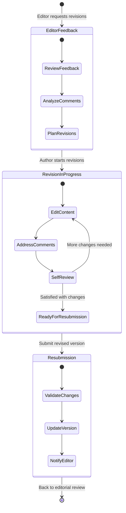
```mermaid
stateDiagram-v2
    [*] --> EditorFeedback: Editor requests revisions

    state EditorFeedback {
        [*] --> ReviewFeedback
        ReviewFeedback --> AnalyzeComments
        AnalyzeComments --> PlanRevisions
    }

    EditorFeedback --> RevisionInProgress: Author starts revisions

    state RevisionInProgress {
        [*] --> EditContent
        EditContent --> AddressComments
        AddressComments --> SelfReview
        SelfReview --> EditContent: More changes needed
        SelfReview --> ReadyForResubmission: Satisfied with changes
    }

    RevisionInProgress --> Resubmission: Submit revised version

    state Resubmission {
        [*] --> ValidateChanges
        ValidateChanges --> UpdateVersion
        UpdateVersion --> NotifyEditor
    }

    Resubmission --> [*]: Back to editorial review
```

---

## Editor Workflows

### **1. Editorial Assignment and Review**

#### **Editor Assignment Flow**

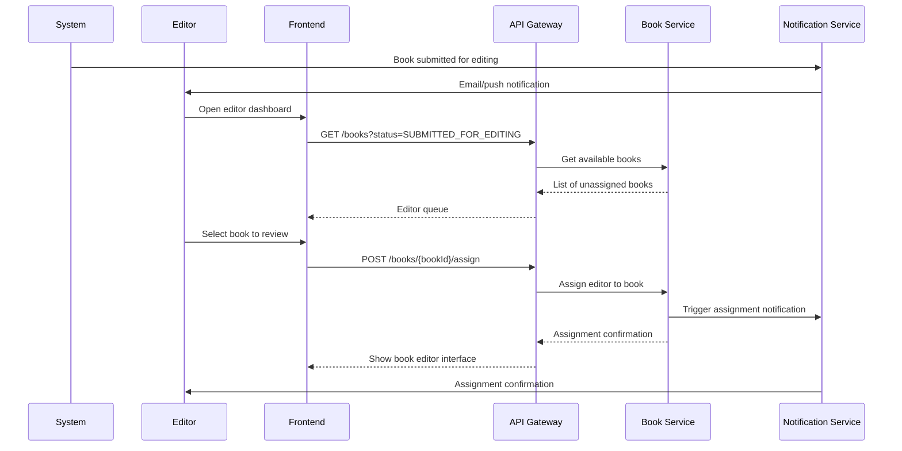
```mermaid
sequenceDiagram
    participant SYSTEM as System
    participant E as Editor
    participant UI as Frontend
    participant API as API Gateway
    participant BOOK as Book Service
    participant NOTIF as Notification Service

    SYSTEM->>NOTIF: Book submitted for editing
    NOTIF->>E: Email/push notification

    E->>UI: Open editor dashboard
    UI->>API: GET /books?status=SUBMITTED_FOR_EDITING
    API->>BOOK: Get available books
    BOOK-->>API: List of unassigned books
    API-->>UI: Editor queue

    E->>UI: Select book to review
    UI->>API: POST /books/{bookId}/assign
    API->>BOOK: Assign editor to book
    BOOK->>NOTIF: Trigger assignment notification
    BOOK-->>API: Assignment confirmation
    API-->>UI: Show book editor interface

    NOTIF->>E: Assignment confirmation
```

#### **Editorial Review Process**

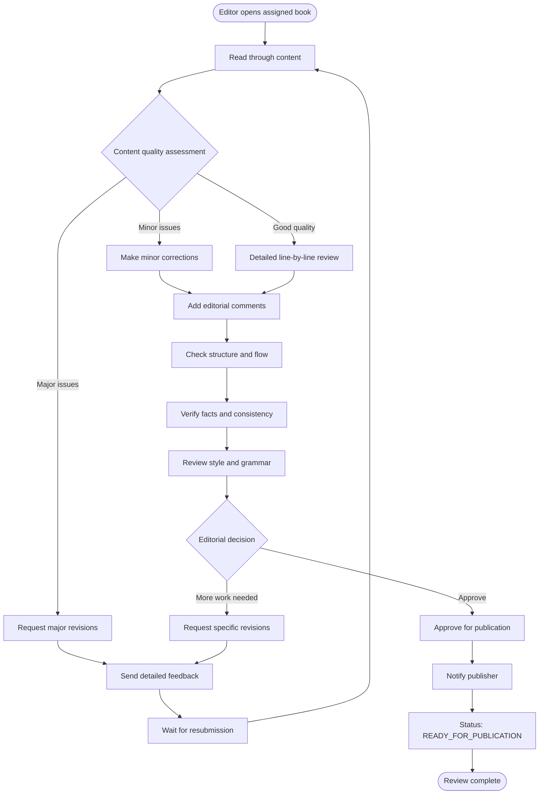
```mermaid
flowchart TD
    START([Editor opens assigned book]) --> READ_CONTENT[Read through content]

    READ_CONTENT --> INITIAL_ASSESSMENT{Content quality assessment}

    INITIAL_ASSESSMENT -->|Major issues| REJECT[Request major revisions]
    INITIAL_ASSESSMENT -->|Minor issues| MINOR_EDITS[Make minor corrections]
    INITIAL_ASSESSMENT -->|Good quality| DETAILED_REVIEW[Detailed line-by-line review]

    MINOR_EDITS --> ADD_COMMENTS[Add editorial comments]
    DETAILED_REVIEW --> ADD_COMMENTS

    ADD_COMMENTS --> STRUCTURE_CHECK[Check structure and flow]
    STRUCTURE_CHECK --> FACT_CHECK[Verify facts and consistency]
    FACT_CHECK --> STYLE_CHECK[Review style and grammar]

    STYLE_CHECK --> FINAL_DECISION{Editorial decision}

    FINAL_DECISION -->|Approve| APPROVE[Approve for publication]
    FINAL_DECISION -->|More work needed| REQUEST_REVISIONS[Request specific revisions]

    REJECT --> NOTIFY_AUTHOR[Send detailed feedback]
    REQUEST_REVISIONS --> NOTIFY_AUTHOR
    APPROVE --> NOTIFY_PUBLISHER[Notify publisher]

    NOTIFY_AUTHOR --> WAIT_RESUBMISSION[Wait for resubmission]
    NOTIFY_PUBLISHER --> UPDATE_STATUS[Status: READY_FOR_PUBLICATION]

    WAIT_RESUBMISSION --> READ_CONTENT
    UPDATE_STATUS --> END([Review complete])
```

### **2. Collaborative Editing Features**

#### **Real-time Collaborative Editing**

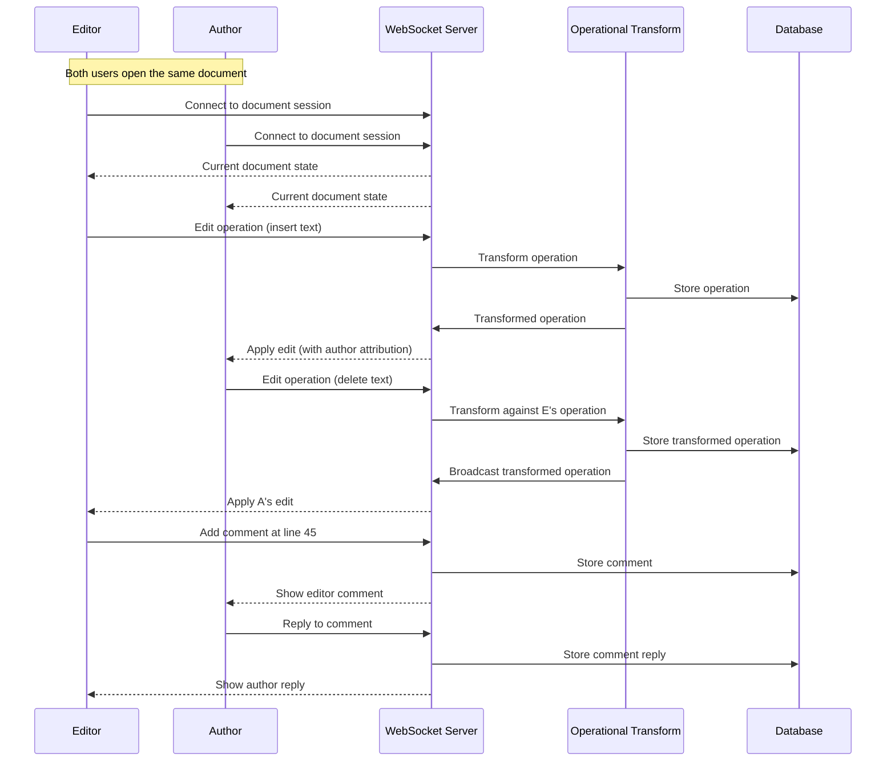
```mermaid
sequenceDiagram
    participant E as Editor
    participant A as Author
    participant WS as WebSocket Server
    participant OT as Operational Transform
    participant DB as Database

    Note over E,A: Both users open the same document

    E->>WS: Connect to document session
    A->>WS: Connect to document session
    WS-->>E: Current document state
    WS-->>A: Current document state

    E->>WS: Edit operation (insert text)
    WS->>OT: Transform operation
    OT->>DB: Store operation
    OT->>WS: Transformed operation
    WS-->>A: Apply edit (with author attribution)

    A->>WS: Edit operation (delete text)
    WS->>OT: Transform against E's operation
    OT->>DB: Store transformed operation
    OT->>WS: Broadcast transformed operation
    WS-->>E: Apply A's edit

    E->>WS: Add comment at line 45
    WS->>DB: Store comment
    WS-->>A: Show editor comment

    A->>WS: Reply to comment
    WS->>DB: Store comment reply
    WS-->>E: Show author reply
```

---

## Publisher Workflows

### **1. Publication Management**

#### **Publication Decision Flow**

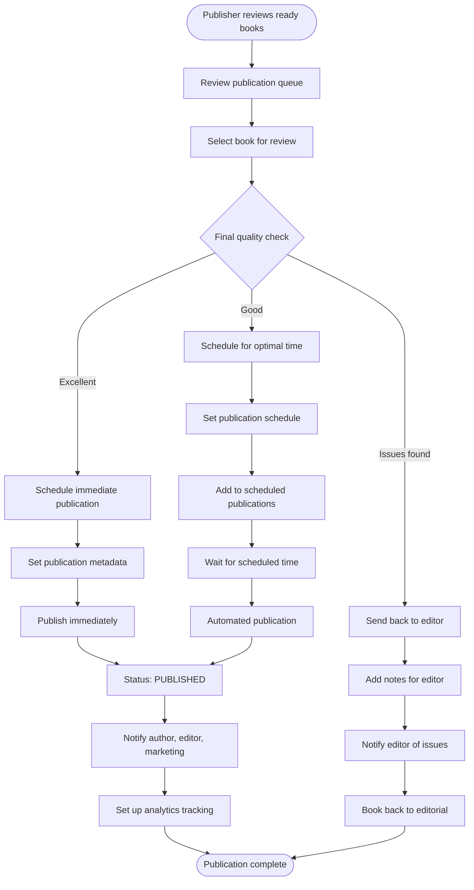
```mermaid
graph TD
    START([Publisher reviews ready books]) --> QUEUE[Review publication queue]

    QUEUE --> SELECT_BOOK[Select book for review]
    SELECT_BOOK --> QUALITY_CHECK{Final quality check}

    QUALITY_CHECK -->|Excellent| IMMEDIATE_PUBLISH[Schedule immediate publication]
    QUALITY_CHECK -->|Good| SCHEDULE_PUBLISH[Schedule for optimal time]
    QUALITY_CHECK -->|Issues found| SEND_BACK[Send back to editor]

    IMMEDIATE_PUBLISH --> SET_METADATA[Set publication metadata]
    SCHEDULE_PUBLISH --> SET_SCHEDULE[Set publication schedule]
    SEND_BACK --> ADD_NOTES[Add notes for editor]

    SET_METADATA --> PUBLISH_NOW[Publish immediately]
    SET_SCHEDULE --> QUEUE_PUBLISH[Add to scheduled publications]
    ADD_NOTES --> NOTIFY_EDITOR[Notify editor of issues]

    PUBLISH_NOW --> UPDATE_STATUS[Status: PUBLISHED]
    QUEUE_PUBLISH --> WAIT_SCHEDULE[Wait for scheduled time]
    NOTIFY_EDITOR --> WORKFLOW_BACK[Book back to editorial]

    WAIT_SCHEDULE --> AUTO_PUBLISH[Automated publication]
    AUTO_PUBLISH --> UPDATE_STATUS

    UPDATE_STATUS --> NOTIFY_STAKEHOLDERS[Notify author, editor, marketing]
    NOTIFY_STAKEHOLDERS --> ANALYTICS_SETUP[Set up analytics tracking]

    ANALYTICS_SETUP --> END([Publication complete])
    WORKFLOW_BACK --> END
```

### **2. Publication Analytics and Management**

#### **Publisher Dashboard Flow**

```mermaid
sequenceDiagram
    participant P as Publisher
    participant UI as Dashboard
    participant API as Analytics API
    participant DB as Database
    participant EXTERNAL as External APIs

    P->>UI: Open publisher dashboard
    UI->>API: GET /analytics/publisher/dashboard

    parallel
        API->>DB: Get publication metrics
        and
        API->>DB: Get sales data
        and
        API->>EXTERNAL: Get market trends
    end

    DB-->>API: Publication stats
    DB-->>API: Revenue data
    EXTERNAL-->>API: Industry benchmarks

    API-->>UI: Comprehensive dashboard data
    UI-->>P: Show KPI dashboard

    P->>UI: Filter by time period
    UI->>API: GET /analytics/books/performance?period=30d
    API->>DB: Query filtered metrics
    DB-->>API: Filtered data
    API-->>UI: Updated charts
    UI-->>P: Refreshed analytics

    P->>UI: Drill down into specific book
    UI->>API: GET /analytics/books/{bookId}
    API->>DB: Get detailed book metrics
    DB-->>API: Book performance data
    API-->>UI: Detailed book analytics
    UI-->>P: Book-specific insights
```

---

## Reader Workflows

### **1. Book Discovery and Reading**

#### **Book Discovery Flow**

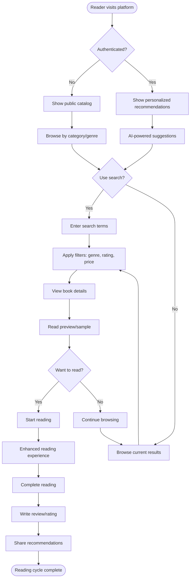
```mermaid
flowchart TD
    START([Reader visits platform]) --> AUTH_CHECK{Authenticated?}

    AUTH_CHECK -->|No| GUEST_VIEW[Show public catalog]
    AUTH_CHECK -->|Yes| PERSONALIZED[Show personalized recommendations]

    GUEST_VIEW --> BROWSE_CATEGORIES[Browse by category/genre]
    PERSONALIZED --> RECOMMENDATIONS[AI-powered suggestions]

    BROWSE_CATEGORIES --> SEARCH{Use search?}
    RECOMMENDATIONS --> SEARCH

    SEARCH -->|Yes| SEARCH_QUERY[Enter search terms]
    SEARCH -->|No| BROWSE_RESULTS[Browse current results]

    SEARCH_QUERY --> FILTER_RESULTS[Apply filters: genre, rating, price]
    BROWSE_RESULTS --> FILTER_RESULTS

    FILTER_RESULTS --> BOOK_DETAILS[View book details]

    BOOK_DETAILS --> PREVIEW[Read preview/sample]
    PREVIEW --> DECISION{Want to read?}

    DECISION -->|Yes| READ_BOOK[Start reading]
    DECISION -->|No| BACK_TO_SEARCH[Continue browsing]

    READ_BOOK --> READING_EXPERIENCE[Enhanced reading experience]
    BACK_TO_SEARCH --> BROWSE_RESULTS

    READING_EXPERIENCE --> FINISH_BOOK[Complete reading]
    FINISH_BOOK --> WRITE_REVIEW[Write review/rating]

    WRITE_REVIEW --> SHARE[Share recommendations]
    SHARE --> END([Reading cycle complete])
```

### **2. Review and Rating System**

#### **Review Submission Flow**

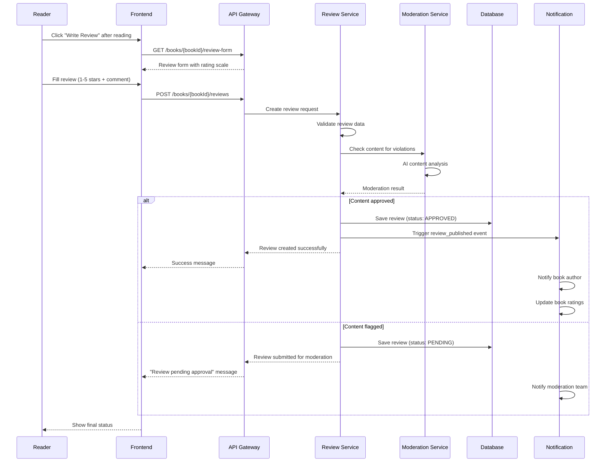
```mermaid
sequenceDiagram
    participant R as Reader
    participant UI as Frontend
    participant API as API Gateway
    participant REVIEW as Review Service
    participant MODERATION as Moderation Service
    participant DB as Database
    participant NOTIF as Notification

    R->>UI: Click "Write Review" after reading
    UI->>API: GET /books/{bookId}/review-form
    API-->>UI: Review form with rating scale

    R->>UI: Fill review (1-5 stars + comment)
    UI->>API: POST /books/{bookId}/reviews
    API->>REVIEW: Create review request

    REVIEW->>REVIEW: Validate review data
    REVIEW->>MODERATION: Check content for violations

    MODERATION->>MODERATION: AI content analysis
    MODERATION-->>REVIEW: Moderation result

    alt Content approved
        REVIEW->>DB: Save review (status: APPROVED)
        REVIEW->>NOTIF: Trigger review_published event
        REVIEW-->>API: Review created successfully
        API-->>UI: Success message

        NOTIF->>NOTIF: Notify book author
        NOTIF->>NOTIF: Update book ratings

    else Content flagged
        REVIEW->>DB: Save review (status: PENDING)
        REVIEW-->>API: Review submitted for moderation
        API-->>UI: "Review pending approval" message

        NOTIF->>NOTIF: Notify moderation team
    end

    UI-->>R: Show final status
```

### **3. Social Features and Recommendations**

#### **Social Sharing and Recommendations**

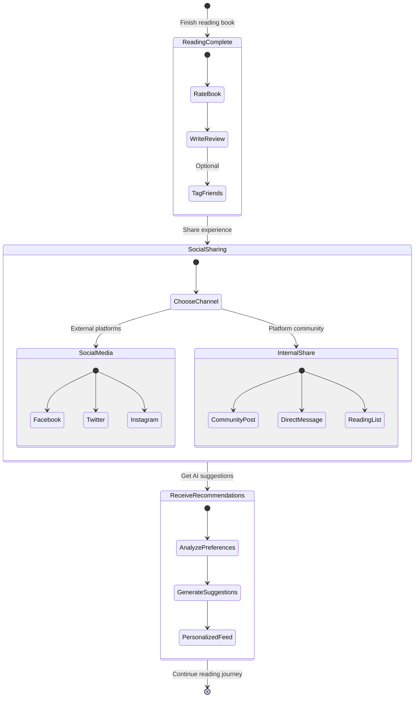
```mermaid
stateDiagram-v2
    [*] --> ReadingComplete: Finish reading book

    state ReadingComplete {
        [*] --> RateBook
        RateBook --> WriteReview
        WriteReview --> TagFriends: Optional
    }

    ReadingComplete --> SocialSharing: Share experience

    state SocialSharing {
        [*] --> ChooseChannel
        ChooseChannel --> SocialMedia: External platforms
        ChooseChannel --> InternalShare: Platform community

        state SocialMedia {
            [*] --> Facebook
            [*] --> Twitter
            [*] --> Instagram
        }

        state InternalShare {
            [*] --> CommunityPost
            [*] --> DirectMessage
            [*] --> ReadingList
        }
    }

    SocialSharing --> ReceiveRecommendations: Get AI suggestions

    state ReceiveRecommendations {
        [*] --> AnalyzePreferences
        AnalyzePreferences --> GenerateSuggestions
        GenerateSuggestions --> PersonalizedFeed
    }

    ReceiveRecommendations --> [*]: Continue reading journey
```

---

## Notification System

### **Notification Architecture and Flows**

#### **Event-Driven Notification System**

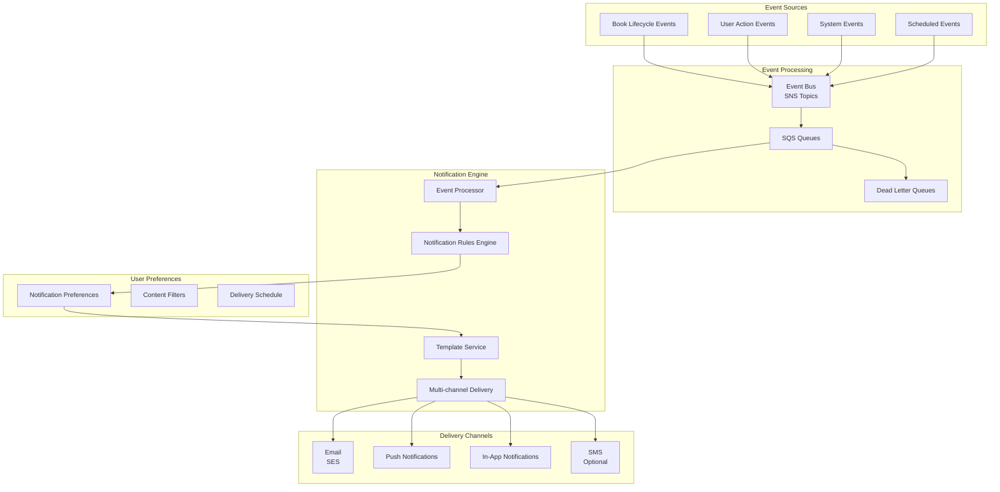
```mermaid
graph TB
    subgraph "Event Sources"
        BOOK_EVENTS[Book Lifecycle Events]
        USER_EVENTS[User Action Events]
        SYSTEM_EVENTS[System Events]
        SCHEDULE_EVENTS[Scheduled Events]
    end

    subgraph "Event Processing"
        EVENT_BUS[Event Bus<br/>SNS Topics]
        QUEUE[SQS Queues]
        DLQ[Dead Letter Queues]
    end

    subgraph "Notification Engine"
        PROCESSOR[Event Processor]
        RULES[Notification Rules Engine]
        TEMPLATES[Template Service]
        DELIVERY[Multi-channel Delivery]
    end

    subgraph "Delivery Channels"
        EMAIL[Email<br/>SES]
        PUSH[Push Notifications]
        IN_APP[In-App Notifications]
        SMS[SMS<br/>Optional]
    end

    subgraph "User Preferences"
        PREFS[Notification Preferences]
        FILTERS[Content Filters]
        SCHEDULE[Delivery Schedule]
    end

    BOOK_EVENTS --> EVENT_BUS
    USER_EVENTS --> EVENT_BUS
    SYSTEM_EVENTS --> EVENT_BUS
    SCHEDULE_EVENTS --> EVENT_BUS

    EVENT_BUS --> QUEUE
    QUEUE --> PROCESSOR
    QUEUE --> DLQ

    PROCESSOR --> RULES
    RULES --> PREFS
    PREFS --> TEMPLATES
    TEMPLATES --> DELIVERY

    DELIVERY --> EMAIL
    DELIVERY --> PUSH
    DELIVERY --> IN_APP
    DELIVERY --> SMS
```

#### **Notification Types and Triggers**

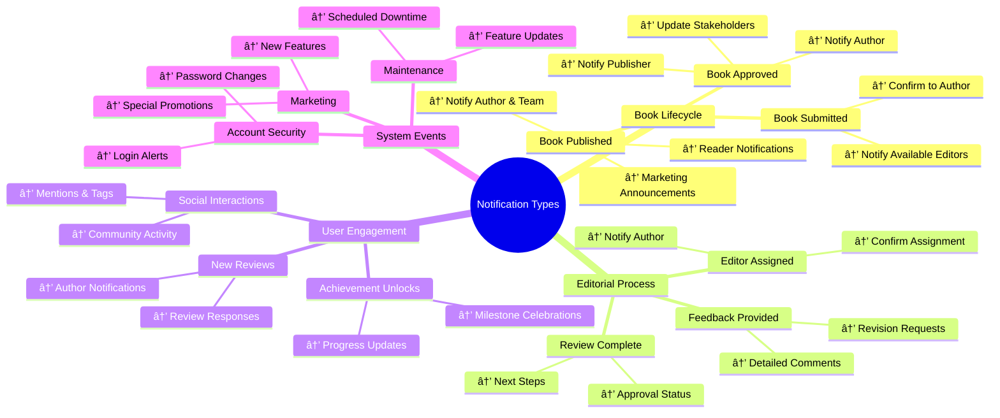
```mermaid
mindmap
  root((Notification Types))
    Book Lifecycle
      Book Submitted
        → Notify Available Editors
        → Confirm to Author
      Book Approved
        → Notify Author
        → Notify Publisher
        → Update Stakeholders
      Book Published
        → Notify Author & Team
        → Marketing Announcements
        → Reader Notifications
    Editorial Process
      Editor Assigned
        → Confirm Assignment
        → Notify Author
      Feedback Provided
        → Detailed Comments
        → Revision Requests
      Review Complete
        → Approval Status
        → Next Steps
    User Engagement
      New Reviews
        → Author Notifications
        → Review Responses
      Social Interactions
        → Mentions & Tags
        → Community Activity
      Achievement Unlocks
        → Milestone Celebrations
        → Progress Updates
    System Events
      Account Security
        → Login Alerts
        → Password Changes
      Maintenance
        → Scheduled Downtime
        → Feature Updates
      Marketing
        → New Features
        → Special Promotions
```

### **Notification Delivery Flow**

#### **Multi-Channel Notification Processing**

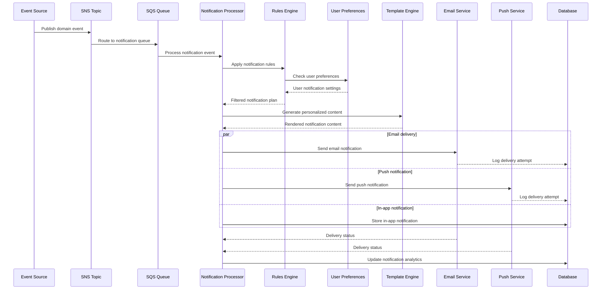
```mermaid
sequenceDiagram
    participant EVENT as Event Source
    participant SNS as SNS Topic
    participant SQS as SQS Queue
    participant PROCESSOR as Notification Processor
    participant RULES as Rules Engine
    participant USER as User Preferences
    participant TEMPLATE as Template Engine
    participant EMAIL as Email Service
    participant PUSH as Push Service
    participant DB as Database

    EVENT->>SNS: Publish domain event
    SNS->>SQS: Route to notification queue

    SQS->>PROCESSOR: Process notification event
    PROCESSOR->>RULES: Apply notification rules
    RULES->>USER: Check user preferences

    USER-->>RULES: User notification settings
    RULES-->>PROCESSOR: Filtered notification plan

    PROCESSOR->>TEMPLATE: Generate personalized content
    TEMPLATE-->>PROCESSOR: Rendered notification content

    par Email delivery
        PROCESSOR->>EMAIL: Send email notification
        EMAIL-->>DB: Log delivery attempt
    and Push notification
        PROCESSOR->>PUSH: Send push notification
        PUSH-->>DB: Log delivery attempt
    and In-app notification
        PROCESSOR->>DB: Store in-app notification
    end

    EMAIL-->>PROCESSOR: Delivery status
    PUSH-->>PROCESSOR: Delivery status

    PROCESSOR->>DB: Update notification analytics
```

---

## Real-time Collaboration

### **Collaborative Editing System**

#### **Operational Transformation Flow**

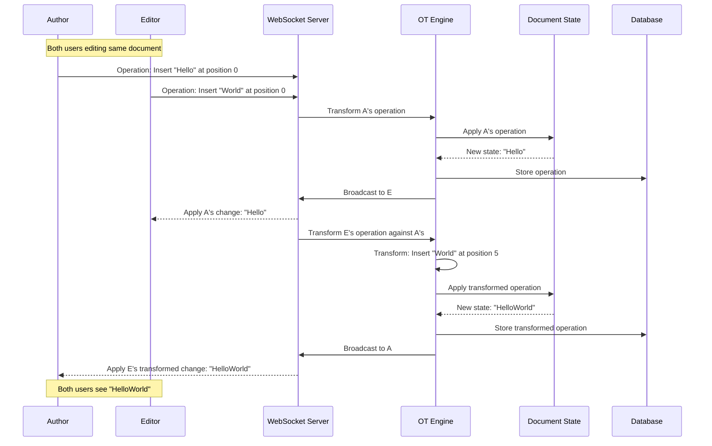
```mermaid
sequenceDiagram
    participant A as Author
    participant E as Editor
    participant WS as WebSocket Server
    participant OT as OT Engine
    participant STATE as Document State
    participant DB as Database

    Note over A,E: Both users editing same document

    A->>WS: Operation: Insert "Hello" at position 0
    E->>WS: Operation: Insert "World" at position 0

    WS->>OT: Transform A's operation
    OT->>STATE: Apply A's operation
    STATE-->>OT: New state: "Hello"
    OT->>DB: Store operation
    OT->>WS: Broadcast to E
    WS-->>E: Apply A's change: "Hello"

    WS->>OT: Transform E's operation against A's
    OT->>OT: Transform: Insert "World" at position 5
    OT->>STATE: Apply transformed operation
    STATE-->>OT: New state: "HelloWorld"
    OT->>DB: Store transformed operation
    OT->>WS: Broadcast to A
    WS-->>A: Apply E's transformed change: "HelloWorld"

    Note over A,E: Both users see "HelloWorld"
```

#### **Conflict Resolution Workflow**

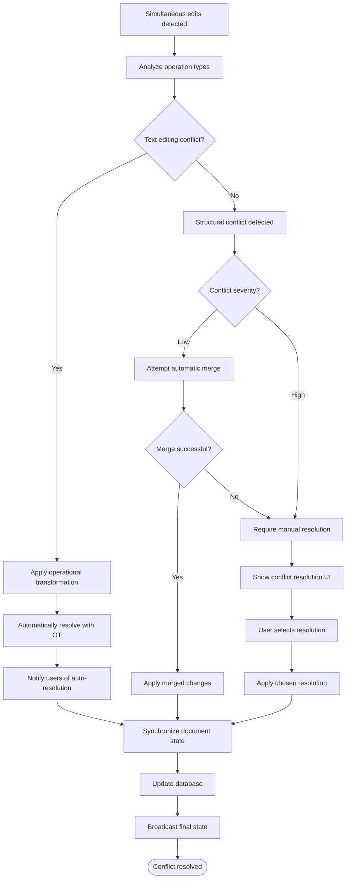
```mermaid
flowchart TD
    CONFLICT[Simultaneous edits detected] --> ANALYZE[Analyze operation types]

    ANALYZE --> TEXT_CONFLICT{Text editing conflict?}
    TEXT_CONFLICT -->|Yes| OT_TRANSFORM[Apply operational transformation]
    TEXT_CONFLICT -->|No| MERGE_CONFLICT[Structural conflict detected]

    OT_TRANSFORM --> AUTO_RESOLVE[Automatically resolve with OT]
    AUTO_RESOLVE --> NOTIFY_USERS[Notify users of auto-resolution]

    MERGE_CONFLICT --> SEVERITY{Conflict severity?}
    SEVERITY -->|Low| AUTO_MERGE[Attempt automatic merge]
    SEVERITY -->|High| MANUAL_RESOLUTION[Require manual resolution]

    AUTO_MERGE --> SUCCESS{Merge successful?}
    SUCCESS -->|Yes| APPLY_MERGE[Apply merged changes]
    SUCCESS -->|No| MANUAL_RESOLUTION

    MANUAL_RESOLUTION --> PRESENT_OPTIONS[Show conflict resolution UI]
    PRESENT_OPTIONS --> USER_CHOICE[User selects resolution]
    USER_CHOICE --> APPLY_RESOLUTION[Apply chosen resolution]

    APPLY_MERGE --> SYNC_STATE[Synchronize document state]
    APPLY_RESOLUTION --> SYNC_STATE
    NOTIFY_USERS --> SYNC_STATE

    SYNC_STATE --> UPDATE_DB[Update database]
    UPDATE_DB --> BROADCAST[Broadcast final state]
    BROADCAST --> END([Conflict resolved])
```

---

## Error Handling Flows

### **Comprehensive Error Handling Strategy**

#### **API Error Response Flow**

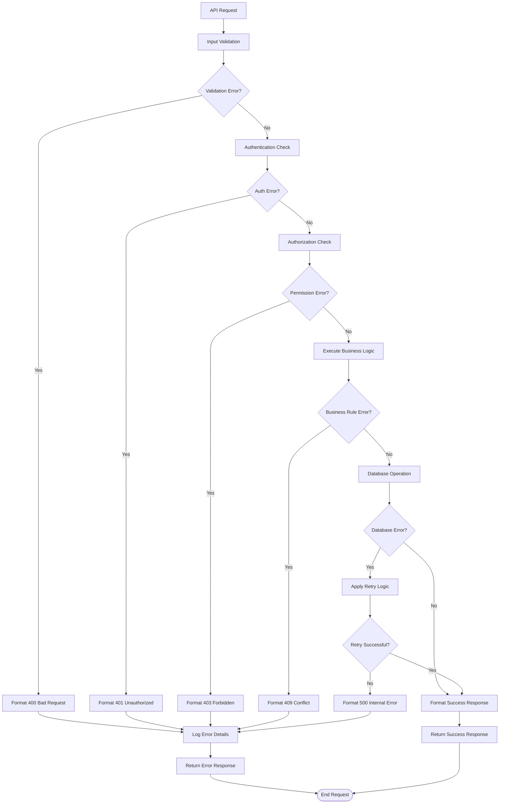
```mermaid
flowchart TD
    REQUEST[API Request] --> VALIDATE[Input Validation]

    VALIDATE --> VALIDATION_ERROR{Validation Error?}
    VALIDATION_ERROR -->|Yes| FORMAT_ERROR[Format 400 Bad Request]
    VALIDATION_ERROR -->|No| AUTH_CHECK[Authentication Check]

    AUTH_CHECK --> AUTH_ERROR{Auth Error?}
    AUTH_ERROR -->|Yes| FORMAT_401[Format 401 Unauthorized]
    AUTH_ERROR -->|No| AUTHORIZATION[Authorization Check]

    AUTHORIZATION --> AUTHZ_ERROR{Permission Error?}
    AUTHZ_ERROR -->|Yes| FORMAT_403[Format 403 Forbidden]
    AUTHZ_ERROR -->|No| BUSINESS_LOGIC[Execute Business Logic]

    BUSINESS_LOGIC --> BUSINESS_ERROR{Business Rule Error?}
    BUSINESS_ERROR -->|Yes| FORMAT_409[Format 409 Conflict]
    BUSINESS_ERROR -->|No| DATABASE[Database Operation]

    DATABASE --> DB_ERROR{Database Error?}
    DB_ERROR -->|Yes| RETRY_LOGIC[Apply Retry Logic]
    DB_ERROR -->|No| SUCCESS_RESPONSE[Format Success Response]

    RETRY_LOGIC --> RETRY_SUCCESS{Retry Successful?}
    RETRY_SUCCESS -->|Yes| SUCCESS_RESPONSE
    RETRY_SUCCESS -->|No| FORMAT_500[Format 500 Internal Error]

    FORMAT_ERROR --> LOG_ERROR[Log Error Details]
    FORMAT_401 --> LOG_ERROR
    FORMAT_403 --> LOG_ERROR
    FORMAT_409 --> LOG_ERROR
    FORMAT_500 --> LOG_ERROR

    LOG_ERROR --> RETURN_ERROR[Return Error Response]
    SUCCESS_RESPONSE --> RETURN_SUCCESS[Return Success Response]

    RETURN_ERROR --> END([End Request])
    RETURN_SUCCESS --> END
```

#### **Frontend Error Handling Flow**

```mermaid
stateDiagram-v2
    [*] --> APICall: User action triggers API call

    state APICall {
        [*] --> Loading
        Loading --> Success: 2xx response
        Loading --> ClientError: 4xx response
        Loading --> ServerError: 5xx response
        Loading --> NetworkError: Network failure
        Loading --> Timeout: Request timeout
    }

    Success --> UpdateUI: Update interface

    state ClientError {
        [*] --> BadRequest: 400
        [*] --> Unauthorized: 401
        [*] --> Forbidden: 403
        [*] --> NotFound: 404
        [*] --> Conflict: 409
        [*] --> ValidationError: 422
    }

    BadRequest --> ShowValidationErrors
    Unauthorized --> RedirectLogin
    Forbidden --> ShowPermissionError
    NotFound --> ShowNotFoundPage
    Conflict --> ShowConflictResolution
    ValidationError --> HighlightFormErrors

    state ServerError {
        [*] --> InternalError: 500
        [*] --> ServiceUnavailable: 503
        [*] --> GatewayTimeout: 504
    }

    InternalError --> ShowGenericError
    ServiceUnavailable --> ShowMaintenanceMode
    GatewayTimeout --> RetryRequest

    NetworkError --> CheckConnection
    Timeout --> RetryRequest

    state ErrorRecovery {
        ShowValidationErrors --> [*]
        RedirectLogin --> [*]
        ShowPermissionError --> [*]
        ShowNotFoundPage --> [*]
        ShowConflictResolution --> [*]
        HighlightFormErrors --> [*]
        ShowGenericError --> [*]
        ShowMaintenanceMode --> [*]
        RetryRequest --> APICall
        CheckConnection --> APICall
    }

    UpdateUI --> [*]
    ErrorRecovery --> [*]
```

---

This comprehensive user flow documentation ensures all user interactions, system processes, and error scenarios are clearly mapped, providing a complete guide for implementation and user experience design.

---

## Related Documentation

- **[Requirements](./01-REQUIREMENTS.md)**: Comprehensive project requirements
- **[Architecture](./02-ARCHITECTURE.md)**: System design and component architecture
- **[Implementation](./03-IMPLEMENTATION.md)**: Development roadmap and tasks
- **[Security](./04-SECURITY.md)**: Security and compliance framework
- **[API Specification](./05-API.md)**: Complete REST API documentation
- **[Data Model](./06-DATA.md)**: Database design and access patterns
- **[Development](./07-DEVELOPMENT.md)**: Local development setup and workflow
- **[Deployment](./08-DEPLOYMENT.md)**: Infrastructure deployment and management
