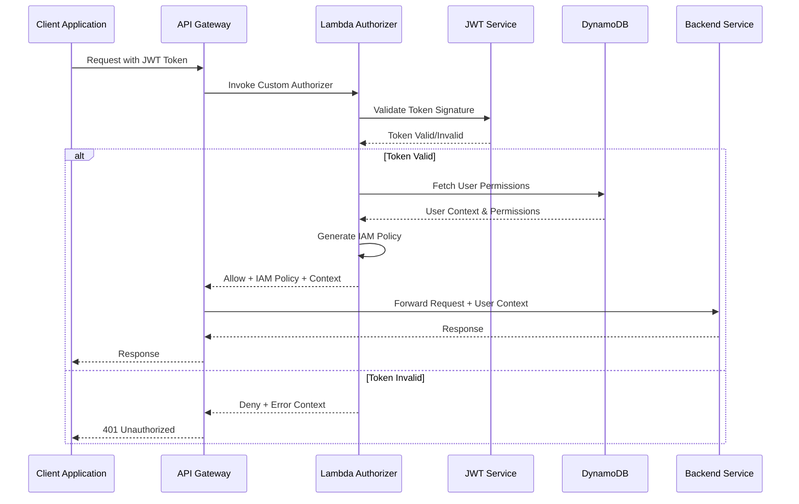
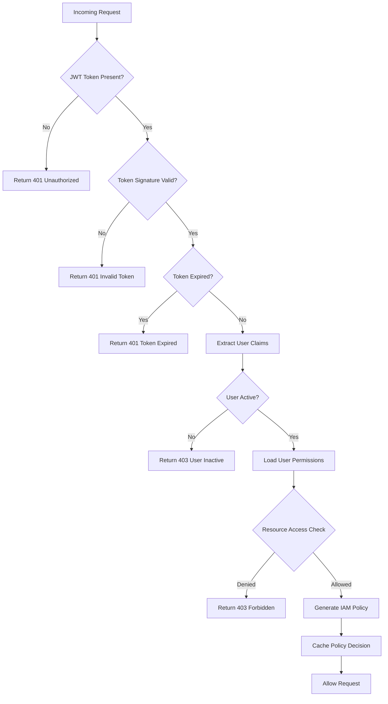
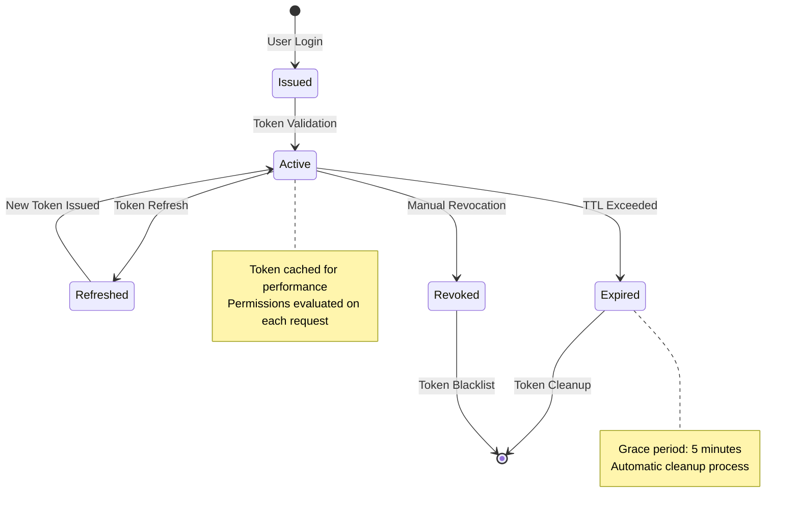
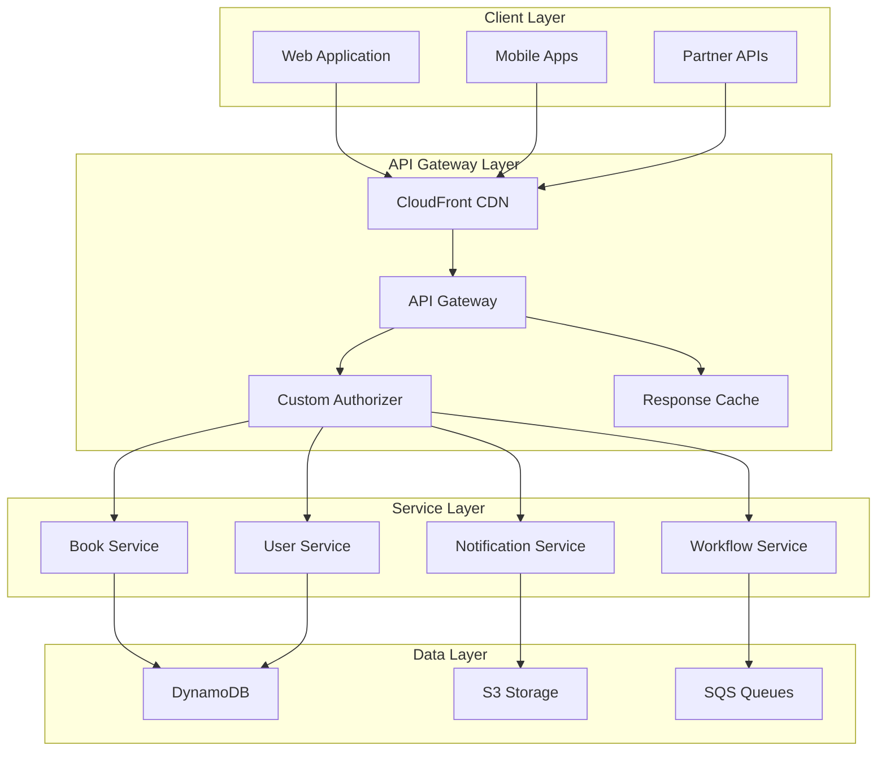
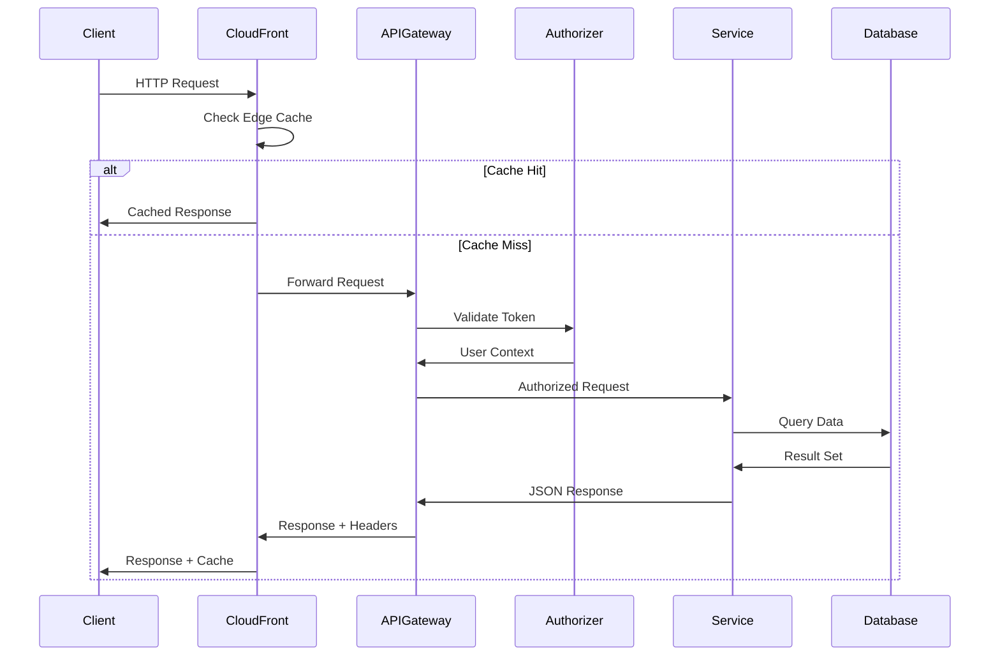
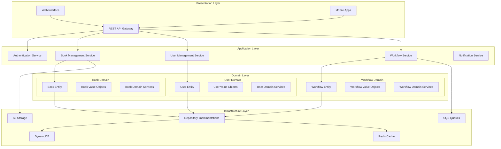
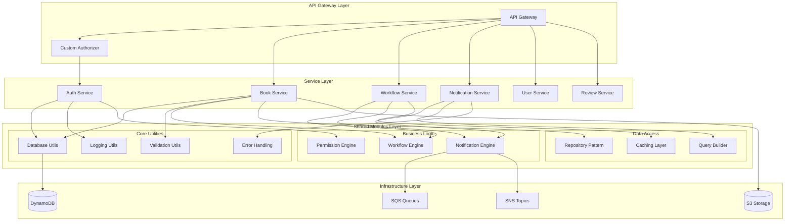

# Enterprise Ebook Publishing Platform - High-Level System Design


## Authn Flow Sequence Diagram



### Authorization Decision Tree**



### JWT Token Lifecycle State Machine*


*### API Gateway Architecture**



**### Request/Response Flow Architecture**



**### Domain-Driven Design Architecture**


**### Microservices Architecture**


## System Overview

```
┌─────────────────────────────────────────────────────────────────────────────────┐
│                           ENTERPRISE EBOOK PUBLISHING PLATFORM                  │
│                                                                                 │
│  ┌─────────────────┐    ┌─────────────────┐    ┌─────────────────┐             │
│  │   AUTHOR WEB    │    │   EDITOR WEB    │    │ PUBLISHER WEB   │             │
│  │   APPLICATION   │    │   APPLICATION   │    │  APPLICATION    │             │
│  └─────────────────┘    └─────────────────┘    └─────────────────┘             │
│           │                       │                       │                     │
│           └───────────────────────┼───────────────────────┘                     │
│                                   │                                             │
│  ┌─────────────────────────────────┼─────────────────────────────────────────┐   │
│  │                    PRESENTATION LAYER                                     │   │
│  │                                                                           │   │
│  │  ┌─────────────────┐    ┌─────────────────┐    ┌─────────────────┐       │   │
│  │  │   CLOUDFRONT    │    │   S3 FRONTEND   │    │   MOBILE APPS   │       │   │
│  │  │      CDN        │    │     HOSTING     │    │   (FUTURE)      │       │   │
│  │  └─────────────────┘    └─────────────────┘    └─────────────────┘       │   │
│  └─────────────────────────────────┼─────────────────────────────────────────┘   │
│                                    │                                             │
└────────────────────────────────────┼─────────────────────────────────────────────┘
                                     │
┌────────────────────────────────────┼─────────────────────────────────────────────┐
│                       API GATEWAY LAYER                                        │
│                                    │                                             │
│  ┌─────────────────────────────────┼─────────────────────────────────────────┐   │
│  │                    AWS API GATEWAY                                        │   │
│  │                                                                           │   │
│  │  ┌─────────────────┐    ┌─────────────────┐    ┌─────────────────┐       │   │
│  │  │  RATE LIMITING  │    │  AUTHENTICATION │    │   CORS & WAF    │       │   │
│  │  │   & THROTTLING  │    │   & VALIDATION  │    │   PROTECTION    │       │   │
│  │  └─────────────────┘    └─────────────────┘    └─────────────────┘       │   │
│  └─────────────────────────────────┼─────────────────────────────────────────┘   │
└────────────────────────────────────┼─────────────────────────────────────────────┘
                                     │
┌────────────────────────────────────┼─────────────────────────────────────────────┐
│                      MICROSERVICES LAYER                                       │
│                                    │                                             │
│  ┌─────────────────┐    ┌─────────────────┐    ┌─────────────────┐             │
│  │  AUTH SERVICE   │    │  BOOK SERVICE   │    │  USER SERVICE   │             │
│  │                 │    │                 │    │                 │             │
│  │ • JWT Tokens    │    │ • CRUD Ops      │    │ • Profiles      │             │
│  │ • User Auth     │    │ • Workflows     │    │ • Preferences   │             │
│  │ • Role Mgmt     │    │ • Versioning    │    │ • Settings      │             │
│  └─────────────────┘    └─────────────────┘    └─────────────────┘             │
│                                                                                 │
│  ┌─────────────────┐    ┌─────────────────┐    ┌─────────────────┐             │
│  │WORKFLOW SERVICE │    │ REVIEW SERVICE  │    │NOTIFICATION SVC │             │
│  │                 │    │                 │    │                 │             │
│  │ • State Machine │    │ • Comments      │    │ • Email/SMS     │             │
│  │ • Approvals     │    │ • Ratings       │    │ • Push Notifs   │             │
│  │ • Transitions   │    │ • Feedback      │    │ • Event Driven  │             │
│  └─────────────────┘    └─────────────────┘    └─────────────────┘             │
│                                    │                                             │
└────────────────────────────────────┼─────────────────────────────────────────────┘
                                     │
┌────────────────────────────────────┼─────────────────────────────────────────────┐
│                        DATA LAYER                                              │
│                                    │                                             │
│  ┌─────────────────┐    ┌─────────────────┐    ┌─────────────────┐             │
│  │   DYNAMODB      │    │   S3 STORAGE    │    │   ELASTICACHE   │             │
│  │                 │    │                 │    │                 │             │
│  │ • Single Table  │    │ • Book Content  │    │ • Session Store │             │
│  │ • GSI Indexes   │    │ • Media Files   │    │ • Query Cache   │             │
│  │ • Streams       │    │ • Backups       │    │ • Rate Limiting │             │
│  └─────────────────┘    └─────────────────┘    └─────────────────┘             │
└─────────────────────────────────────────────────────────────────────────────────┘

┌─────────────────────────────────────────────────────────────────────────────────┐
│                           MESSAGING & EVENTS                                   │
│                                                                                 │
│  ┌─────────────────┐    ┌─────────────────┐    ┌─────────────────┐             │
│  │      SNS        │    │      SQS        │    │   EVENTBRIDGE   │             │
│  │                 │    │                 │    │                 │             │
│  │ • Notifications │    │ • Task Queues   │    │ • Event Routing │             │
│  │ • Fan-out       │    │ • Dead Letters  │    │ • Rule Engine   │             │
│  │ • Multi-channel │    │ • Retry Logic   │    │ • Integrations  │             │
│  └─────────────────┘    └─────────────────┘    └─────────────────┘             │
└─────────────────────────────────────────────────────────────────────────────────┘

┌─────────────────────────────────────────────────────────────────────────────────┐
│                      MONITORING & OBSERVABILITY                                │
│                                                                                 │
│  ┌─────────────────┐    ┌─────────────────┐    ┌─────────────────┐             │
│  │   CLOUDWATCH    │    │    X-RAY        │    │   CLOUDTRAIL    │             │
│  │                 │    │                 │    │                 │             │
│  │ • Metrics       │    │ • Tracing       │    │ • Audit Logs    │             │
│  │ • Logs          │    │ • Performance   │    │ • API Calls     │             │
│  │ • Alarms        │    │ • Dependencies  │    │ • Compliance    │             │
│  └─────────────────┘    └─────────────────┘    └─────────────────┘             │
└─────────────────────────────────────────────────────────────────────────────────┘

┌─────────────────────────────────────────────────────────────────────────────────┐
│                         SECURITY & COMPLIANCE                                  │
│                                                                                 │
│  ┌─────────────────┐    ┌─────────────────┐    ┌─────────────────┐             │
│  │      IAM        │    │      KMS        │    │   SECRETS MGR   │             │
│  │                 │    │                 │    │                 │             │
│  │ • Roles         │    │ • Encryption    │    │ • API Keys      │             │
│  │ • Policies      │    │ • Key Rotation  │    │ • DB Passwords  │             │
│  │ • Permissions   │    │ • Audit Trail   │    │ • Certificates  │             │
│  └─────────────────┘    └─────────────────┘    └─────────────────┘             │
└─────────────────────────────────────────────────────────────────────────────────┘
```

## Core Components Detail

### 1. Presentation Layer

**Frontend Applications**
- **React SPA**: Modern single-page application with responsive design
- **CloudFront CDN**: Global content delivery with edge caching
- **S3 Static Hosting**: Scalable static asset hosting
- **Mobile Apps**: Future native mobile applications

**Key Features**:
- Role-based UI components (Author/Editor/Publisher views)
- Real-time notifications and updates
- Offline capability with sync
- Progressive Web App (PWA) features

### 2. API Gateway Layer

**AWS API Gateway**
- **REST APIs**: RESTful service endpoints
- **WebSocket APIs**: Real-time communication
- **Custom Authorizers**: JWT token validation
- **Request/Response Transformation**: Data formatting

**Security Features**:
- Rate limiting and throttling
- CORS configuration
- WAF integration
- API key management

### 3. Microservices Architecture

**Auth Service**
```
┌─────────────────────────────────────┐
│           AUTH SERVICE              │
├─────────────────────────────────────┤
│ • User Registration & Login         │
│ • JWT Token Generation/Validation   │
│ • Multi-Factor Authentication       │
│ • Password Policy Enforcement       │
│ • Session Management                │
│ • Role-Based Access Control         │
└─────────────────────────────────────┘
```

**Book Service**
```
┌─────────────────────────────────────┐
│           BOOK SERVICE              │
├─────────────────────────────────────┤
│ • Book CRUD Operations              │
│ • Content Management                │
│ • Version Control                   │
│ • Metadata Management               │
│ • Search & Discovery                │
│ • Content Validation                │
└─────────────────────────────────────┘
```

**Workflow Service**
```
┌─────────────────────────────────────┐
│         WORKFLOW SERVICE            │
├─────────────────────────────────────┤
│ • State Machine Management          │
│ • Approval Workflows                │
│ • Status Transitions                │
│ • Business Rule Engine              │
│ • Deadline Management               │
│ • Escalation Procedures             │
└─────────────────────────────────────┘
```

**User Service**
```
┌─────────────────────────────────────┐
│           USER SERVICE              │
├─────────────────────────────────────┤
│ • User Profile Management           │
│ • Preference Settings               │
│ • Activity Tracking                 │
│ • Notification Preferences          │
│ • Dashboard Customization           │
│ • User Analytics                    │
└─────────────────────────────────────┘
```

**Review Service**
```
┌─────────────────────────────────────┐
│          REVIEW SERVICE             │
├─────────────────────────────────────┤
│ • Review & Comment Management       │
│ • Rating System                     │
│ • Feedback Collection               │
│ • Review History                    │
│ • Collaborative Editing             │
│ • Change Tracking                   │
└─────────────────────────────────────┘
```

**Notification Service**
```
┌─────────────────────────────────────┐
│       NOTIFICATION SERVICE          │
├─────────────────────────────────────┤
│ • Multi-Channel Notifications       │
│ • Email/SMS/Push Delivery           │
│ • Template Management               │
│ • Delivery Tracking                 │
│ • Preference Management             │
│ • Event-Driven Triggers             │
└─────────────────────────────────────┘
```

### 4. Data Architecture

**Primary Database - DynamoDB**
```
┌─────────────────────────────────────┐
│            DYNAMODB                 │
├─────────────────────────────────────┤
│ Table: ebook-platform               │
│                                     │
│ Partition Key: PK                   │
│ Sort Key: SK                        │
│                                     │
│ GSI1: GSI1PK, GSI1SK               │
│ GSI2: GSI2PK, GSI2SK               │
│                                     │
│ Entities:                           │
│ • USER#{userId}                     │
│ • BOOK#{bookId}                     │
│ • REVIEW#{reviewId}                 │
│ • WORKFLOW#{workflowId}             │
└─────────────────────────────────────┘
```

**File Storage - S3**
```
┌─────────────────────────────────────┐
│              S3 BUCKETS             │
├─────────────────────────────────────┤
│ • Frontend Assets Bucket            │
│   - Static web content             │
│   - Compiled applications           │
│                                     │
│ • Content Storage Bucket            │
│   - Book manuscripts               │
│   - Media files                    │
│   - Document attachments           │
│                                     │
│ • Backup & Archive Bucket           │
│   - Database backups               │
│   - Log archives                   │
│   - Compliance records             │
└─────────────────────────────────────┘
```

**Caching Layer - ElastiCache**
```
┌─────────────────────────────────────┐
│           ELASTICACHE               │
├─────────────────────────────────────┤
│ • Session Storage                   │
│ • Query Result Caching              │
│ • Rate Limiting Counters            │
│ • Temporary Data Storage            │
│ • Real-time Analytics               │
└─────────────────────────────────────┘
```

### 5. Event-Driven Architecture

**Message Flow**
```
┌─────────────┐    ┌─────────────┐    ┌─────────────┐
│   SERVICE   │───▶│     SNS     │───▶│   SERVICE   │
│  PRODUCER   │    │   TOPIC     │    │  CONSUMER   │
└─────────────┘    └─────────────┘    └─────────────┘
                          │
                          ▼
                   ┌─────────────┐
                   │     SQS     │
                   │    QUEUE    │
                   └─────────────┘
                          │
                          ▼
                   ┌─────────────┐
                   │   LAMBDA    │
                   │  PROCESSOR  │
                   └─────────────┘
```

**Event Types**
- Book status changes
- User registration/login
- Review submissions
- Workflow transitions
- System alerts
- Compliance events

### 6. Security Architecture

**Authentication Flow**
```
┌─────────────┐    ┌─────────────┐    ┌─────────────┐
│    USER     │───▶│    AUTH     │───▶│   JWT       │
│   LOGIN     │    │  SERVICE    │    │  TOKEN      │
└─────────────┘    └─────────────┘    └─────────────┘
                                             │
                                             ▼
┌─────────────┐    ┌─────────────┐    ┌─────────────┐
│   CUSTOM    │◀───│  API GW     │◀───│  PROTECTED  │
│AUTHORIZER   │    │             │    │   REQUEST   │
└─────────────┘    └─────────────┘    └─────────────┘
```

**Security Layers**
- **Network Security**: VPC, Security Groups, NACLs
- **Application Security**: WAF, Input validation, Output encoding
- **Data Security**: Encryption at rest/transit, KMS key management
- **Identity Security**: IAM roles, MFA, JWT tokens
- **Monitoring Security**: CloudTrail, GuardDuty, Security Hub

### 7. Monitoring & Observability

**Monitoring Stack**
```
┌─────────────────────────────────────┐
│          CLOUDWATCH                 │
├─────────────────────────────────────┤
│ • Application Metrics               │
│ • Custom Business Metrics           │
│ • Log Aggregation                   │
│ • Alarm Management                  │
│ • Dashboard Visualization           │
└─────────────────────────────────────┘

┌─────────────────────────────────────┐
│             X-RAY                   │
├─────────────────────────────────────┤
│ • Distributed Tracing               │
│ • Performance Analysis              │
│ • Service Map Visualization         │
│ • Error Analysis                    │
│ • Latency Tracking                  │
└─────────────────────────────────────┘

┌─────────────────────────────────────┐
│          CLOUDTRAIL                 │
├─────────────────────────────────────┤
│ • API Call Logging                  │
│ • Compliance Auditing               │
│ • Security Event Tracking           │
│ • Change Management                 │
│ • Forensic Analysis                 │
└─────────────────────────────────────┘
```

### 8. Deployment Architecture

**Multi-Environment Strategy**
```
┌─────────────┐    ┌─────────────┐    ┌─────────────┐
│    DEV      │    │     QA      │    │    PROD     │
│ ENVIRONMENT │    │ ENVIRONMENT │    │ ENVIRONMENT │
├─────────────┤    ├─────────────┤    ├─────────────┤
│ • Feature   │    │ • Integration│    │ • Production│
│   Testing   │    │   Testing    │    │   Workloads │
│ • Rapid     │    │ • Performance│    │ • High      │
│   Iteration │    │   Testing    │    │   Availability│
│ • Cost      │    │ • Security   │    │ • Disaster  │
│   Optimized │    │   Testing    │    │   Recovery  │
└─────────────┘    └─────────────┘    └─────────────┘
```

**Infrastructure as Code**
```
┌─────────────────────────────────────┐
│           TERRAFORM                 │
├─────────────────────────────────────┤
│ • Infrastructure Provisioning       │
│ • Environment Management            │
│ • State Management                  │
│ • Resource Lifecycle                │
│ • Compliance Validation             │
└─────────────────────────────────────┘
```

### 9. Data Flow Diagrams

**Book Publishing Workflow**
```
┌─────────────┐    ┌─────────────┐    ┌─────────────┐
│   AUTHOR    │───▶│    DRAFT    │───▶│  SUBMITTED  │
│   CREATES   │    │    BOOK     │    │ FOR EDITING │
└─────────────┘    └─────────────┘    └─────────────┘
                                             │
                                             ▼
┌─────────────┐    ┌─────────────┐    ┌─────────────┐
│  PUBLISHED  │◀───│   READY FOR │◀───│   EDITOR    │
│    BOOK     │    │ PUBLICATION │    │  REVIEWS    │
└─────────────┘    └─────────────┘    └─────────────┘
```

**User Authentication Flow**
```
┌─────────────┐    ┌─────────────┐    ┌─────────────┐
│    USER     │───▶│   LOGIN     │───▶│    JWT      │
│  ATTEMPTS   │    │  VALIDATION │    │   ISSUED    │
│   LOGIN     │    │             │    │             │
└─────────────┘    └─────────────┘    └─────────────┘
                          │
                          ▼
                   ┌─────────────┐
                   │   ACCESS    │
                   │   GRANTED   │
                   │             │
                   └─────────────┘
```

### 10. Scalability Patterns

**Auto-Scaling Configuration**
- **Lambda Functions**: Automatic concurrency scaling
- **DynamoDB**: On-demand billing with auto-scaling
- **API Gateway**: Built-in scaling capabilities
- **CloudFront**: Global edge locations
- **ElastiCache**: Cluster mode with automatic failover

**Performance Optimization**
- **Caching Strategy**: Multi-layer caching (CDN, Application, Database)
- **Database Optimization**: Efficient access patterns and indexing
- **Content Optimization**: Compression, minification, lazy loading
- **Network Optimization**: CDN distribution and edge computing

This high-level system design provides a comprehensive view of the Enterprise Ebook Publishing Platform, showcasing modern cloud architecture patterns, security best practices, and scalability considerations suitable for enterprise environments.


